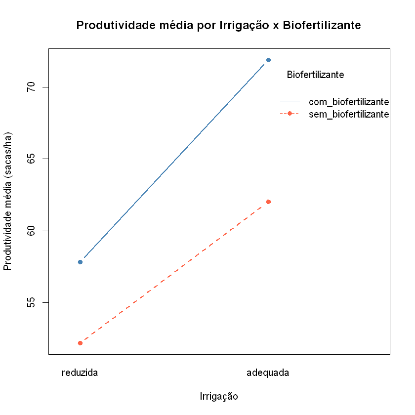
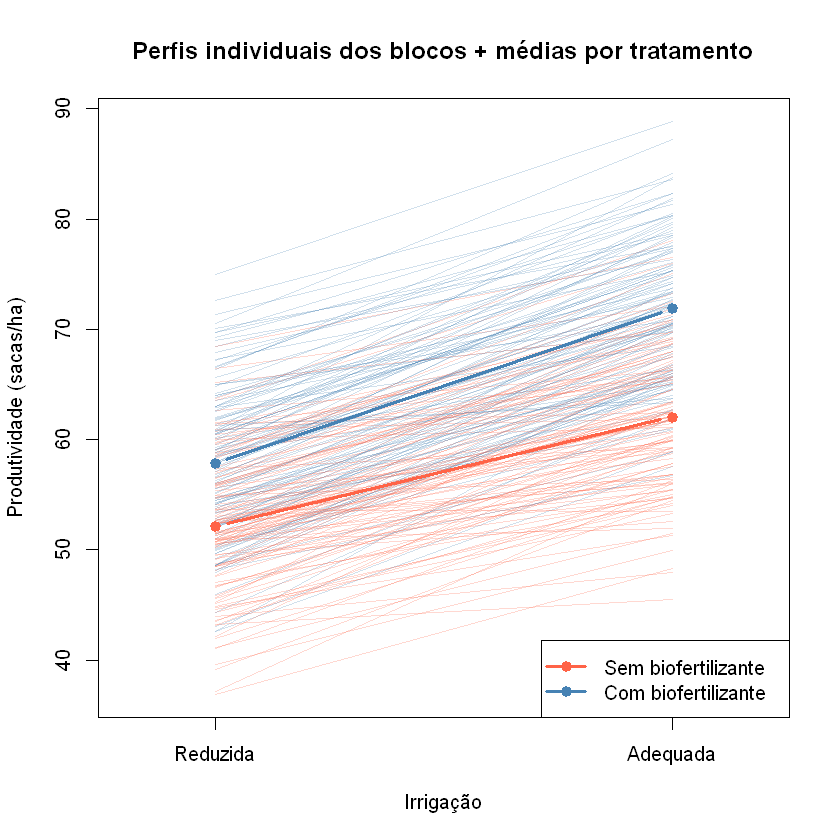

### *(a) uma breve descrição do contexto da base de dados;*

A base de dados referente ao trabalho é um arquivo .csv cujo nome é "produtividade_milho" disponibilizado pelo professor Ricardo.

O arquivo está em formato longo e contém 480 linhas, correspondentes a 120 blocos agrícolas (unidades experimentais) observados sob os 4 tratamentos formados pela combinação de dois fatores: irrigação (reduzida/adequada) e biofertilizante (sem/com biofertilizante). Cada linha traz o bloco, o nível de cada fator, o rótulo do tratamento (combinação dos dois fatores) e a produtividade de milho observada (sacas por hectare).

Trata-se de um delineamento em blocos com **medidas repetidas**: cada bloco é observado sob os 4 tratamentos, o que caracteriza um experimento fatorial 2x2 com blocagem. O objetivo é avaliar se a irrigação, o biofertilizante e a interação entre esses fatores alteram a produtividade média de milho.

Usando R descobrimos que temos um cenário de delineamento balanceado, cada tratamento possui 120 observações.


```
           sem_biofertilizante com_biofertilizante
  reduzida                 120                 120
  adequada                 120                 120
```

Algumas descritivas dos dados em geral

```
produtividade_sacas_ha
Min.   :36.88         
1st Qu.:53.73         
Median :60.52         
Mean   :60.98         
3rd Qu.:67.84         
Max.   :88.86
```

Iremos usar ferramentas estatísticas (vetor de médias, gráficos de perfis/interação e, posteriormente, testes de hipótese para medidas repetidas / ANOVA) para responder a essa pergunta.

### *(b) identificação das variáveis quantitativas e categóricas que serão utilizadas na análise e o(s) tratamento(s) considerados;*

**Variável quantitativa (resposta):**

- "produtividade_sacas_ha": produtividade de milho, em sacas por hectare.

**Variáveis categóricas (fatores / identificadores):**

- "bloco": identificador da unidade experimental (fator de blocagem), com 120 níveis;
- "irrigacao": fator 1, com 2 níveis (reduzida / adequada);
- "biofertilizante": fator 2, com 2 níveis (sem biofertilizante / com biofertilizante);
- "tratamento": variável categórica derivada, que rotula a combinação de irrigação x biofertilizante em cada linha (4 níveis).


**Tratamentos considerados:**

O experimento é fatorial 2x2, gerando 4 tratamentos, aos quais cada um dos 120 blocos foi submetido (medidas repetidas):

$T_1$: irrigação reduzida, sem biofertilizante

$T_2$: irrigação reduzida, com biofertilizante

$T_3$: irrigação adequada, sem biofertilizante

$T_4$: irrigação adequada, com biofertilizante

Chamando de $X_{kj}$ a produtividade do bloco $j$ no tratamento $k$ ($k = 1,2,3,4$), o vetor de observações de cada bloco é $\boldsymbol{X}_j = (X_{1j}, X_{2j}, X_{3j}, X_{4j})'$, $j = 1, \dots, 120$.


```
reduzida_sem_biofertilizante 52.1695833333333
reduzida_com_biofertilizante 57.8170833333333
adequada_sem_biofertilizante 62.03475
adequada_com_biofertilizante 71.90775
```

Interpretação:

- $\bar{X_1}$ (Reduzida / Sem biofertilizante)  = 52.170 sacas/ha
- $\bar{X_2}$ (Reduzida / Com biofertilizante)  = 57.817 sacas/ha
- $\bar{X_3}$ (Adequada / Sem biofertilizante)  = 62.035 sacas/ha
- $\bar{X_4}$ (Adequada / Com biofertilizante)  = 71.908 sacas/ha

Com base na amostra de 120 blocos, estima-se que a produtividade média de milho da população em estudo varie de 52.170 sacas/ha (tratamento com pior desempenho médio) até 71.908 sacas/ha (tratamento com melhor desempenho médio), a depender da combinação de irrigação e biofertilizante aplicada.

### *(d) Gráfico de linhas: efeitos principais e interação entre irrigação e biofertilizante;*

Vamos construir dois gráficos:

1. um gráfico de linhas com as **médias amostrais** da produtividade em cada combinação dos fatores (irrigação no eixo horizontal, uma linha para cada nível de biofertilizante), para visualizar os efeitos principais e uma possível interação;
2. o mesmo gráfico acrescido dos **perfis individuais** de cada bloco (uma linha fina por bloco, ligando sua produtividade sob irrigação reduzida à produtividade sob irrigação adequada), separados por nível de biofertilizante.





Note que as duas linhas não estão perfeitamenta paralelas, o que sugere uma possível interação.

Além disso estimamos seus efeitos.

- Efeito principal da irrigacao: passar de reduzida para adequada altera a produtividade média em 11.978 sacas/ha (em aumento), o que sugere um efeito principal relevante da irrigação, condizente com o gráfico.

- Efeito principal do biofertilizante: usar biofertilizante altera a produtividade média em 7.760 sacas/ha (em aumento), o que sugere um efeito principal relevante do biofertilizante, também condizente com o gráfico.

- Possível interação: sob 'sem biofertilizante', mudar de irrigação reduzida para adequada altera a produtividade em 9.865 sacas/ha; sob 'com biofertilizante', essa mudança é de 14.091 sacas/ha. A diferença entre esses dois efeitos (medida de interação) é de 4.225 sacas/ha, o que sugere que existe uma interação, e já falamos antes que há indício visual de interação entre irrigação e biofertilizante (o efeito de um fator depende do nível do outro).

Essas conclusões são descritivas, baseadas apenas na inspeção visual das médias e dos perfis; a confirmação formal de efeitos principais e de interação deve ser feita posteriormente por meio de testes de hipótese apropriados (ex.: ANOVA para medidas repetidas / modelo com blocos).