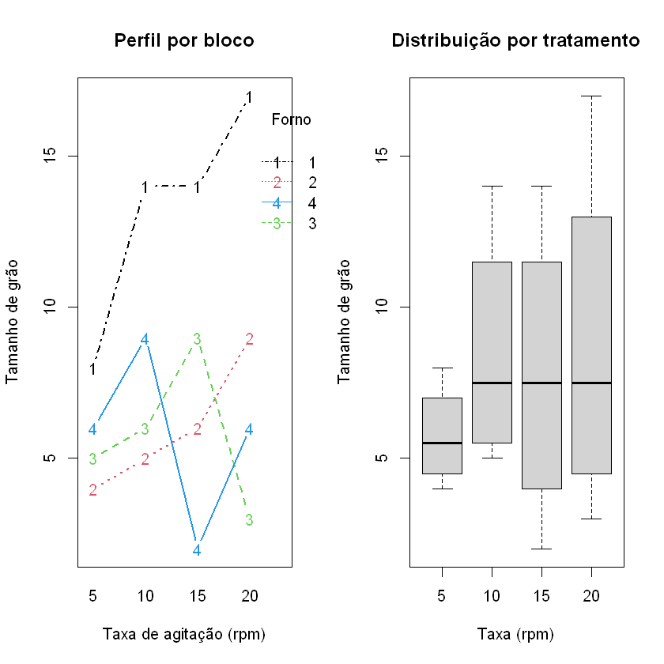
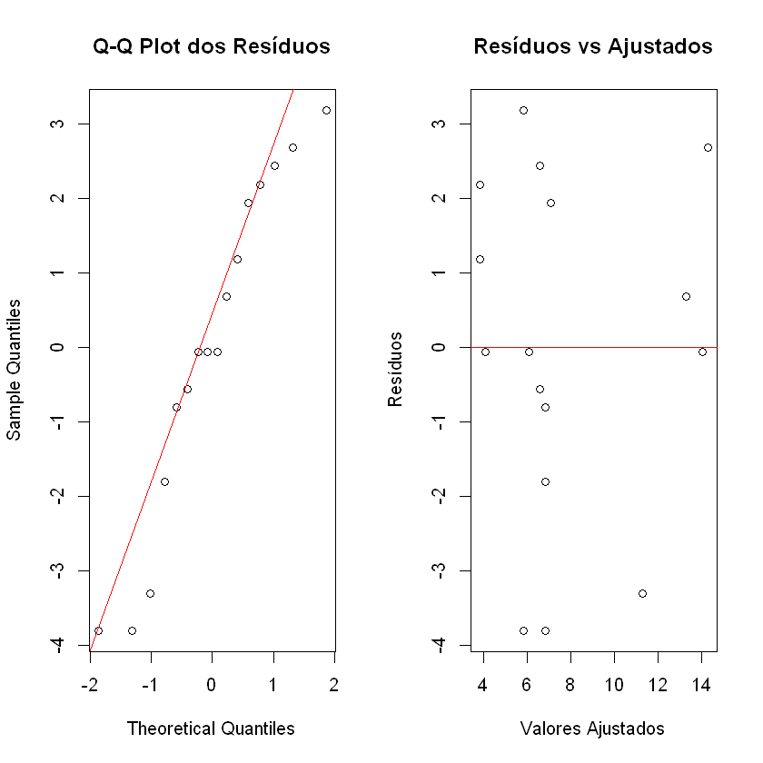
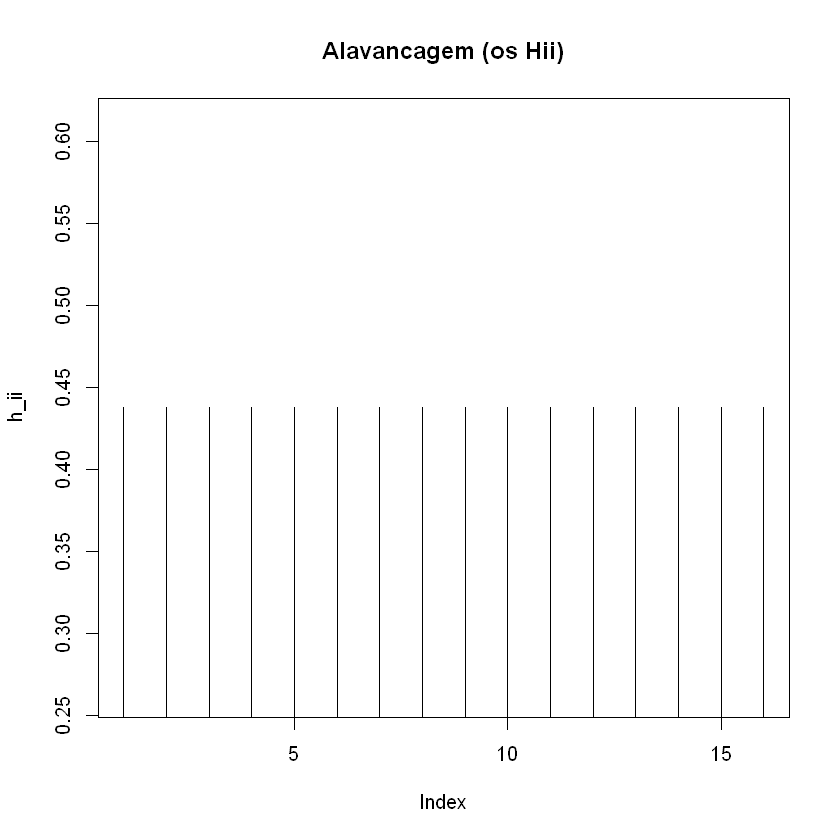
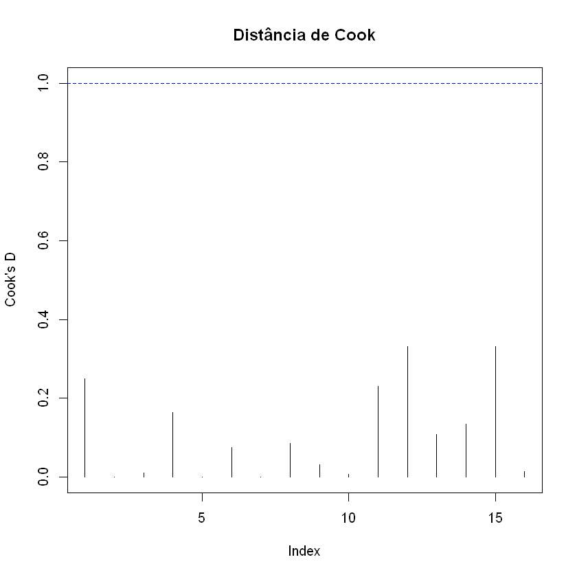

# Atividade 4 -- Planejamento e Experimento:

Aluno: Marcelo Huang

## Enunciado:
Encontre um conjunto de dados envolvendo um Fator e um Bloco. Faça a análise completa destes dados. 
Escreva o seu relatorio em PDF. Esteja preparado para apresentá-lo em sala de aula.

---

##### Conjunto de dados escolhido: 

Problem **4-7** do livro "Design and Analysis of Experiments"(5th Edition), Douglas C. Montgomery,

### Contextualização do Problema

Uma empresa fabricante de ligas-mestre de alumínio produz refinadores de grão em forma de lingotes. O processo produtivo é realizado em quatro fornos diferentes. Cada forno possui características operacionais próprias, o que pode influenciar o tamanho de grão do produto final.

Os engenheiros de processo suspeitam que a **taxa de agitação** do material durante a produção afeta o tamanho de grão obtido. Entretanto, como os fornos apresentam diferenças naturais entre si, eles são tratados como uma fonte de variabilidade não controlável no experimento, ou seja, como **blocos**.

Para investigar o efeito da taxa de agitação sobre o tamanho de grão, foi conduzido um experimento utilizando um **Delineamento em Blocos Aleatorizados  (DBA)**.

---

### Objetivo

Avaliar se diferentes taxas de agitação influenciam significativamente o tamanho de grão do produto, controlando a variabilidade causada pelos diferentes fornos utilizados no processo.

---

### Estrutura Experimental

- **Fator (Tratamento):** Taxa de agitação (rpm)
- **Níveis do fator:** 5, 10, 15 e 20 rpm
- **Blocos:** Fornos (1, 2, 3 e 4)
- **Variável resposta:** Tamanho de grão

---

### Dados do Experimento

| Taxa de Agitação (rpm) | Forno 1 | Forno 2 | Forno 3 | Forno 4 |
|------------------------|----------|----------|----------|----------|
| 5                      | 8        | 4        | 5        | 6        |
| 10                     | 14       | 5        | 6        | 9        |
| 15                     | 14       | 6        | 9        | 2        |
| 20                     | 17       | 9        | 3        | 6        |

---

### Software Utilizado

As análises serão realizadas no software **R**, utilizando funções da linguagem base para ajuste do modelo ANOVA e análise diagnóstica.

# 1. Análise completa dos dados

Nesse caso, o modelo utilizado para o DBA é:

$Y_{ij} = \mu + \tau_i + \beta_j + \varepsilon_{ij}$

onde:

- $Y_{ij}$: observação do tratamento $i$ no bloco $j$
- $\mu$: média geral
- $\tau_i$: efeito do tratamento (taxa de agitação)
- $\beta_j$: efeito do bloco (forno)
- $\varepsilon_{ij}$: erro aleatório experimental

---

# Hipóteses que podem ser feitas

### Para os tratamentos (taxa de agitação) (**Prioridade**)

$
H_0: \tau_1 = \tau_2 = \tau_3 = \tau_4 = 0
$

$
H_1: \text{Pelo menos uma taxa de agitação apresenta efeito diferente}
$

### Para os blocos (fornos) (não importa nessa situação)

$
H_0: \beta_1 = \beta_2 = \beta_3 = \beta_4 = 0
$

$
H_1: \text{Pelo menos um forno apresenta efeito diferente}
$

---

# Metodologia de Análise

A análise será realizada por meio de:

1. Estatística descritiva;
2. Verificação dos pressupostos:
   - normalidade dos resíduos;
   - homogeneidade das variâncias;
3. Análise de variância (ANOVA);
4. Comparação múltipla de médias (Teste de Tukey);

#### 1.1 Estatística descritiva

As estatísticas descritivas exploratórias:

| Taxa  | Media | DP | n |
|-------|--------|---------|---|
| 5  | 5.75 | 1.707825 | 4 |
| 10 | 8.50 | 4.041452 | 4 |
| 15 | 7.75 | 5.057997 | 4 |
| 20 | 8.75 | 6.020797 | 4 |

---

| Forno | Media | DP | n |
|--------|--------|---------|---------|
| 1 | 13.25 | 3.774917 | 4 |
| 2 | 6.00  | 2.160247 | 4|
| 3 | 5.75  | 2.500000 | 4|
| 4 | 5.75  | 2.872281 | 4|

#### 1.2 Veificando os pressupostos

Feito o ajuste do modelo, pode-se verificar os pressupostos:

Os resíduos do modelo de regressão devem atender aos pressupostos de normalidade, homocedasticidade e independência (já garantida pela aleatorização). 

Abaixo são apresentados os testes estatísticos e os gráficos de diagnóstico.

| | Normalidade(Shapiro-Wilk) | Homocedasticidade (Bartlett) | Homocedasticidade (Levene) |
|-------|--------|---------|---|
|Valor-p dos testes| 0.24| 0.31|0.42|

Os pressupostos não são violados, pelos testes feitos acima e os gráficos.

---

#### 1.3 Resultados da ANOVA

|           | Df| Sum Sq |Mean Sq| F value| Pr(>F) | 
|-----------|-------|--------|---------|---|--------|
|Taxa       |  3 | 22.19  |  7.40  | 0.853 |0.4995  
|Forno      |  3 |165.19  | 55.06  | 6.348 | 0.0133 
|Residuals  | 9 | 78.06   | 8.67  |

A estatística $F_0$ de 0.853 não é significativa e o valor-p = 0.4995 é grande, então a
hipótese nula não é rejeitada. Os dados não oferecem evidências suficientes para concluir que a taxa de agitação apresenta efeito diferente no tamanho do grão produzido.

#### 1.4 Comparações
Consequentemente, como o fator de interesse (efeito de taxa de agitação) não foi significativo, não há necessidade de fazer comparações múltiplas (nem Bonferroni nem Tukey.)

*Note que o efeito do bloco(forno) foi significativo para o tamanho do grão, uma comparação múltipla pode ser feita, mas não é o interesse da situação*

---

# 2. Análise completa dos dados, só que com modelo de regressão

Nesse caso, O modelo de regressão com blocos pode ser representado por:

$Y_{ij} = \mu + \tau_1X_1 + \tau_2X_2+ \tau_3X_3 + \beta_1Z_1 +\beta_1Z_2 + \beta_1Z_3 + \varepsilon_{ij}$

*Set to zero*: $\tau_4 = \beta_4= 0$

em que  

* $Y_{ij}$: tamanho de grão observado para a taxa de agitação $i$ no forno $j$;
* $X_i = 1$ se a observação for submetido ao $i^{th}$ nível, e $X_i = 0$ caso contrário (primeiro nível: taxa de 5 rpm, segundo: 10 rpm assim por diante)
* $Z_j = 1$ se a observação for submetido ao $j^{th}$ bloco, e $Z_j = 0$ caso contrário
* $\mu$: média geral do experimento;
* $\tau_i$: efeito da taxa de agitação;
* $\beta_j$: efeito do bloco (forno);
* $\varepsilon_{ij}$: erro aleatório associado à observação.

Assume-se que:

$
\varepsilon_{ij} \sim N(0, \sigma^2)
$

ou seja, os erros são independentes, normalmente distribuídos e com variância constante.

---

# Hipóteses que podem ser feitas

## Efeito da taxa de agitação  (Hipótese de Interesse, Prioridade)

$
H_0: \tau_1 = \tau_2 = \tau_3 = \tau_4 = 0
$

$
H_1: \text{Pelo menos uma taxa de agitação afeta o tamanho de grão}
$

## Efeito dos fornos/blocos (não é o Interesse, não importa, ignora)

$
H_0: \beta_1 = \beta_2 = \beta_3 = \beta_4 = 0
$

$
H_1: \text{Pelo menos um forno apresenta efeito significativo}
$

---

# Metodologia de Análise

A análise será realizada por meio de:

1. Análise descritiva;
2. Verificação dos pressupostos;
3. Análise de variância (ANOVA):

---

## 2.1 Análise descritiva

As estatísticas descritivas exploratórias (são as mesmas):

| Taxa  | Media | DP | n |
|-------|--------|---------|---|
| 5  | 5.75 | 1.707825 | 4 |
| 10 | 8.50 | 4.041452 | 4 |
| 15 | 7.75 | 5.057997 | 4 |
| 20 | 8.75 | 6.020797 | 4 |

---

| Forno | Media | DP | n |
|--------|--------|---------|---------|
| 1 | 13.25 | 3.774917 | 4 |
| 2 | 6.00  | 2.160247 | 4|
| 3 | 5.75  | 2.500000 | 4|
| 4 | 5.75  | 2.872281 | 4|

---

## 2.2 Verificação dos pressupostos

Feito o ajuste do modelo, pode-se verificar os pressupostos:

Os resíduos do modelo de regressão devem atender aos pressupostos de normalidade, homocedasticidade e independência (já garantida pela aleatorização). 

Abaixo são apresentados os testes estatísticos e os gráficos de diagnóstico.

| | Normalidade(Shapiro-Wilk) | Homocedasticidade (Breusch-Pagan) |
|-------|--------|---------|
|Valor-p dos testes| 0.24| 0.64|

Os pressupostos não são violados, pelos testes feitos acima e os gráficos.

---

## 2.3 Tabela ANOVA

Tabela ANOVA do modelo completo: 

| Fonte     | Df | Sum Sq | Mean Sq | F value | Pr(>F) |
|------------|----|---------|----------|----------|---------|
| Taxa5 ($\tau_1$)     | 1  | 20.021  | 20.021   | 2.308    | 0.163 |
| Taxa10 ($\tau_2$)    | 1  | 0.167   | 0.167    | 0.019    | 0.893 |
| Taxa15 ($\tau_3$)    | 1  | 2.000   | 2.000    | 0.231    | 0.643 |
| Forno1 ($\beta_1$)    | 1  | 165.021 | 165.021  | 19.026   | 0.002 |
| Forno2 ($\beta_2$)    | 1  | 0.167   | 0.167    | 0.019    | 0.893 |
| Forno3 ($\beta_3$)    | 1  | 0.000   | 0.000    | 0.000    | 1.000 |
| Residuals  | 9  | 78.062  | 8.674    | NA       | NA |

Podemos tirar as mesmas conclusões:

As estatísticas $F_0$ do fator não são significativo e os valores-p são grandes, então a
hipótese nula não é rejeitada. Os dados não oferecem evidências suficientes para concluir que a taxa de agitação apresenta efeito diferente no tamanho do grão produzido.

Consequentemente, como o fator de interesse (efeito de taxa de agitação) não foi significativo, não há necessidade de fazer comparações múltiplas (nem Bonferroni nem Tukey).

*Note que o efeito do bloco(forno) foi significativo para o tamanho do grão, uma comparação múltipla pode ser feita, mas não é o interesse da situação*

---

#### 2.Extra.1

Fazendo teste F-parcial (modelo reduzido sem os $\tau_i$, mantendo apenas os $\beta_j$ vs. modelo completo; e modelo reduzido sem os $\beta_j$, mantendo apenas os $\tau_i$ vs. modelo completo ):

| Fonte     | Df | Sum Sq | Mean Sq | F value | Pr(>F) |
|------------|----|---------|----------|----------|---------|
| Taxa de agitação    | 3  | 22.19  | 7.4   | 0.853    | 0.499 |
| Forno    | 3  | 165.19   | 55.06    | 6.348    | 0.0133 |
|Resíduos | 9| 78.06| 8.67 |

Assim, pode-se dizer que:

* Para "Taxa de agitação": valor-p = 0.499 é grande, isso significa que remover “Taxa de agitação” não piora o ajuste do modelo, mesmo mantendo “Forno”.

* Para “Forno”: valor-p = 0.01 é  pequeno, isso significa que remover “Forno” piora fortemente o ajuste do modelo, mesmo mantendo "Taxa de agitação".

Resumindo: dá pra tirar a mesma conclusão de antes: o fator de interesse (efeito de taxa de agitação) não foi significativo.

---
#### 2.Extra.2

Pode-se calcular a matriz chapéu *H*,

Mas o delineamento é balanceado e todas as combinações tratamento-bloco estão presentes, a matriz X tem certa simetria, e os $h_{ii}$ ​podem ser iguais para todas as observações (aproximadamente $p/n=7/16=0,4375$). Nesse caso, a análise de alavancagem é pouco informativa.

Além disso, pode-se calcular a distância de cook

Assim, calculando a matriz chapéu e DCook, não identificou observações com alavancagem excessiva (nenhum $h_{ii}$ ​ superou $2p/n = 7/16$) nem pontos influentes (distância de Cook < 1 para todas as observações). Isso corrobora a adequação do modelo de regressão e a ausência de outliers que comprometessem as conclusões.

---

## 3. Comparação entre as abordagens

As duas abordagens levaram a mesma conclusão: A
hipótese nula não é rejeitada. Os dados não oferecem evidências suficientes para concluir que a taxa de agitação (o fator de interesse) apresenta efeito diferente no tamanho do grão produzido.