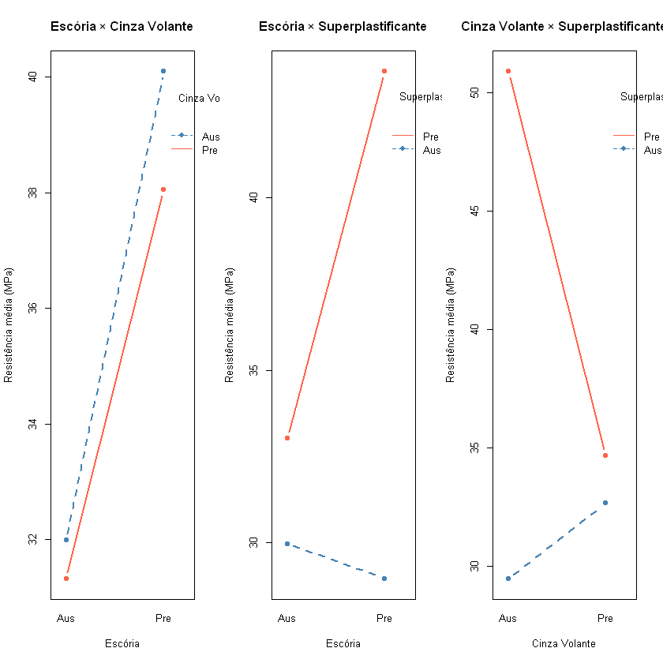
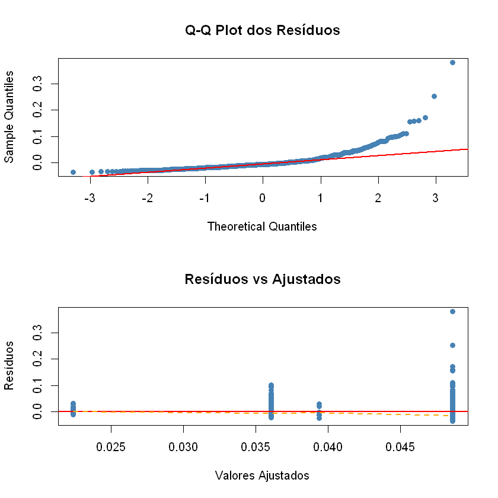
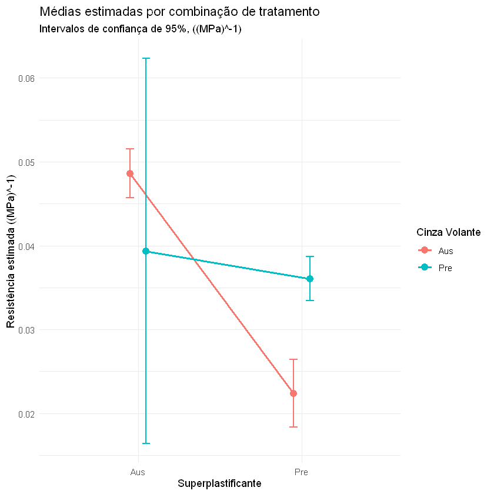

# Atividade 6 — Análise Fatorial Desbalanceada: Resistência à Compressão do Concreto

Aluno: Marcelo Huang

## Enunciado

---

Faça uma análise completa da base de dados apresentada pelo seu grupo, considerando um experimento com **três fatores** e **tamanhos amostrais desiguais** entre as combinações de tratamentos. A análise deverá ser conduzida utilizando a **abordagem de regressão para modelos fatoriais desbalanceados**.

O relatório deve incluir:
- Descrição da estrutura do experimento
- Formulação do modelo completo
- Definição das variáveis indicadoras utilizadas
- Testes dos efeitos fatoriais por comparação entre modelos reduzidos e completos
- Escolha de um modelo final hierarquicamente consistente
- Análise de resíduos
- Interpretação estatística dos resultados
- Comparações múltiplas quando pertinente

---

## Base de Dados

A base utilizada é o **Concrete Compressive Strength Data Set** (UCI Machine Learning Repository). A variável resposta é a **resistência à compressão do concreto** (MPa). 

#### Interesse: verificar se os seguintes fatores interfiram na resistência

Os três fatores de interesse são definidos a partir da presença ou ausência dos seguintes ingredientes:

| Fator | Símbolo | Nível 0 | Nível 1 |
|-------|---------|---------|----------|
| Escória de alto-forno | `Es` | Ausente | Presente |
| Cinza Volante | `CinV` | Ausente | Presente |
| Superplastificante | `SupP` | Ausente | Presente |


Como os ingredientes aparecem em proporções contínuas no banco original, e para atender o interesse do contexto, binarizei as variaveis: **presente** se a quantidade for maior que zero, **ausente** caso contrário. O resultado é um experimento **fatorial $2^3$ desbalanceado** — há replicação em todas as $2^3 = 8$ combinações, mas o número de observações por célula varia consideravelmente.

---

## 1. Dados

O banco de dados possui 1030 observações, não é detectado inconsistência.

### 1.1 Distribuição amostral por combinação de tratamentos

O primeiro passo é verificar quantas observações existem em cada uma das 8 células do arranjo fatorial. O desbalanceamento é um fato central desta análise, isso impede o uso direto da ANOVA clássica e motiva a abordagem de regressão.

### SupP = Aus

| Es  | CinV = Aus | CinV = Pre |
|-----|------------|------------|
| Aus | 209        | 1          |
| Pre | 164        | 5          |


### SupP = Pre

| Es  | CinV = Aus | CinV = Pre |
|-----|------------|------------|
| Aus | 23         | 233        |
| Pre | 170        | 225        |

Total de observações: 1030 

Mínimo por célula: 1

Máximo: 233

---

## 2. Estrutura Experimental e Modelo

### 2.1 Estrutura do experimento

Trata-se de um experimento **fatorial $2^3$ completamente aleatorizado com tamanhos amostrais desiguais**, em que:

- **Fator A** = Escória (`Es`): Ausente / Presente — $a = 2$ níveis  
- **Fator B** = Cinza Volante (`CinV`): Ausente / Presente — $b = 2$ níveis  
- **Fator C** = Superplastificante (`SupP`): Ausente / Presente — $c = 2$ níveis  
- **Variável resposta**: Resistência à compressão do concreto (MPa)

O modelo fatorial completo com três fatores e todas as interações é:

$$Y_{ijkl} = \mu + \alpha_i + \beta_j + \gamma_k + (\alpha\beta)_{ij} + (\alpha\gamma)_{ik} + (\beta\gamma)_{jk} + (\alpha\beta\gamma)_{ijk} + \varepsilon_{ijkl}$$

onde:
- $Y_{ijkl}$: $l$-ésima observação no nível $i$ de Escória, $j$ de Cinza Volante e $k$ de Superplastificante  
- $\mu$: média geral  
- $\alpha_i$: efeito principal da Escória  
- $\beta_j$: efeito principal da Cinza Volante  
- $\gamma_k$: efeito principal do Superplastificante  
- $(\alpha\beta)_{ij}$, $(\alpha\gamma)_{ik}$, $(\beta\gamma)_{jk}$: interações de dois fatores  
- $(\alpha\beta\gamma)_{ijk}$: interação tripla  
- $\varepsilon_{ijkl} \sim N(0, \sigma^2)$: erro aleatório

### 2.2 Codificação das variáveis indicadoras (*dummies*)

Como cada fator tem 2 níveis, basta **uma** variável indicadora por fator, com a categoria de referência sendo **Ausente** (nível 0). Definimos:

| Variável | Definição |
|----------|----------|
| $X_1$ | 1 se Escória Presente, 0 c.c. |
| $X_2$ | 1 se Cinza Volante Presente, 0 c.c. |
| $X_3$ | 1 se Superplastificante Presente, 0 c.c. |
| $X_1 X_2$ | interação Escória × Cinza Volante |
| $X_1 X_3$ | interação Escória × Superplastificante |
| $X_2 X_3$ | interação Cinza Volante × Superplastificante |
| $X_1 X_2 X_3$ | interação tripla |

O modelo de regressão equivalente ao modelo fatorial completo é então:

$$Y = \beta_0 + \beta_1 X_1 + \beta_2 X_2 + \beta_3 X_3 + \beta_{12} X_1 X_2 + \beta_{13} X_1 X_3 + \beta_{23} X_2 X_3 + \beta_{123} X_1 X_2 X_3 + \varepsilon$$

Este modelo tem **8 parâmetros**, correspondendo exatamente às 8 médias de célula do fatorial $2^3$.

---

## 3. Análise Exploratória

| Es  | CinV | SupP | n   | Média | DP   |
|-----|------|-----|-----|-------|------|
| Aus | Aus  | Aus | 209 | 29.8  | 14.6 |
| Aus | Aus  | Pre | 23  | 51.8  | 14.6 |
| Aus | Pre  | Aus | 1   | 64.0  | NA   |
| Aus | Pre  | Pre | 233 | 31.2  | 13.3 |
| Pre | Aus  | Aus | 164 | 29.0  | 14.8 |
| Pre | Aus  | Pre | 170 | 50.8  | 17.0 |
| Pre | Pre  | Aus | 5   | 26.4  | 10.9 |
| Pre | Pre  | Pre | 225 | 38.3  | 14.2 |



Os gráficos de perfis de médias permitem uma avaliação visual inicial
dos possíveis efeitos de interação entre os fatores:

- No gráfico **Escória × Cinza Volante**, as linhas apresentam comportamento
aproximadamente paralelo, sugerindo pouca evidência de interação entre esses fatores.

- Já nos gráficos envolvendo **Superplastificante** (Escória × Superplastificante
e Cinza Volante × Superplastificante), observa-se maior divergência entre as linhas,
indicando possível presença de interação.

Essas evidências visuais serão verificadas formalmente por meio da análise de
variância e da comparação de modelos com e sem termos de interação.

---

## 4. Construção das Variáveis Indicadoras e Ajuste do Modelo Completo

** Ajustando o modelo completo Usando R:**

```
Call:
lm(formula = Resistencia ~ X1 + X2 + X3 + X12 + X13 + X23 + X123, 
    data = dados)

Residuals:
    Min      1Q  Median      3Q     Max 
-32.476 -11.765  -0.397  10.655  45.182 

Coefficients:
            Estimate Std. Error t value Pr(>|t|)    
(Intercept)  29.8059     1.0162  29.330  < 2e-16 ***
X1           -0.7710     1.5326  -0.503 0.615036    
X2           34.2119    14.7263   2.323 0.020365 *  
X3           22.0308     3.2275   6.826 1.49e-11 ***
X12         -36.8482    16.1662  -2.279 0.022852 *  
X13          -0.3048     3.6059  -0.085 0.932661    
X23         -54.8655    15.0723  -3.640 0.000286 ***
X123         45.0427    16.5495   2.722 0.006605 ** 
---
Signif. codes:  0 '***' 0.001 '**' 0.01 '*' 0.05 '.' 0.1 ' ' 1

Residual standard error: 14.69 on 1022 degrees of freedom
Multiple R-squared:  0.2319,	Adjusted R-squared:  0.2266 
F-statistic: 44.08 on 7 and 1022 DF,  p-value: < 2.2e-16

```

### Note que o coeficiente associado à interação tripla deu significativa.

Observa-se que a interação tripla foi significativa no modelo original. Além disso, pensando nos pressupostos do modelo, optou-se por aplicar uma transformação na variável resposta, utilizando $Y^*=1/Y$, a fim de verificar se o ajuste e a interpretação dos efeitos seriam alterados.

**Ajustando o novo modelo Usando R:**

```
Call:
lm(formula = (Resistencia)^-1 ~ X1 + X2 + X3 + X12 + X13 + X23 + 
    X123, data = dados)

Residuals:
     Min       1Q   Median       3Q      Max 
-0.03697 -0.01482 -0.00586  0.00590  0.37407 

Coefficients:
             Estimate Std. Error t value Pr(>|t|)    
(Intercept)  0.043763   0.001962  22.303  < 2e-16 ***
X1           0.011021   0.002959   3.724 0.000207 ***
X2          -0.028142   0.028435  -0.990 0.322549    
X3          -0.022677   0.006232  -3.639 0.000288 ***
X12          0.017474   0.031215   0.560 0.575754    
X13         -0.009552   0.006963  -1.372 0.170380    
X23          0.047684   0.029103   1.638 0.101635    
X123        -0.028266   0.031955  -0.885 0.376607    
---
Signif. codes:  0 '***' 0.001 '**' 0.01 '*' 0.05 '.' 0.1 ' ' 1

Residual standard error: 0.02837 on 1022 degrees of freedom
Multiple R-squared:  0.1205,	Adjusted R-squared:  0.1145 
F-statistic:    20 on 7 and 1022 DF,  p-value: < 2.2e-16


```

Após a transformação, a interação tripla deixou de ser estatisticamente significativa, sugerindo que parte da evidência de interação observada no modelo original estava associada à escala da variável resposta.
### 4.1 Interpretação dos coeficientes do modelo completo

| Coeficiente | Parâmetro | Interpretação |
|------------|-----------|---------------|
| `(Intercept)` | $\beta_0$ | Média da inversa de resistência quando **todos os ingredientes estão ausentes** |
| `X1` | $\beta_1$ | Acréscimo médio da inversa de resistência ao adicionar Escória (fixando CinV=0, SupP=0) |
| `X2` | $\beta_2$ | Acréscimo médio ao adicionar Cinza Volante (fixando Es=0, SupP=0) |
| `X3` | $\beta_3$ | Acréscimo médio ao adicionar Superplastificante (fixando Es=0, CinV=0) |
| `X12` | $\beta_{12}$ | Correção de interação: quanto o efeito de Es muda quando CinV está presente |
| `X13` | $\beta_{13}$ | Correção de interação: quanto o efeito de Es muda quando SupP está presente |
| `X23` | $\beta_{23}$ | Correção de interação: quanto o efeito de CinV muda quando SupP está presente |
| `X123` | $\beta_{123}$ | Interação tripla: ajuste adicional quando todos os três estão presentes |
---

## 5. Testes de Hipóteses por Comparação de Modelos

### 5.1 Estratégia

Para dados desbalanceados, as **somas de quadrados do Tipo I** (sequenciais) dependem da ordem de entrada dos termos no modelo, o que as torna inadequadas. Usamos a abordagem de **comparação entre modelos aninhados**: para testar um efeito, comparamos o **modelo completo** com um **modelo reduzido** que omite apenas aquele efeito, mantendo todos os outros. Isso equivale às **Somas de Quadrados do Tipo III** (parciais, ou marginais).

Seguimos uma estratégia **hierárquica de cima para baixo** (*backward*):

1. Testar a interação tripla $ABC$
2. Testar as interações duplas $AB$, $AC$, $BC$
3. Testar os efeitos principais $A$, $B$, $C$

Um efeito de ordem inferior **só é removido** se o efeito de ordem superior que o contém também for não significativo.

### 5.2 Abordagem via `car::Anova` (Tipo III)

Uma forma direta de obter os testes marginais seria usar a função `Anova()` do pacote `car` com `type = "III"`. Porém o assunto desse trabalho é regressão.
### 5.3 Teste da interação tripla $Es \times CinV \times SupP$

Testamos:
$$H_0: \beta_{123} = 0 \qquad H_1: \beta_{123} \neq 0$$

Isso equivale a comparar o modelo completo com o modelo que omite o termo $X_1 X_2 X_3$. Acontece que o teste F parcial para essa hipótese é equivalente ao teste t que vimos na seção 4, onde obtivemos um valor-p de 0.37 que nos levou a **não rejeitar** a hipótese nula.
### 5.4 Testes das interações duplas

Com base no resultado anterior, definimos o **modelo de referência atual** (completo ou sem a tripla, conforme o resultado acima) e testamos cada interação dupla.

As hipóteses para cada uma são da forma:
$$H_0: \beta_{ij} = 0 \qquad H_1: \beta_{ij} \neq 0$$

**Fazendo testes Usando R:**

```
── Teste F: interação Es × CinV (X12)
Analysis of Variance Table

Model 1: (Resistencia)^-1 ~ X1 + X2 + X3 + X13 + X23
Model 2: (Resistencia)^-1 ~ X1 + X2 + X3 + X12 + X13 + X23
  Res.Df     RSS Df Sum of Sq      F Pr(>F)
1   1024 0.82466                           
2   1023 0.82303  1 0.0016274 2.0228 0.1553
```

---

```
── Teste F: interação Es × SupP (X13)
Analysis of Variance Table

Model 1: (Resistencia)^-1 ~ X1 + X2 + X3 + X12 + X23
Model 2: (Resistencia)^-1 ~ X1 + X2 + X3 + X12 + X13 + X23
  Res.Df     RSS Df Sum of Sq      F Pr(>F)
1   1024 0.82510                           
2   1023 0.82303  1 0.0020683 2.5708 0.1092
```

---

```
── Teste F: interação CinV × SupP (X23)
Analysis of Variance Table

Model 1: (Resistencia)^-1 ~ X1 + X2 + X3 + X12 + X13
Model 2: (Resistencia)^-1 ~ X1 + X2 + X3 + X12 + X13 + X23
  Res.Df     RSS Df Sum of Sq     F  Pr(>F)  
1   1024 0.82630                             
2   1023 0.82303  1 0.0032728 4.068 0.04396 *
---
Signif. codes:  0 '***' 0.001 '**' 0.01 '*' 0.05 '.' 0.1 ' ' 1
```

Pelos resultados acima, ao nível de 5%, as hipóteses $$H_0: \beta_{12} = 0$$ e $$H_0: \beta_{13} = 0$$ **não** foram rejeitadas. 

Mas rejeitamos a hipótese $$H_0: \beta_{23} = 0$$. 

Ou seja, temos evidências para poder tirar as covariáveis $X_{1}X_{2}$ e $X_{1}X_{3}$. Mantivemos a covariável $X_{2}X_{3}$
### 5.5 Testes dos efeitos principais

Mantendo apenas a interação significativa ($\beta_{23}$) no modelo, testamos os efeitos principais. **Um efeito principal só deve ser removido se não estiver envolvido em nenhuma interação significativa** — este é o princípio da hierarquia.

As hipóteses são:

$$H_0: \beta_k = 0 \qquad \text{(não há efeito do fator k)}$$

$$ H_1: \beta_k \neq 0, \quad k = 1, 2, 3$$

**Fazendo testes Usando R:**

```
── Teste F: efeito principal de Escória (X1)
Analysis of Variance Table

Model 1: (Resistencia)^-1 ~ X2 + X3 + X23
Model 2: (Resistencia)^-1 ~ X1 + X2 + X3 + X23
  Res.Df     RSS Df  Sum of Sq  F Pr(>F)
1   1026 0.84423                        
2   1025 0.84423  1 5.1999e-09  0  0.998
```

---

```
── Teste F: efeito principal de Cinza Volante (X2)
Analysis of Variance Table

Model 1: (Resistencia)^-1 ~ X1 + X3 + X23
Model 2: (Resistencia)^-1 ~ X1 + X2 + X3 + X23
  Res.Df     RSS Df  Sum of Sq      F Pr(>F)
1   1026 0.84474                            
2   1025 0.84423  1 0.00050223 0.6098 0.4351
```

---

```
── Teste F: efeito principal de Superplastificante (X3)
Analysis of Variance Table

Model 1: (Resistencia)^-1 ~ X1 + X2 + X23
Model 2: (Resistencia)^-1 ~ X1 + X2 + X3 + X23
  Res.Df     RSS Df Sum of Sq      F    Pr(>F)    
1   1026 0.92314                                  
2   1025 0.84423  1  0.078902 95.796 < 2.2e-16 ***
---
Signif. codes:  0 '***' 0.001 '**' 0.01 '*' 0.05 '.' 0.1 ' ' 1
```

Pelos resultados acima, ao nível de 5%, as hipóteses $$H_0: \beta_{1} = 0$$ e $$H_0: \beta_{2} = 0$$ **não** foram rejeitadas. 

Mas rejeitamos a hipótese $H_0: \beta_{3} = 0$. 

Ou seja, temos evidências para poder tirar a covariávei $X_{1}$. Mantivemos a covariável $X_{3}$Não vamos tirar a $X_{2}$ pois sua interação com $X_3$ é significativa.

---

## 6. Seleção do Modelo Final

Com base na sequência de testes F parciais, o modelo final é escolhido seguindo o **princípio da hierarquia**: efeitos de ordem inferior são mantidos se os de ordem superior que os contêm forem significativos. O modelo final deve ser **hierarquicamente consistente**.
Assim, o modelo é: 

$$  Y^* = 1/Y = \beta_0  + \beta_2 X_2 + \beta_3 X_3 + \beta_{23} X_2 X_3 + \varepsilon$$

O modelo escolhido foi ajustado via mínimos quadrados ordinários e seus coeficientes estão apresentados abaixo.

```

Call:
lm(formula = (Resistencia)^-1 ~ X2 + X3 + X23, data = dados)

Residuals:
     Min       1Q   Median       3Q      Max 
-0.03527 -0.01552 -0.00644  0.00595  0.38024 

Coefficients:
             Estimate Std. Error t value Pr(>|t|)    
(Intercept)  0.048609   0.001485  32.727   <2e-16 ***
X2          -0.009243   0.011804  -0.783   0.4338    
X3          -0.026229   0.002544 -10.312   <2e-16 ***
X23          0.022910   0.012058   1.900   0.0577 .  
---
Signif. codes:  0 '***' 0.001 '**' 0.01 '*' 0.05 '.' 0.1 ' ' 1

Residual standard error: 0.02869 on 1026 degrees of freedom
Multiple R-squared:  0.09713,	Adjusted R-squared:  0.09449 
F-statistic: 36.79 on 3 and 1026 DF,  p-value: < 2.2e-16
```

Sobre o modelo como um todo:O teste F global é significativo $(F = 36{,}79
,p < 0{,}001$), então o modelo como um todo não é inútil, ele captura algo real nos dados.
Sobre os coeficientes:

$\hat{\beta_0}​=0,0486$: média de $Y^*$ quando Cinza Volante e Superplastificante estão ambos ausentes
 
$\hat{\beta}_3 = -0{,}0262 (p < 0{,}001)$: a presença do Superplastificante sozinho reduz $Y^*$
em média 0,026 unidades, como $Y^* = 1/Y$ reduzir $Y^*$ significa aumentar a resistência

$\hat{\beta}_2 = -0{,}0092(p = 0{,}43)$: o efeito da Cinza Volante sozinha (quando SupP está ausente)

$\hat{\beta}_{23} = 0{,}0229 (p = 0{,}058)$: quando os dois estão presentes juntos, parte do efeito do Superplastificante é atenuado, a interação age em direção oposta ao efeito principal de $X_3$.

O baixo poder explicativo do modelo ($R^2 = 9{,}7\%$) era esperado, uma vez que os três fatores foram binarizados — perdendo toda a informação sobre as quantidades efetivas de cada ingrediente. 

A resistência do concreto depende não apenas da presença ou ausência dos componentes, mas das suas proporções na mistura. 

As variáveis binárias capturam apenas um efeito médio grosseiro entre as categorias presença/ausência, o que limita estruturalmente a capacidade preditiva do modelo. Ainda assim, os efeitos identificados são estatisticamente significativos e interpretáveis, o que atende ao objetivo da análise fatorial.

---

## 7. Análise de Resíduos

Para que as inferências sejam válidas, os resíduos do modelo devem satisfazer os pressupostos de:
1. **Normalidade**: $\varepsilon \sim N(0, \sigma^2)$
2. **Homocedasticidade**: variância constante entre os grupos
3. **Independência**: sem padrão sistemático nos resíduos

Avaliamos esses pressupostos tanto graficamente quanto por testes formais.

```
Shapiro-Wilk (normalidade): W = 0.6893 | valor-p = 0 
Breusch-Pagan (homocedasticidade): BP = 16.0309 | valor-p = 0.0011
```




A violação simultânea de normalidade e homocedasticidade indica que o modelo, mesmo após a transformação recíproca Y^* = 1/Y, não foi suficiente para adequar os resíduos aos pressupostos clássicos. Parte disso é estrutural: 

com preditores binários, os valores ajustados assumem apenas quatro valores possíveis, o que concentra os resíduos em faixas estreitas e dificulta qualquer avaliação de homocedasticidade no sentido contínuo. Além disso, a forte assimetria da variável resposta original, resistência à compressão do concreto, e o desbalanceamento extremo entre as células contribuem para a não-normalidade residual. 

Em um contexto com n = 1030 observações, os testes formais têm poder muito elevado e tendem a rejeitar $H_0$
​mesmo para desvios de magnitude prática pequena; por isso, a avaliação gráfica deve ter peso maior na interpretação. Ainda assim, as violações observadas são suficientemente severas para ter cautela na interpretação dos intervalos de confiança e dos valores-p obtidos.

---

## 8. Comparações Múltiplas

Para complementar a análise de variância e explorar a interação entre o cinza volante ($X_2$) e o superplastificante ($X_3$), que se mostrou marginalmente significativa no modelo final, foram realizadas comparações múltiplas na forma de **efeitos simples**. Essa abordagem consiste em avaliar o efeito de cada fator separadamente dentro de cada nível do outro fator, evitando a interpretação isolada dos efeitos principais, que seria inadequada na presença de interação.

As comparações foram conduzidas sobre a escala transformada $Y^* = 1/Y$ (em que $Y$ é a resistência original), utilizando as médias estimadas do modelo final. O método de Bonferroni foi aplicado para controlar a taxa de erro por família.

É importante lembrar que, na escala $Y^* = 1/Y$, **menores valores indicam maior resistência**. Portanto, diferenças negativas em $Y^*$ correspondem a aumentos na resistência, enquanto diferenças positivas indicam redução.

---

### Efeito simples da cinza volante ($X_2$) nos níveis de superplastificante ($X_3$)

O efeito da cinza volante (comparação entre os níveis com e sem adição) foi avaliado separadamente para cada nível de superplastificante.

**Usando R**:
```
SupP_f = Aus:
 contrast  estimate      SE   df t.ratio p.value
 Aus - Pre  0.00924 0.01180 1026   0.783  0.4338

SupP_f = Pre:
 contrast  estimate      SE   df t.ratio p.value
 Aus - Pre -0.01367 0.00246 1026  -5.552  <.0001

```

#### Quando $X_3$ está no nível *Aus* (sem superplastificante)

O contraste entre a ausência e a presença de cinza volante, no nível *Aus* de superplastificante, resultou em uma estimativa de $+0{,}00924$ na escala $Y^*$. O erro padrão associado foi de $0{,}01180$, com $1026$ graus de liberdade, estatística $t = 0{,}783$ e valor-$p$ ajustado de $0{,}4338$.

Esse resultado indica que, na ausência de superplastificante, a adição de cinza volante não produz efeito estatisticamente significativo sobre a resistência (considerando um nível de significância de $5\%$).

#### Quando $X_3$ está no nível *Pre* (com superplastificante)

Já no nível *Pre* de superplastificante, o efeito estimado da adição de cinza volante foi de $-0{,}01367$ na escala $Y^*$, com erro padrão de $0{,}00246$, $1026$ graus de liberdade, estatística $t = -5{,}552$ e valor-$p$ ajustado inferior a $0{,}0001$.

Esse contraste é altamente significativo. O sinal negativo indica que, na presença de superplastificante, a adição de cinza volante **aumenta** o valor de $Y^*$ (já que `Aus - Pre` é negativo, logo `Pre > Aus$). Na escala transformada, **maior** $Y^*$ significa **menor** resistência. Portanto, nessa condição, a adição de cinza volante **reduz significativamente** a resistência (ou, de forma equivalente, a ausência de cinza volante leva a uma resistência significativamente maior).


A figura a seguir ilustra graficamente os efeitos simples descritos, com barras de erro representando os intervalos de confiança ajustados.



---

## 9. Conclusões

### Estrutura do experimento

O banco de dados originou um experimento **fatorial $2^3$ completamente aleatorizado com tamanhos amostrais desiguais** (desbalanceado), com $n = 1030$ observações distribuídas entre as oito combinações formadas pela presença ou ausência de Escória de alto-forno, Cinza Volante e Superplastificante no concreto. O desbalanceamento — com células variando de uma única observação até centenas — inviabilizou o uso direto da ANOVA clássica com somas de quadrados do Tipo I, motivando a **abordagem de regressão com variáveis indicadoras** e testes F parciais (Tipo III) por comparação de modelos aninhados.

### Seleção do modelo

A partir do modelo fatorial completo, os testes F parciais hierárquicos indicaram que:

- A **interação tripla** $Es \times CinV \times SupP$ não foi significativa e foi removida;
- As **interações duplas** $Es \times CinV$ e $Es \times SupP$ também não foram significativas e foram removidas;
- A **interação** $CinV \times SupP$ foi significativa ao nível de 5% e mantida;
- O **efeito principal da Escória** não foi significativo e foi removido;
- Os **efeitos principais** de Cinza Volante ($X_2$) e Superplastificante ($X_3$) foram mantidos por exigência hierárquica, uma vez que participam da interação significativa.

A transformação recíproca $Y^* = 1/Y$ foi adotada para estabilizar a variância dos resíduos. O modelo final hierarquicamente consistente é:

$$Y^* = \frac{1}{Y} = \beta_0 + \beta_2 X_2 + \beta_3 X_3 + \beta_{23} X_2 X_3 + \varepsilon$$

### Significância e interpretação dos efeitos

A Cinza Volante, isoladamente, não apresentou efeito significativo, mas **interage** com o Superplastificante: quando Superplastificante está presente, a adicção de Cinza Volante promove o redução de resistência. A Escória não demonstrou efeito detectável sobre a resistência no contexto desta análise fatorial binária.

### Limitações

O baixo poder explicativo do modelo ($R^2 = 9{,}7\%$) e as violações dos pressupostos de normalidade e homocedasticidade dos resíduos, confirmadas pelo teste de Shapiro-Wilk ($W = 0{,}689$, $p \approx 0$) e pelo teste de Breusch-Pagan ($BP = 16{,}03$, $p = 0{,}001$), são consequências estruturais da binarização dos fatores. A transformação de variáveis contínuas em indicadoras de presença/ausência descarta toda a informação sobre as quantidades efetivas de cada ingrediente, que são determinantes para a resistência do concreto. Essas limitações recomendam cautela na interpretação dos intervalos de confiança e valores-p, e sugerem que uma modelagem com os preditores em escala contínua produziria resultados substancialmente mais informativos.

---

## Apêndice: códigos usados

```
library(readxl)
library(dplyr)
library(lmtest)   
library(emmeans)  # para comparações múltiplas
library(ggplot2) 

dados_brutos <- read_excel("Concrete_Data.xls")

# Renomeando colunas para facilitar o manuseio
colnames(dados_brutos) <- c("Cimento", "Escoria", "CinzaVolante", "Agua",
                            "Superplastificante", "AgregadoGraudo",
                            "AgregadoMiudo", "Idade", "Resistencia")

# Binarização da presença dos componentes (1 = presente, 0 = ausente)
dados_brutos$Es   <- ifelse(dados_brutos$Escoria > 0, 1, 0)
dados_brutos$CinV <- ifelse(dados_brutos$CinzaVolante > 0, 1, 0)
dados_brutos$SupP <- ifelse(dados_brutos$Superplastificante > 0, 1, 0)

# Selecionando apenas as colunas de interesse para a análise
dados <- dados_brutos[, c("Es", "CinV", "SupP", "Resistencia")]

# Convertendo para fatores com rótulos intuitivos (Aus / Pre)
dados$Es   <- factor(dados$Es,   levels = c(0, 1), labels = c("Aus", "Pre"))
dados$CinV <- factor(dados$CinV, levels = c(0, 1), labels = c("Aus", "Pre"))
dados$SupP <- factor(dados$SupP, levels = c(0, 1), labels = c("Aus", "Pre"))

cat("Dimensões do banco de dados:", nrow(dados), "obs. x", ncol(dados), "variáveis\n")
head(dados)

# 3. ANÁLISE DESCRITIVA E EXPLORATÓRIA ----------------------------------

# 3.1 Tabela de contingência (balanceamento das células)
tab_n <- xtabs(~ Es + CinV + SupP, data = dados)
print(tab_n)
cat("\nTotal de observações:", sum(tab_n), "\n")
cat("Mínimo por célula:", min(tab_n), "| Máximo:", max(tab_n), "\n")

# 3.2 Médias e desvios-padrão por combinação de tratamentos
resumo <- dados %>%
  group_by(Es, CinV, SupP) %>%
  summarise(
    n      = n(),
    Media  = round(mean(Resistencia), 2),
    DP     = round(sd(Resistencia), 2),
    .groups = "drop"
  )
print(resumo)

# 3.3 Gráficos de perfis para visualizar interações
par(mfrow = c(1, 3))

# Escória × CinzaVolante (marginalizado sobre SupP)
interaction.plot(dados$Es, dados$CinV, dados$Resistencia,
                 type = "b", col = c("steelblue", "tomato"), lwd = 2, pch = 19,
                 xlab = "Escória", ylab = "Resistência média (MPa)",
                 trace.label = "Cinza Volante",
                 main = "Escória × Cinza Volante")

# Escória × SupP
interaction.plot(dados$Es, dados$SupP, dados$Resistencia,
                 type = "b", col = c("steelblue", "tomato"), lwd = 2, pch = 19,
                 xlab = "Escória", ylab = "Resistência média (MPa)",
                 trace.label = "Superplast.",
                 main = "Escória × Superplastificante")

# CinzaVolante × SupP
interaction.plot(dados$CinV, dados$SupP, dados$Resistencia,
                 type = "b", col = c("steelblue", "tomato"), lwd = 2, pch = 19,
                 xlab = "Cinza Volante", ylab = "Resistência média (MPa)",
                 trace.label = "Superplast.",
                 main = "Cinza Volante × Superplastificante")
par(mfrow = c(1, 1))

# 4. CRIAÇÃO DE DUMMIES E TERMOS DE INTERAÇÃO ----------------------------
# Referência: Aus (0) para todos os fatores
dados$X1  <- as.numeric(dados$Es   == "Pre")   # Escória
dados$X2  <- as.numeric(dados$CinV == "Pre")   # Cinza Volante
dados$X3  <- as.numeric(dados$SupP == "Pre")   # Superplastificante

dados$X12  <- dados$X1 * dados$X2               # Es × CinV
dados$X13  <- dados$X1 * dados$X3               # Es × SupP
dados$X23  <- dados$X2 * dados$X3               # CinV × SupP
dados$X123 <- dados$X1 * dados$X2 * dados$X3    # tripla

cat("Variáveis do banco de análise:\n")
print(head(dados))

# 5. MODELAGEM NA ESCALA TRANSFORMADA Y* = 1/Y ---------------------------

# 5.1 Modelo completo (com todos os efeitos e interações)
mod_completo <- lm((Resistencia)^-1 ~ X1 + X2 + X3 + X12 + X13 + X23 + X123,
                   data = dados)
summary(mod_completo)

# 5.2 Modelo sem a interação tripla (para testar sua significância)
mod_sem_abc <- lm((Resistencia)^-1 ~ X1 + X2 + X3 + X12 + X13 + X23,
                  data = dados)

cat("── Teste F: interação tripla Es × CinV × SupP\n")
anova(mod_sem_abc, mod_completo)

# 6. SELEÇÃO DO MODELO (BACKWARD ELIMINATION) ----------------------------

# Modelo de referência (sem a tripla, conforme resultado do teste anterior)
mod_ref <- mod_sem_abc

# 6.1 Teste da interação Es × CinV (X12)
mod_sem_12 <- lm((Resistencia)^-1 ~ X1 + X2 + X3 + X13 + X23, data = dados)
cat("── Teste F: interação Es × CinV (X12)\n")
print(anova(mod_sem_12, mod_ref))
cat("\n")

# 6.2 Teste da interação Es × SupP (X13)
mod_sem_13 <- lm((Resistencia)^-1 ~ X1 + X2 + X3 + X12 + X23, data = dados)
cat("── Teste F: interação Es × SupP (X13)\n")
print(anova(mod_sem_13, mod_ref))
cat("\n")

# 6.3 Teste da interação CinV × SupP (X23)
mod_sem_23 <- lm((Resistencia)^-1 ~ X1 + X2 + X3 + X12 + X13, data = dados)
cat("── Teste F: interação CinV × SupP (X23)\n")
print(anova(mod_sem_23, mod_ref))
cat("\n")

# 6.4 Teste dos efeitos principais (a partir do modelo com apenas X23 mantida)
mod_principais <- lm((Resistencia)^-1 ~ X1 + X2 + X3 + X23, data = dados)

mod_sem_X1 <- lm((Resistencia)^-1 ~ X2 + X3 + X23, data = dados)
cat("── Teste F: efeito principal de Escória (X1)\n")
print(anova(mod_sem_X1, mod_principais))
cat("\n")

mod_sem_X2 <- lm((Resistencia)^-1 ~ X1 + X3 + X23, data = dados)
cat("── Teste F: efeito principal de Cinza Volante (X2)\n")
print(anova(mod_sem_X2, mod_principais))
cat("\n")

mod_sem_X3 <- lm((Resistencia)^-1 ~ X1 + X2 + X23, data = dados)
cat("── Teste F: efeito principal de Superplastificante (X3)\n")
print(anova(mod_sem_X3, mod_principais))
cat("\n")

# 6.5 Definição do Modelo Final
# Baseado nos testes acima, mantém-se X2, X3 e a interação X23 (CinV × SupP)
mod_final <- lm((Resistencia)^-1 ~ X2 + X3 + X23, data = dados)

cat("── Resumo do Modelo Final:\n")
summary(mod_final)

# 7. DIAGNÓSTICO DOS RESÍDUOS --------------------------------------------

res_final  <- residuals(mod_final)
fit_final  <- fitted(mod_final)

# 7.1 Testes formais
sw <- shapiro.test(res_final)
bp <- bptest(mod_final)

cat("Shapiro-Wilk (normalidade): W =", round(sw$statistic, 4),
    "| valor-p =", round(sw$p.value, 4), "\n")
cat("Breusch-Pagan (homocedasticidade): BP =", round(bp$statistic, 4),
    "| valor-p =", round(bp$p.value, 4), "\n")

# 7.2 Gráficos de diagnóstico
par(mfrow = c(2, 1))

# Q-Q plot
qqnorm(res_final, main = "Q-Q Plot dos Resíduos", pch = 19, col = "steelblue")
qqline(res_final, col = "red", lwd = 2)

# Resíduos vs Valores Ajustados
plot(fit_final, res_final,
     xlab = "Valores Ajustados", ylab = "Resíduos",
     main = "Resíduos vs Ajustados", pch = 19, col = "steelblue")
abline(h = 0, col = "red", lwd = 2)
lines(lowess(fit_final, res_final), col = "orange", lwd = 2, lty = 2)
par(mfrow = c(1, 1))

# 8. COMPARAÇÕES MÚLTIPLAS (EFEITOS SIMPLES) COM BONFERRONI ------------
# Reajustar usando fatores para o emmeans funcionar bem
mod_emm <- lm((Resistencia)^-1 ~ CinV * SupP, data = dados)

# 8.1 Criando o grid de médias ajustadas a partir do modelo final

# Atenção: as variáveis preditoras no modelo são X2, X3 e X23.
# Para fazer o desdobramento, especificamos os fatores originais (CinV e SupP)
# no argumento 'specs'. O emmeans reconhece que X2 e X3 vêm dos fatores.
emm_grid <- emmeans(mod_emm, ~ CinV | SupP)

# 8.2 Contrastes pareados com ajuste de Bonferroni (família = 2 testes)
resultado_contrastes <- pairs(emm_grid, adjust = "bonferroni")
print(resultado_contrastes)

# 8.3 Gráfico das médias estimadas na escala transformada (MPa^-1)
emm_df <- as.data.frame(emm_grid)

ggplot(emm_df, aes(x = SupP, y = emmean, color = CinV, group = CinV)) +
  geom_point(size = 3, position = position_dodge(0.2)) +
  geom_line(linewidth = 1, position = position_dodge(0.2)) +
  geom_errorbar(aes(ymin = lower.CL, ymax = upper.CL),
                width = 0.1, linewidth = 0.8,
                position = position_dodge(0.2)) +
  labs(
    title = "Médias estimadas por combinação de tratamento",
    subtitle = "Intervalos de confiança de 95% (escala MPa^-1)",
    x = "Superplastificante",
    y = "Resistência estimada (MPa^-1)",
    color = "Cinza Volante"
  ) +
  theme_minimal()
```