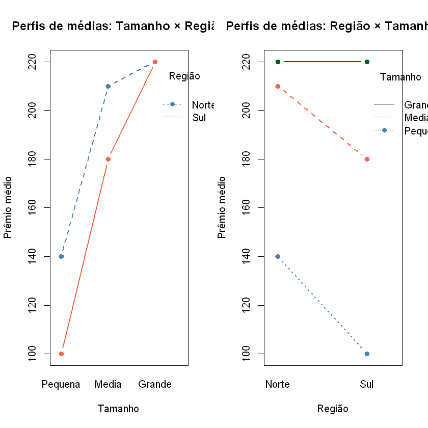
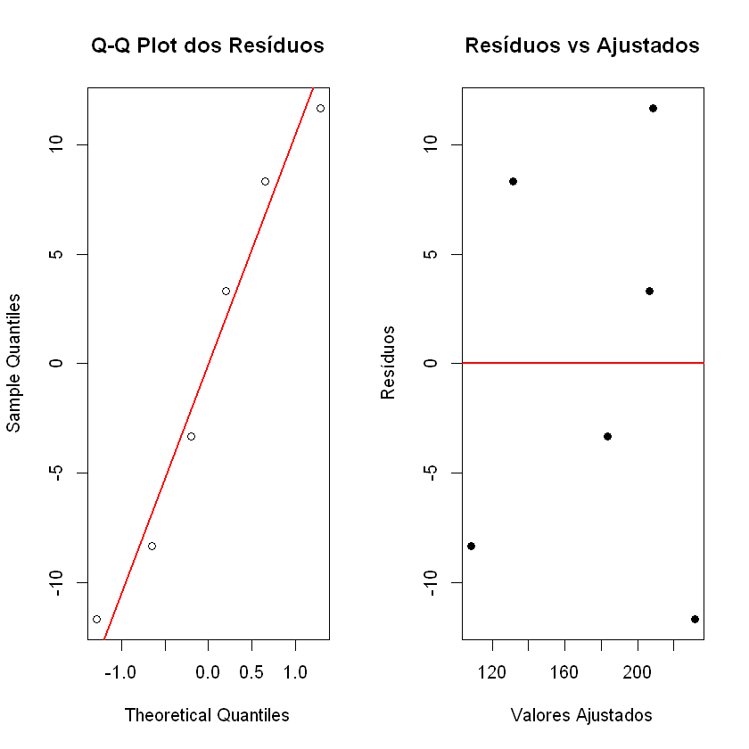
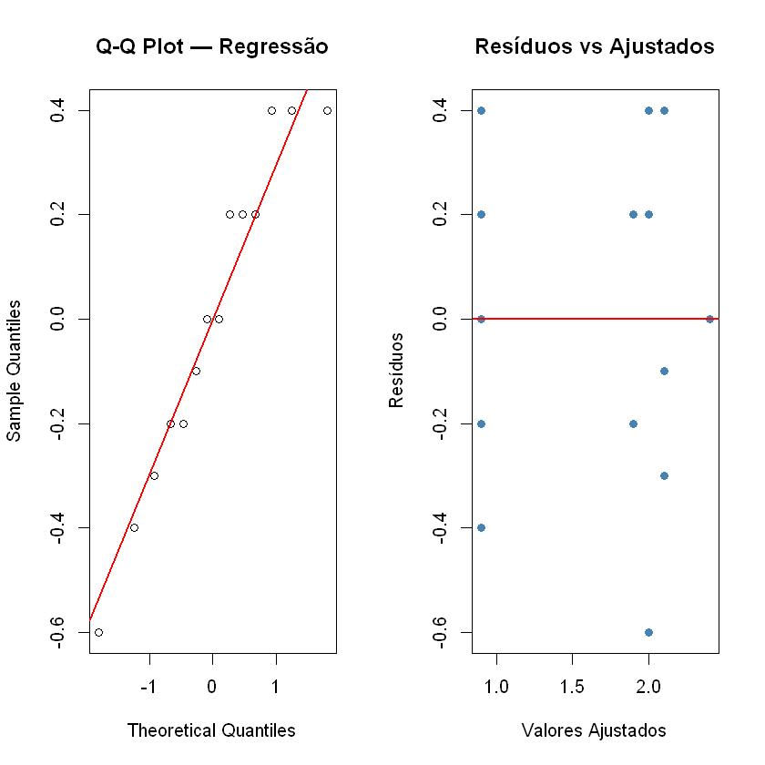

# Atividade 6 - Planejamento

## Enunciado: 

---

### Problema 1
Um fiscal de agência de seguro avalia os valores de Prêmios cobrado por uma seguradora em 6 cidades. As cidades possuem duas características:
- **A = Tamanho** (Pequena, Média, Grande)  
- **B = Região** (Norte, Sul)

| Tamanho/Região | Norte | Sul |
|----------------|-------|-----|
| Pequena        | 140   | 100 |
| Média          | 210   | 180 |
| Grande         | 220   | 220 |

- **item a:** Faça análise completa dos dados do problema.  
- **item b:** Use o teste de aditividade de Tukey para verificar a interação.  
- **item c:** Caso positivo, use o modelo de regressão para elaborar a análise.

---

## Análise Completa

### Estrutura Experimental

Trata-se de um experimento **fatorial 3 × 2 sem replicação**, em que:
- **Fator A** = Tamanho da cidade (Pequena, Média, Grande) — $a = 3$ níveis  
- **Fator B** = Região (Norte, Sul) — $b = 2$ níveis  
- **Variável resposta**: Prêmio cobrado (em unidades monetárias)

Como há apenas **uma observação por tratamento**, não é possível estimar a interação diretamente a partir da ANOVA — a SSE seria 0, a SS da interação seria o novo SSE.
Por isso, o modelo assumido inicialmente é o **modelo aditivo**:

$$Y_{ij} = \mu + \alpha_i + \beta_j + \varepsilon_{ij}$$

onde:
- $Y_{ij}$: prêmio observado no nível $i$ do Tamanho e $j$ da Região  
- $\mu$: média geral  
- $\alpha_i$: efeito do nível $i$ do Fator A (Tamanho), com $\sum \alpha_i = 0$  
- $\beta_j$: efeito do nível $j$ do Fator B (Região), com $\sum \beta_j = 0$  
- $\varepsilon_{ij} \sim N(0,\sigma^2)$: erro aleatório

### Hipóteses

**Para o Fator A (Tamanho):**

$$H_0: \alpha_1 = \alpha_2 = \alpha_3 = 0$$
$$H_1: \text{Pelo menos um } \alpha_i \neq 0$$

**Para o Fator B (Região):**

$$H_0: \beta_1 = \beta_2 = 0$$
$$H_1: \text{Pelo menos um } \beta_j \neq 0$$

### Item a — Análise Completa

#### a.1 Estatística descritiva


```
A tibble: 3 × 4
Tamanho	Media	DP	        n
Pequena	120	    28.28427	2
Media	195	    21.21320	2
Grande	220     0.00000	    2

```

```
A tibble: 2 × 4
Regiao	Media	    DP	        n
Norte	190.0000	43.58899	3
Sul	    166.6667	61.10101	3

```

#### a.2 Gráficos exploratórios

O gráfico de perfis de médias é especialmente útil para inspecionar visualmente a presença de interação: se as linhas forem paralelas, o modelo aditivo é adequado; caso contrário, há indício de interação.



Os perfis de médias apresentam linhas visualmente mais ou menos próximas do paralelismo, sugerindo ligeiramente a ausência de interação — mas isso será testado formalmente pelo teste de Tukey (item b).

---

#### a.3 Ajuste do Modelo Aditivo e ANOVA

O modelo é ajustado conforme dito anteriormente:

$$Y_{ij} = \mu + \alpha_i + \beta_j + \varepsilon_{ij}$$

#### Verificação dos Pressupostos

Com apenas 6 observações e 2 graus de liberdade residual, os testes têm pouca potência, mas são realizados por completude.

```
	Shapiro-Wilk normality test

data:  residuos1
W = 0.94813, p-value = 0.7251

```



#### Interpretação da ANOVA

```
            Df Sum Sq Mean Sq F value Pr(>F)  
Tamanho      2  10833    5417  25.000 0.0385 *
Regiao       1    817     817   3.769 0.1917  
Residuals    2    433     217                 
---
Signif. codes:  0 '***' 0.001 '**' 0.01 '*' 0.05 '.' 0.1 ' ' 1

```

Com base na tabela ANOVA:

- **Fator A (Tamanho):** Valor-p = 0.0385, rejeita-se $H_0$ ao nível de 5%, concluindo que o tamanho da cidade influencia significativamente o prêmio cobrado.  
- **Fator B (Região):** Valor-p = 0.1917,$H_0$ não rejeitada, a região da cidade não influencia significamente o prêmio cobrado.

Como não há replicação, a interação $AB$ não é estimada diretamente — ela seria confundida com o erro. O teste formal de interação é o de Tukey, realizado no item b.

---

### Item b — Teste de Aditividade de Tukey

O **teste de aditividade de Tukey** avalia formalmente se a interação $AB$ é nula no modelo sem replicação. A ideia é decompor a SS do resíduo em uma componente atribuível à interação (1 g.l.) e o restante.

A estatística é baseada em:

$$SS_{\text{interação}} = \frac{\left(\sum_{i,j} y_{ij}\, \hat{\alpha}_i\, \hat{\beta}_j\right)^2}{MSE}$$

que segue uma distribuição F com 1 e ab - (a+b) = 6-5 = 1 graus de liberdade,

onde $\hat{\alpha}_i = \bar{y}_{i.} - \bar{y}_{..}$ e $\hat{\beta}_j = \bar{y}_{.j} - \bar{y}_{..}$.

As hipóteses são:

$$H_0: \text{não há interação (modelo aditivo é adequado)}$$
$$H_1: \text{existe interação não-aditiva}$$

Resultado
```
F_Tukey = 0.0919  | g.l. = 1 e 1  | valor-p = 0.8126 
```

#### Interpretação do Teste de Aditividade de Tukey

- **Valor-p =  0.8126**: é grande, não há evidência de interação — o modelo aditivo é adequado e o item c não é necessário.  

---


### Problema 2

Um hormônio de crescimento sintético é administrado em crianças com deficiência em produção desse hormônio. A variável resposta é a **diferença entre as taxas de crescimento** (antes e depois do uso).O pesquisador tem interesse em avaliar o efeito do **sexo** e do **grau de desenvolvimento ósseo**(Severo, moderado, leve). Em cada grupo, 3 crianças foram aleatoriamente alocadas. Porém 4 familias desistiram do experimento.


| **Sexo/Grau** | **Severo**          | **Moderado**        | **Leve**            |
|-----------|-----------------|-----------------|-----------------|
| Masculino | 1.4 ($Y_{111}$) <br> 2.4 ($Y_{112}$) <br> 2.2 ($Y_{113}$) | 2.1 ($Y_{121}$) <br> 1.7 ($Y_{122}$)     | 0.7 ($Y_{131}$) <br> 1.1 ($Y_{132}$)      |
| Feminino  | 2.4 ($Y_{211}$)            | 2.5 ($Y_{221}$) <br> 1.8 ($Y_{222}$) <br> 2.0 ($Y_{223}$) | 0.5($Y_{231}$) <br> 0.9 ($Y_{232}$) <br> 1.3 ($Y_{233}$)  |

item: faça análise completa desses dados

---

## Problema 2 — Análise Completa

### Estrutura Experimental

Este é um experimento **fatorial 2 × 3 com dados desbalanceados**, com:
- **Fator A** = Sexo (Masculino, Feminino) — $a = 2$ níveis  
- **Fator B** = Grau de desenvolvimento ósseo (Severo, Moderado, Leve) — $b = 3$ níveis  
- **Variável resposta**: Diferença na taxa de crescimento

O modelo usado seria:

$$Y_{ijk} = \mu + \alpha_i + \beta_j + (\alpha\beta)_{ij} + \varepsilon_{ijk}$$

onde:
- $Y_{ijk}$: $k$-ésima observação no nível $i$ de Sexo e nível $j$ de Grau  
- $\mu$: média geral  
- $\alpha_i$: efeito do $i$-ésimo nível de Sexo  
- $\beta_j$: efeito do $j$-ésimo nível de Grau  
- $(\alpha\beta)_{ij}$: efeito da interação  
- $\varepsilon_{ijk} \sim N(0, \sigma^2)$: erro aleatório

### Hipóteses seriam

**Para a Interação AB:**

$$H_0: (\alpha\beta)_{ij} = 0 \quad \forall i,j$$
$$H_1: \text{Pelo menos uma interação} \neq 0$$

**Para o Fator A (Sexo):**

$$H_0: \alpha_1 = \alpha_2 = 0 \qquad H_1: \text{Pelo menos um } \alpha_i \neq 0$$

**Para o Fator B (Grau):**

$$H_0: \beta_1 = \beta_2 = \beta_3 = 0 \qquad H_1: \text{Pelo menos um } \beta_j \neq 0$$

### Mas os dados são desbalancedos. Saída: Modelo de Regressão
---
### Modelo

$$Y_{ijk} = \mu + \alpha_2 X_2 + \beta_2 Z_2 + \beta_3 Z_3 + \gamma_{22} X_2 Z_2  + \gamma_{23} X_2 Z_3 + \varepsilon_{ijk}$$

Com as codificações *dummy* (referência: Masculino e Severo):

| Variável | Significado |
|----------|-------------|
| $X_2$    | 1 se Feminino, 0 c.c. |
| $Z_2$    | 1 se Moderado, 0 c.c. |
| $Z_3$    | 1 se Leve, 0 c.c.     |
| $X_2 Z_2$ | interação Feminino × Moderado |
| $X_2 Z_3$ | interação Feminino × Leve     |

*Set to zero*: $\alpha_1 = \alpha_{\text{Masculino}} = 0$, $\beta_1 = \beta_{\text{Severo}} = 0$ (categorias de referência).

O vetor de parâmetros é:
$$\boldsymbol{\beta} = (\mu,\; \alpha_2,\; \beta_2,\; \beta_3,\; \gamma_{22},\; \gamma_{23})^\top$$


#### Médias de cada tratamento

| **Sexo/Grau** | **Severo**  | **Moderado**    | **Leve**        |
|-----------|-----------------|-----------------|-----------------|
| Masculino |     2.0         |     1.9         |   0.9           |
| Feminino  |        2.4      |         2.1     |      0.9        |


### 2.1 Ajuste do modelo de regressão

O modelo completo com interação é ajustado confoeme dito acima, via `lm()`. Note que o R com default já usa a codificação de referência — ao criar as dummies manualmente temos controle total sobre qual categoria é a referência.

### Diagnóstico

```
Shapiro-Wilk: W = 0.9413 | valor-p = 0.4346 
Breusch-Pagan: BP = 5.1488 | valor-p = 0.398 
```



Resultados:


```

Call:
lm(formula = Taxa ~ Fem + Moderado + Leve + Fem_Mod + Fem_Leve, 
    data = dados2)

Residuals:
   Min     1Q Median     3Q    Max 
  -0.6   -0.2    0.0    0.2    0.4 

Coefficients:
            Estimate Std. Error t value Pr(>|t|)    
(Intercept)   2.0000     0.2327   8.593  2.6e-05 ***
Fem           0.4000     0.4655   0.859   0.4152    
Moderado     -0.1000     0.3680  -0.272   0.7927    
Leve         -1.1000     0.3680  -2.989   0.0174 *  
Fem_Mod      -0.2000     0.5934  -0.337   0.7447    
Fem_Leve     -0.4000     0.5934  -0.674   0.5192    
---
Signif. codes:  0 '***' 0.001 '**' 0.01 '*' 0.05 '.' 0.1 ' ' 1

Residual standard error: 0.4031 on 8 degrees of freedom
Multiple R-squared:  0.7749,	Adjusted R-squared:  0.6342 
F-statistic: 5.507 on 5 and 8 DF,  p-value: 0.01722

```

Note que no teste F global valor-p deu 0.017, que é pequeno e $H_0: \boldsymbol{\beta} = 0$ é rejeitada. O teste t para leve grau de desenvolvimento ósseo retornou um valor-p pequeno.

#### Interpretação dos coeficientes

| Coeficiente | Parâmetro | Significado |
|-------------|-----------|-------------|
| `(Intercept)` | $\mu$ | Média de Masculino–Severo |
| `Fem` | $\alpha_2$ | Diferença Feminino − Masculino no grau Severo |
| `Moderado` | $\beta_2$ | Diferença Moderado − Severo para Masculino |
| `Leve` | $\beta_3$ | Diferença Leve − Severo para Masculino |
| `Fem_Mod` | $\gamma_{22}$ | Quanto a diferença Moderado − Severo muda para Feminino |
| `Fem_Leve` | $\gamma_{23}$ | Quanto a diferença Leve − Severo muda para Feminino |

As respostas preditas de cada tratamento pelo modelo são:

$$\hat{Y}_{ij} = \hat{\mu} + \hat{\alpha}_i + \hat{\beta}_j + \hat{\gamma}_{ij}$$

Nesse caso seria igual a média amostral de cada tratamento.

### 2.2 Tabela ANOVA do modelo de regressão

Para dados desbalanceados, podemos usar o **Tipo III** via `car::Anova()`do R que testa a significância de cada covariável marginalmente.

```
A anova: 7 × 4
            Sum Sq	    Df	F value	    Pr(>F)
(Intercept)	12.00000000	1	73.84615385	2.599882e-05
Fem	        0.12000000	1	0.73846154	4.151604e-01
Moderado	0.01200000	1	0.07384615	7.926981e-01
Leve	    1.45200000	1	8.93538462	1.735481e-02
Fem_Mod	    0.01846154	1	0.11360947	7.447441e-01
Fem_Leve	0.07384615	1	0.45443787	5.192349e-01
Residuals	1.30000000	8	NA	        N

```

Pelo resultado, pode-se perceber que o grau de desenvolvimento parece significativo (valor-p de "Leve" é pequeno); Além disso, o sexo e as interações não parecem ter muita significância (valores-p acima de 5%).

Iremos comparar modelo sem interação com o modelo sem grau e sem interação.

```
mod_final <- lm(Taxa ~ Sexo + Grau, data = dados2)
mod_final_sem_grau <- lm(Taxa ~ Fem, data = dados2)
anova(mod_sem_grau, mod_final_sem_interacao)

A anova: 2 × 6
    Res.Df	RSS	        Df	    Sum of Sq	F	        Pr(>F)
1	12	    5.771429	NA	    NA	        NA	        NA
2	10	    1.375429	2	    4.396	    15.98047	0.0007687296

```
Comparando modelo sem interação com o modelo sem sexo e sem interação

```
mod_final_sem_sexo <- lm(Taxa ~ Grau, data = dados2)
anova(mod_final_sem_sexo,mod_final_sem_interacao)

A anova: 2 × 6
    Res.Df	RSS	        Df	Sum of Sq	F	        Pr(>F)
1	10	    1.375429	NA	NA	        NA	        NA
2	11	    1.468000	1	-0.09257143	0.673037	0.4311159

```

### 2.3 Conclusão

Com os resultados acima, podemos dizer que a eficiência do hormônio de crecimento sintético é mais influenciada pelo grau de desenvolvimento ósseo da criança; Não há evidencias de que o sexo e as interações entre sexo e grau influenciam na eficiência.