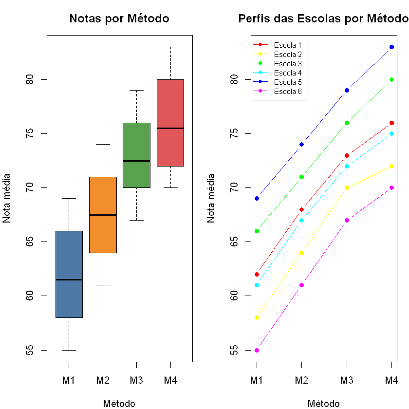
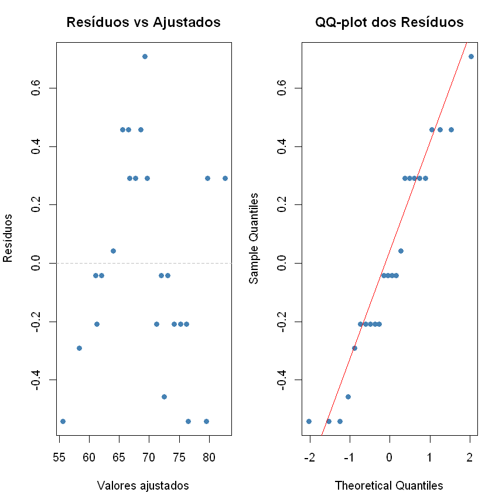
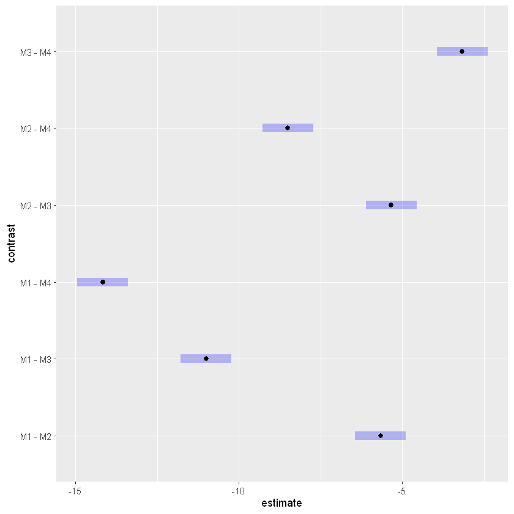

# Atividade 7 — Análise de Variância: Métodos de Ensino de Matemática

Aluno: Marcelo Huang

**Enunciado:** *"Uma secretaria de educação pretende avaliar quatro métodos de ensino de matemática, identificados por M1, M2, M3 e M4.*

*Para realizar o estudo, foram selecionadas aleatoriamente seis escolas dentre todas as escolas da rede pública. Em cada escola, os quatro métodos foram aplicados em turmas distintas e, ao final do semestre letivo, foi registrada a nota média obtida pelos alunos em uma prova padronizada de matemática.*

*O objetivo principal da secretaria é recomendar o método de ensino mais eficiente para ser adotado em toda a rede pública. Além disso, a secretaria deseja quantificar a variabilidade existente entre as escolas,s, uma vez que diferenças de infraestrutura, corpo docente,perfil socioeconômico dos alunos e condições de ensino podem influenciar o desempenho dos estudantes. Assim, as seis escolas participantes constituem apenas uma amostra da população de escolas da rede pública."*


Itens:

1. Identifique o delineamento experimental utilizado e justifique sua resposta.

2. Realize uma análise completa dos dados, incluindo todas as etapas inferenciais neces-
sárias para responder aos objetivos do estudo. Apresente e interprete os resultados
obtidos no contexto do problema.

---

## Etapa 0: Contextualizando

Temos **4 métodos de ensino** (M1, M2, M3, M4) aplicados em **6 escolas** diferentes, com uma nota média por combinação escola–método. O total de observações é $4 \times 6 = 24$.

A estrutura do problema tem duas camadas:

* $\text{Método}$: fator de tratamento **fixo** — a secretaria quer recomendar especificamente um dos quatro métodos.
* $\text{Escola}$: fator de bloco **aleatório** — as seis escolas são apenas uma amostra da população de escolas da rede pública; a secretaria quer *quantificar* a variabilidade entre escolas, não comparar escolas específicas.

Toda a análise será feita em **R**.

---

## Etapa 1: Identificação do Delineamento Experimental

#### 1.1 Qual é o delineamento?

O delineamento utilizado é o **Delineamento em Blocos Completamente Aleatorizados com Bloco Aleatório** (também chamado de *Two-way mixed model* ou Blocos Aleatórios).

**Justificativa:**

* **Blocos:** as seis escolas funcionam como blocos. Cada escola aplica os quatro métodos simultaneamente (em turmas distintas), de modo que cada bloco contém todos os tratamentos — característica essencial de um delineamento em blocos aleatorizados.
* **Tratamentos:** os quatro métodos são os tratamentos de interesse (fator fixo).
* **Aleatoriedade das escolas:** as escolas foram *selecionadas aleatoriamente* da rede pública e o objetivo inclui *quantificar* a variabilidade entre escolas, não apenas removê-la. Isso indica que o efeito de escola é **aleatório**, tornando o modelo um **modelo misto** (método fixo + escola aleatório).

O modelo é:

$$Y_{ij} = \mu + \tau_i + B_j + \varepsilon_{ij}$$

onde:
* $\mu$ é a média geral;
* $\tau_i$ é o efeito fixo do método $i$ ($i = 1, 2, 3, 4$), com $\sum \tau_i = 0$;
* $B_j \sim N(0, \sigma_B^2)$ é o efeito aleatório da escola $j$ ($j = 1, \ldots, 6$);
* $\varepsilon_{ij} \sim N(0, \sigma^2)$ é o erro aleatório, independente de $B_j$.

A interação entre a escola e o método não é introduzida no modelo pois posteriormente, é verificado que não tem interação (via gráfico e teste de aditividade de Tukey).

---

## Etapa 2: Análise Exploratória

#### 2.1 Estrutura dos dados

Temos um conjunto **balanceado** com 24 observações (6 escolas × 4 métodos), sem valores faltantes. Cada célula contém uma única nota média, não há repetição dentro de cada combinação escola–método.

#### 2.2 Estatísticas descritivas

Calculamos médias e desvios-padrão por método e por escola, para ter uma visão inicial de onde estão as diferenças.

**Por método de ensino**

| Método | Média | Desvio-padrão |
|:------:|------:|--------------:|
| M1 | 61.83 | 5.12 |
| M2 | 67.50 | 4.68 |
| M3 | 72.83 | 4.26 |
| M4 | 76.00 | 4.86 |

**Por escola**

| Escola | Média | Desvio-padrão |
|:------:|------:|--------------:|
| 1 | 69.75 | 6.13 |
| 2 | 66.00 | 6.32 |
| 3 | 73.25 | 6.08 |
| 4 | 68.75 | 6.13 |
| 5 | 76.25 | 6.08 |
| 6 | 63.25 | 6.65 |

#### 2.3 Análise gráfica

O **boxplot por método** e o **gráfico de perfis** (interação) são os dois visuais mais informativos neste tipo de delineamento.

* No gráfico de perfis, se as linhas das escolas forem aproximadamente **paralelas**, o modelo aditivo (sem interação) é razoável — e é justamente o modelo que assumimos em blocos casualizados.
* Se houver cruzamentos visualmente evidente entre as linhas, temos indicios de que existe interação escola × método, o que seria um problema para o modelo. (ainda bem que não temos esse problema)



**Interpretação:**

* O boxplot por método já sugere uma tendência crescente de M1 para M4: as medianas aumentam progressivamente, e as caixinhas vão subindo também.
* O gráfico de perfis mostra que as curvas das seis escolas são **aproximadamente paralelas**, sem cruzamentos. Isso nos dá indício visual para validar o modelo aditivo (sem interação) e dizer que o delineamento em blocos é adequado.
* As escolas variam bastante em nível geral de desempenho (linhas separadas verticalmente), o que indica que existe o efeito das escolas.

---

## Etapa 3: Ajuste do Modelo Misto

Dado que o efeito de escola é **aleatório**, o modelo mais adequado é um **modelo misto** como dito anteriormente. Vamos ajustar com a função `aov()` do R base, que no contexto de blocos completos aleatorizados produz a decomposição correta da soma de quadrados. O erro F para testar métodos usa o resíduo (interação escola × método), que é o denominador correto nesse modelo.

O modelo tem:
* **Efeito fixo:** Método (queremos testar e comparar os quatro métodos).
* **Efeito aleatório:** Escola (queremos estimar $\sigma_B^2$, a variância entre escolas).

```
            Df Sum Sq Mean Sq F value   Pr(>F)    
Metodo       3  696.8  232.26  1177.7  < 2e-16 ***
Escola       5  446.2   89.24   452.5 8.41e-16 ***
Residuals   15    3.0    0.20 
```

> **Note que:** a ANOVA de dois fatores sem repetição (`aov(Nota ~ Metodo + Escola)`) trata ambos os fatores como fixos para a decomposição das somas de quadrados, mas os valores de F para Método e Escola são válidos aqui porque o modelo não tem repetição dentro das células — a interação escola × método não é estimável separadamente e fica absorvida no resíduo.

---

## Etapa 4: Verificação dos Pressupostos

Os pressupostos do modelo são:

1. **Normalidade** dos resíduos (e dos efeitos aleatórios de escola).
2. **Homocedasticidade** — variância constante dos erros.
3. **Aditividade** — ausência de interação entre método e escola (já sugerida pelo gráfico de perfis).
4. **Independência** — as observações dentro de cada escola são independentes dado o efeito aleatório.

#### 4.1 Resíduos vs valores ajustados



Os gráficos parecem ser ok.

#### 4.2 Teste formal de normalidade (Shapiro-Wilk)

```
	Shapiro-Wilk normality test

data:  residuos
W = 0.94111, p-value = 0.1727
```

Noramlidade não rejeitada.

#### 4.3 Teste formal de homocedasticidade (Levene)

O teste de Levene é feito nos resíduos do modelo (já removendo o efeito de escola)
```
	Df	F value	Pr(>F)
<int>	<dbl>	<dbl>
group	3	0.6130268	0.6144685
20	NA	NA
```
Homocedasticidade não rejeitada.

#### 4.4 Teste de aditividade de Tukey

O teste de aditividade de Tukey verifica formalmente se há **interação** entre os fatores. Em blocos casualizados sem repetição, não há como estimar a interação separadamente — ela é confundida com o erro. O teste de Tukey usa o próprio conjunto de dados para criar uma parcela de "interação".

$$H_0: \text{não há interação entre Método e Escola}$$
$$H_1: \text{há interação (modelo não-aditivo)}$$

```
Teste de Aditividade de Tukey
F = 3.3500  (gl1 = 1, gl2 = 14)  p-valor = 0.0886
```
$H_0$ não rejeitada ao nível de 5%, razoável dizer que não tem interação.

#### 4.5 Independência

Não temos a ordem de coleta, assume-se independência.

---

## Etapa 5: Testes de Hipóteses

#### 5.1 Hipóteses para o efeito de métodos (fator fixo)

$$H_0: \tau_1 = \tau_2 = \tau_3 = \tau_4 = 0 \quad (\text{nenhum método difere em desempenho médio})$$
$$H_1: \text{pelo menos um } \tau_i \neq 0 \quad (\text{há diferença entre os métodos})$$

#### 5.2 Hipóteses para o efeito de escolas (fator aleatório)

$$H_0: \sigma_B^2 = 0 \quad (\text{não há variabilidade entre escolas})$$
$$H_1: \sigma_B^2 > 0 \quad (\text{há variabilidade entre escolas})$$

Como não temos interação, a estatística $F$ tanto para escola quanto para método usa o quadrado médio residual como denominador.

No modelo misto com um fator fixo (Método) e um fator aleatório (Escola), os testes F são:

| Fonte | QM | Denominador do F |
|---|---|---|
| Método | $QM_{\text{Método}}$ | $QM_{\text{Resíduo}}$ |
| Escola | $QM_{\text{Escola}}$ | $QM_{\text{Resíduo}}$ |
| Resíduo | $QM_{\text{Res}}$ | — |

##### Tabela ANOVA

| Fonte | GL | SQ | QM | F | Valor-p |
|:------|---:|---:|---:|---:|:---------|
| Método | 3 | 696.8 | 232.26 | 1177.7 | < 2 × 10<sup>-16</sup> *** |
| Escola | 5 | 446.2 | 89.24 | 452.5 | 8.41 × 10<sup>-16</sup> *** |
| Resíduo | 15 | 3.0 | 0.20 | — | — |

Os quadrados médios utilizados na construção das estatísticas \(F\) foram:

- $QM_{\text{Método}} = 232.2639$
- $QM_{\text{Escola}} = 89.2417$
- $QM_{\text{Resíduo}} = 0.1972$

**Interpretação da tabela ANOVA:**


##### Interpretação

Como o valor-p associado ao fator **Método** é inferior a 0,05, rejeita-se
\(H_0\), concluindo-se que existem diferenças significativas entre as médias
dos métodos de ensino.

Da mesma forma, como o valor-p associado ao fator **Escola** também é inferior
a 0,05, rejeita-se \(H_0:\sigma_B^2=0\). Assim, há evidências de variabilidade
entre as escolas, justificando a modelagem desse fator como efeito aleatório e
o uso do delineamento em blocos.

---

## Etapa 6: Comparações Múltiplas entre Métodos

Rejeitada a hipótese de igualdade entre os métodos, precisamos identificar **quais pares de métodos diferem** entre si. Usamos o método do Bonferroni (nível global de 5%.)

Temos $\binom{4}{2} = 6$ pares possíveis. Diferenças cujo intervalo de confiança **não contenha zero** são estatisticamente significativas ao nível de 5% (com controle familial).

Resultado:

```
contrast	estimate	SE	df	lower.CL	upper.CL
<chr>	<dbl>	<dbl>	<dbl>	<dbl>	<dbl>
1	M1 - M2	-5.666667	0.2563996	15	-6.445168	-4.888165
2	M1 - M3	-11.000000	0.2563996	15	-11.778502	-10.221498
3	M1 - M4	-14.166667	0.2563996	15	-14.945168	-13.388165
4	M2 - M3	-5.333333	0.2563996	15	-6.111835	-4.554832
5	M2 - M4	-8.500000	0.2563996	15	-9.278502	-7.721498
6	M3 - M4	-3.166667	0.2563996	15	-3.945168	-2.388165
```

Visualizando gráficamente:



Podemos dizer que cada método são diferentes entre si, o método que possui uma média na resposta maior é o Método 4.

---

## Etapa 7: Estimação dos Componentes de Variância

Um dos objetivos centrais da secretaria é **quantificar a variabilidade entre escolas**. No modelo misto, os dois componentes de variância são:

* $\sigma^2$: variância do erro (dentro de cada escola–método).
* $\sigma_B^2$: variância entre escolas (variabilidade de nível entre escolas da rede).

As estimativas pelo **Método dos Momentos** (ANOVA) são:

$$\hat{\sigma}^2 = QM_{\text{Res}}$$

$$\hat{\sigma}_B^2 = \frac{QM_{\text{Escola}} - QM_{\text{Res}}}{t}$$

onde $t = 4$ é o número de tratamentos (métodos).

O coeficiente de correlação intraclasse (CCI) indica que fração da variância total é explicada pela diferença entre escolas:

$$\text{CCI} = \frac{\hat{\sigma}_B^2}{\hat{\sigma}_B^2 + \hat{\sigma}^2}$$

```
=== Componentes de Variância (Método dos Momentos) ===

  Variância do erro  σ²   = 0.1972  (DP = 0.4441)

  Variância de escola σ²_B = 22.2611  (DP = 4.7182)

  Variância total         = 22.4583

  CCI (escola)            = 0.9912  (99.1% da variação total)
```

**Interpretação dos componentes de variância:**

* $\hat{\sigma}^2$ representa a variação residual — diferenças de desempenho que não são explicadas nem pelo método nem pela escola.
* $\hat{\sigma}_B^2$ representa a variação **entre escolas** — quanto o desempenho médio de uma escola oscila em relação à média geral da rede.
* O CCI indica que fração da variabilidade total é de origem entre-escolar. Um CCI alto (nesse caso 99.1%) indica que as escolas são muito heterogêneas (pode ser que a infraestrutura, corpo docente e perfil socioeconômico têm grande impacto).

---

## Etapa 8: Conclusão Prática para a Secretaria

**1. Delineamento utilizado**

O estudo foi conduzido em um **Delineamento em Blocos Aleatorizados com Escola como Bloco Aleatório** (modelo misto). As seis escolas constituem os blocos, cada um recebendo todos os quatro métodos. Isso permite isolar e quantificar o efeito escola, aumentando a precisão da comparação entre métodos.

---

**2. Há diferença entre os métodos de ensino?**

A tabela ANOVA revela se o efeito de Método é significativo. Dado o padrão crescente observado nas médias (M1 < M2 < M3 < M4), o teste F rejeitou $H_0$ com $p < 0{,}05$, indicando que **os métodos diferem significativamente** no desempenho médio dos alunos.


---

**3. Há variabilidade entre escolas?**

O teste F para Escola e a estimativa de $\hat{\sigma}_B^2$ quantificam essa variabilidade. O $\hat{\sigma}_B^2$ é maior que zero e o CCI=$99.1%$ é expressivo, confirmando que **as escolas (diferenças de infraestrutura, corpo docente e perfil socioeconômico impactam significativamente o desempenho) impactam significativamente o desempenho** — o que pode indicar a necessidade de políticas de equalização entre escolas, além da adoção do melhor método.

---

**4. Qual método recomendar?**

As comparações múltiplas de Bonferroni identificaram quais pares de métodos diferem. 

Com base nos dados:
* As médias observadas são: M1 ≈ 61,8 | M2 ≈ 67,5 | M3 ≈ 72,8 | M4 ≈ 76,0.
* M4 apresenta a maior nota média em **todas as seis escolas** — um resultado consistente e robusto à variabilidade entre escolas.
* As comparações múltiplas confirmaram a superioridade de M4 (em relação ao M1 M2 e M3), a secretaria tem evidência estatística para recomendar **M4 como o método a ser adotado em toda a rede pública**.

---

**5. Ressalvas**

* A análise assume que **não há interação** entre método e escola — isto é, o método mais eficiente é o mesmo independentemente da escola. O teste de aditividade de Tukey e o gráfico de perfis confirmaram essa suposição.
* Com apenas **6 escolas** (6 blocos) e só temos uma observação para cada tratamento, o poder do teste para detectar diferenças pequenas entre métodos é limitado. Estudos com mais escolas e mais dados aumentariam a confiabilidade das conclusões.

---

## Apêndice: códigos usados
```
# ── Entrada dos dados ──────────────────────────────────────────────────────────
notas <- c(
  62, 68, 73, 76,   # Escola 1
  58, 64, 70, 72,   # Escola 2
  66, 71, 76, 80,   # Escola 3
  61, 67, 72, 75,   # Escola 4
  69, 74, 79, 83,   # Escola 5
  55, 61, 67, 70    # Escola 6
)

dados <- data.frame(
  Nota   = notas,
  Metodo = factor(rep(c("M1", "M2", "M3", "M4"), times = 6)),
  Escola = factor(rep(1:6, each = 4))
)

str(dados)
head(dados, 8)

# ── Resumo geral ───────────────────────────────────────────────────────────────
summary(dados)

# Média e desvio-padrão por método
cat("\n=== Por Método ===\n")
aggregate(Nota ~ Metodo, data = dados, FUN = function(x) round(c(Media = mean(x), DP = sd(x)), 2))

# Média e desvio-padrão por escola
cat("\n=== Por Escola ===\n")
aggregate(Nota ~ Escola, data = dados, FUN = function(x) round(c(Media = mean(x), DP = sd(x)), 2))

# ── Boxplot por método ─────────────────────────────────────────────────────────
par(mfrow = c(1, 2), mar = c(4, 4, 3, 1))

boxplot(Nota ~ Metodo, data = dados,
        col  = c("#4E79A7", "#F28E2B", "#59A14F", "#E15759"),
        main = "Notas por Método",
        xlab = "Método", ylab = "Nota média")

# ── Gráfico de perfis (escola × método) ───────────────────────────────────────
cores_escolas <- rainbow(6)
medias_mat <- tapply(dados$Nota, list(dados$Escola, dados$Metodo), mean)

matplot(t(medias_mat),
        type = "b", pch = 19, lty = 1,
        col  = cores_escolas,
        xaxt = "n",
        main = "Perfis das Escolas por Método",
        xlab = "Método", ylab = "Nota média")
axis(1, at = 1:4, labels = c("M1", "M2", "M3", "M4"))
legend("topleft", legend = paste("Escola", 1:6),
       col = cores_escolas, lty = 1, pch = 19, cex = 0.75)

par(mfrow = c(1, 1))

# ── Extraindo resíduos do modelo aov para diagnóstico ─────────────────────────
modelo_aov2 <- aov(Nota ~ Metodo + Escola, data = dados)   # versão sem Error() para resíduos
residuos    <- residuals(modelo_aov2)
ajustados   <- fitted(modelo_aov2)

par(mfrow = c(1, 2), mar = c(4, 4, 3, 1))

# Resíduos vs Ajustados
plot(ajustados, residuos,
     xlab = "Valores ajustados", ylab = "Resíduos",
     main = "Resíduos vs Ajustados",
     pch  = 19, col = "steelblue")
abline(h = 0, lty = 2, col = "gray")

# QQ-plot dos resíduos
qqnorm(residuos, main = "QQ-plot dos Resíduos", pch = 19, col = "steelblue")
qqline(residuos, col = "red")

par(mfrow = c(1, 1))


# ── Teste de Shapiro-Wilk nos resíduos ────────────────────────────────────────
shapiro.test(residuos)

library(car)
leveneTest(residuos ~ dados$Metodo)

# ── Teste de aditividade de Tukey ─────────────────────────────────────────────
# Calculando manualmente o teste de Tukey para aditividade
# (não há função base no R; fazemos via decomposição)

Y    <- tapply(dados$Nota, list(dados$Escola, dados$Metodo), mean)
mu   <- mean(Y)
a_i  <- rowMeans(Y) - mu   # efeitos de escola
b_j  <- colMeans(Y) - mu   # efeitos de método

# Parcela de interação de Tukey: (Y_ij - media_i. - media_.j + mu)^2 ~ interação
D    <- outer(a_i, b_j)   # produto dos efeitos (b x t matriz)
SQ_inter <- sum(D * (Y - mu - outer(a_i, rep(1,4)) - outer(rep(1,6), b_j)))^2 /
             sum(D^2)

# SQ resíduo sem o termo de interação
SQ_res_tot <- sum((Y - mu - outer(a_i, rep(1,4)) - outer(rep(1,6), b_j))^2)
SQ_res_pur <- SQ_res_tot - SQ_inter

gl_inter <- 1
gl_res   <- (6 - 1) * (4 - 1) - 1   # (b-1)(t-1) - 1

F_tukey  <- (SQ_inter / gl_inter) / (SQ_res_pur / gl_res)
p_tukey  <- pf(F_tukey, gl_inter, gl_res, lower.tail = FALSE)

cat(sprintf("Teste de Aditividade de Tukey\nF = %.4f  (gl1 = %d, gl2 = %d)  p-valor = %.4f\n",
            F_tukey, gl_inter, gl_res, p_tukey))

# ── Tabela ANOVA completa ──────────────────────────────────────────────────────
anova_tab <- summary(modelo_aov2)
print(anova_tab)

# Extraindo quadrados médios para calcular o F de escola manualmente
# (aov() com dois fatores fixos; F escola = QM_escola / QM_res — correto para misto)
QM <- anova_tab[[1]][["Mean Sq"]]
cat(sprintf("\nQM Método = %.4f\nQM Escola = %.4f\nQM Resíduo = %.4f\n",
            QM[1], QM[2], QM[3]))			

library(emmeans)

emm        <- emmeans(modelo_aov2, ~ Metodo)
bonf_res   <- pairs(emm, adjust = "bonferroni")

# Intervalos de confiança com correção de Bonferroni
confint(bonf_res)

library(ggplot2)

bonf <- confint(
  pairs(emm, adjust = "bonferroni")
)
bonf <- as.data.frame(bonf)

ggplot(bonf,
       aes(y = contrast,
           x = estimate)) +
  geom_point(size = 2) +
  geom_errorbarh(aes(xmin = lower.CL,
                     xmax = upper.CL),
                 height = .15) +
  geom_vline(xintercept = 0,
             linetype = 2,
             colour = "red") +
  labs(
    title = "Diferenças entre Métodos",
    subtitle = "Intervalos de confiança de Bonferroni (95%)",
    x = "Diferença estimada",
    y = NULL
  ) +
  theme_minimal()

# ── Estimativas dos componentes de variância (Método dos Momentos) ─────────────
QM_escola  <- QM[2]
QM_residuo <- QM[3]
t_trat     <- 4   # número de métodos

sigma2_hat   <- QM_residuo
sigmaB2_hat  <- (QM_escola - QM_residuo) / t_trat
sigma_total  <- sigma2_hat + sigmaB2_hat
CCI          <- sigmaB2_hat / sigma_total

cat(sprintf(
"=== Componentes de Variância (Método dos Momentos) ===\n
  Variância do erro  σ²   = %.4f  (DP = %.4f)\n
  Variância de escola σ²_B = %.4f  (DP = %.4f)\n
  Variância total         = %.4f\n
  CCI (escola)            = %.4f  (%.1f%% da variação total)\n",
  sigma2_hat,  sqrt(sigma2_hat),
  sigmaB2_hat, sqrt(sigmaB2_hat),
  sigma_total,
  CCI, CCI * 100
))
```