# Atividade 3 -- Análise de Regressão:
 
Aluno: Marcelo Huang

Enunciado: "*O conjunto acima envolve as covariáveis Ano de Experiencia, Ano de Escolaridade,
Setor do Trabalho, Idade do Funcionario e a resposta Log(Salário). Ajuste um
modelo de regressão considerando as 4 etapas discutidas em sala.*

E a partir dos teste t's de construções, faça teste F parcial. Use type III.
## Etapa 0:  Contextualizando

Nesta atividade, será realizada uma análise de um conjunto de dados dito na sala de aula, usando um modelo de regressão linear. A partir desses dados, serão conduzidos: Diagnóstico/Análise de resíduos; Detecção de outliers e pontos influentes; Testes estatísticas; e validação do modelo.

O conjunto de dados é composto por 3 covariáveis e 1 variável resposta:

* $X_1$: Anos de Experiência profissional
* $X_2$: Anos de Escolaridade
* $X_3$: Variável dummy, é 1 ou 0. 1 significa **Privado**, 0 significa **Público**
* $X_4$: Idade da pessoa
* $Y$: log(Salário).


---

O conjunto de dados (total de 24 observações) foi dividido em duas partes: teste (7 observações: 1;5;8;13;14;18;19), treino (17 observações: o resto que sobrou)


*Nessa atividade, as análises serão realizadas no software **R**, utilizando funções da linguagem, nativas e/ou de pacotes externas*

## Etapa 1: 
*Pegar os dados brutos e começa a verificar inconveniências.*

Nesse contexto seria verificar a consistência entre idade, experiência e escolaridade.

* Corrigir
* Transformar 
* Remover

*Todas ações feitas devem ser documentadas e justificadas.*

#### 1.1 Carregando os dados:

# Dados do Experimento

|Indice| Ano_Exper | Ano_Escol | Setor | Idade | Log(Salario) |
|------------|------------|--------|--------|---------------|---------------|
|21|	3	|11|	0	|33|	7.997|
|6	|3	|14|	1|	42|	8.388|
| ... | ... | ... | ... | ... |... |
|10	|18	|18	|0	|28	|9.174|
|24	|6	|10|	1	|23|	8.033|

#### 1.2 Verificando inconsistências:

Para um indivíduo, a idade deve ser compatível com anos de experiência e escolaridade. Geralmente a idade de início da vida profissional pode ser aproximada por:

**Início=Idade−(Experiencia + Escolaridade + 6)**

Supondo que a escolaridade ***formal*** comece aos 6 anos. Além disso o início da vida profissional deve ser maior ou igual a 16 anos para ser razoável (podendo ter uma margem de erro).

|Índice da Observação | Idade | Anos de Experiencia | Anos de Escolaridade | Início do trabalho |
|------------|------------|------------|--------|---------------|
|9 | 22  | 17 |  17 | -6 |
|10| 28 | 18 |  18 | -2 |
|11| 28  | 16 |  16 | 2 |
|3| 22  | 9 |  13 | 6 |
| ... | ... | ... | ... | ... |

Tabela acima é ordenada de maneira crescente pelo "Início do trabalho".
Fazendo a conta usando a aproximação dada acima, pode-se perceber que existe algumas observações estranhas, por exemplo: 

* Observação **9**: 

-> Idade=22, Experiencia=17, Escolaridade=17. Início = 22 – 17 – (17 – 6) = 22 – 17 – 11 = –6. 

-> Para ter 17 anos de experiência e 17 de escolaridade, seriam necessários pelo menos 17+11=28 anos de vida. Com 22 anos, é praticamente impossível, a não ser que a pessoa começou a trabalhar e estudar aos 5 anos, tal probabilidade não é nula. Manter.

* Observação **10**:

-> Idade=28, Experiencia=18, Escolaridade=18. Início = 28 – 18 – 12 = –2.

-> Mesmo problema da observação 10: seriam necessários no mínimo 30 anos de vida. a não ser que a pessoa começou a trabalhar e estudar aos 5 anos, tal probabilidade não é nula. Manter.


* Observação **11**:

-> Idade=28, Experiencia=16, Escolaridade=16. Início = 28 – 16 – 10 = 2.

-> Aqui a idade de início seria 2 anos. O total de anos “ocupados” (experiência + escolaridade pós-6) é 16+10=26, contra 28 de idade, sobrariam apenas 2 anos antes dos 6, ou seja, a pessoa teria começado a trabalhar aos 2 anos. Não provável, mas pode trabalhar e estudar ao mesmo tempo. Manter.

* Observação **3**: Idade=22, Experiencia=9, Escolaridade=13. Início = 22 – 9 – 7 = 6.

-> Mais ou menos possível. A anomalia é menos grave. Manter.

#### **Logo nenhuma observação é removida, o conjunto de treino ainda contém 17 observações

---
#### 1.3 Análise gráfica para linearidade:


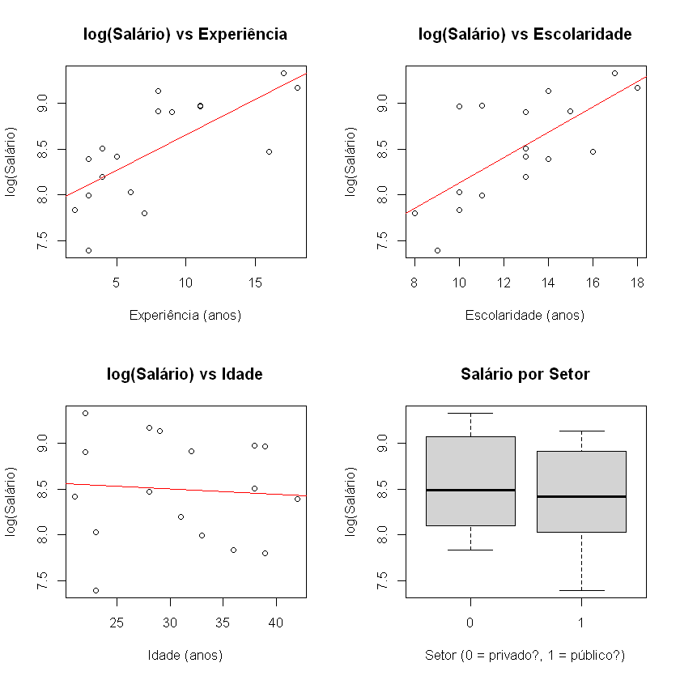

As variáveis Experiência, Escolaridade, e Idade apresentam comportamento linear com a resposta log(Salário). Não tem indícios da necessidade de uma transformação.

---

#### 1.4 Análise descritiva das covariáveis

| Variável | Min. | 1st Qu. | Median | Mean | 3rd Qu. | Max. |
|-----------|------|----------|---------|------|----------|------|
| Experiencia | 2.000 | 4.000 | 7.000 | 7.941 | 11.000 | 18.000 |
| Escolaridade | 8.00 | 10.00 | 13.00 | 12.65 | 14.00 | 18.00 |
| Setor | 0.0000 | 0.0000 | 1.0000 | 0.5294 | 1.0000 | 1.0000 |
| Idade | 21.00 | 23.00 | 31.00 | 30.82 | 38.00 | 42.00 |
| LogSalario | 7.392 | 8.033 | 8.470 | 8.496 | 8.970 | 9.330 |

---

#### 1.5 Concluindo etapa 1

* A base de treino tem 17 observações.

* As variáveis estão nos intervalos esperados, sem erros de digitação óbvios.

* A verificação de idade de início de trabalho mostrou valores entre X e Y, a maior parte dos dados é plausível, tem algumas observações pouco inconveniente mas foram mantidas.

* Os gráficos de dispersão sugerem relação aproximadamente linear entre log-salário e as preditoras, exceto talvez a Idade, que apresentou pouco efeito no log-salário. O boxplot de Setor mostra diferença de medianas, indicando possível efeito.


---

## Etapa 2:

*Para a base da nossa análise, deve se verificar as seguintes coisas:*

* Redução de dimensão das covariáveis (Parcimonia)
* Matriz de correlação
* Matriz de dispersão
* Multicolinearidade, usando critério de VIF (Variance Inflation Factor) como medida
* Seleção de variáveis

*Qual o ponto dessa etapa? Preparar as covariáveis para o ajuste. *

***Covariáveis IMPORTANTES/RELEVANTES***

| | Experiencia | Escolaridade | Idade | LogSalario |
| :--- | :---: | :---: | :---: | :---: |
| **Experiencia** | 1.000 | 0.636 | -0.250 | 0.711 |
| **Escolaridade** | 0.636 | 1.000 | -0.285 | 0.698 |
| **Idade** | -0.250 | -0.285 | 1.000 | -0.071 |
| **LogSalario** | 0.711 | 0.698 | -0.071 | 1.000 |

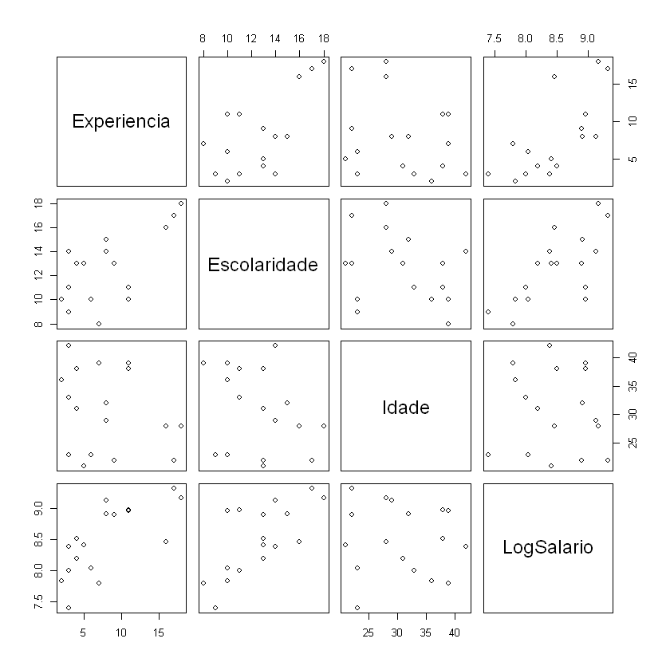
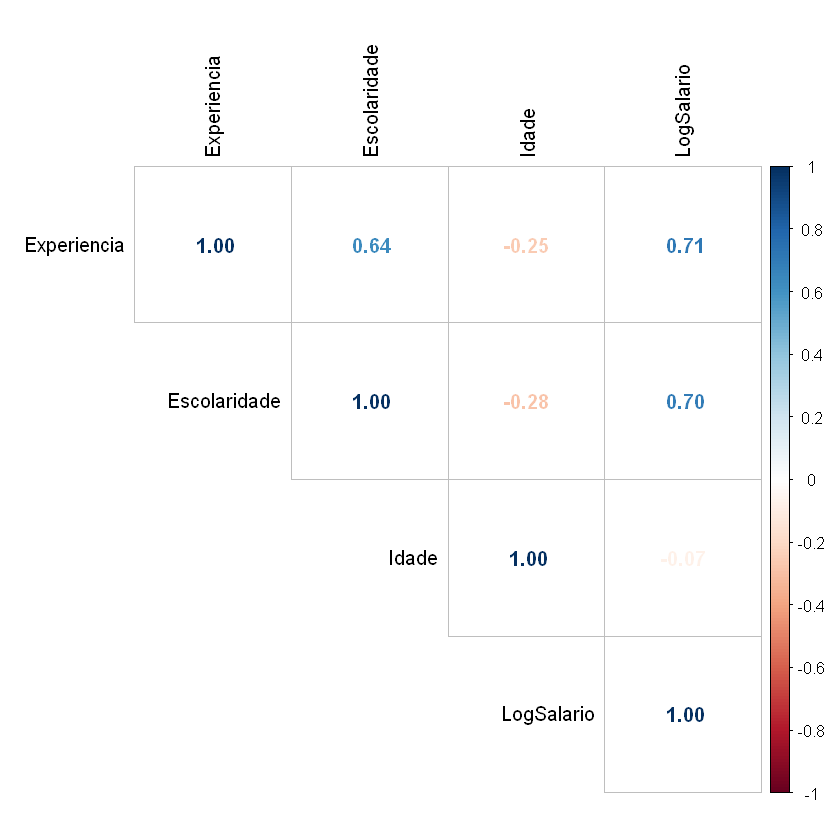

A matriz de correlação não revela correlações muito fortes entre as variáveis preditoras (todas as correlações entre pares de preditores são menores que 0,7 em valor absoluto). Isso sugere **ausência de multicolinearidade** problemática, indicando que as covariáveis são aproximadamente linearmente independentes entre si.

---

#### 2.2 Diagnóstico de multicolinearidade usando VIF (Variance Inflation Factor) como medida

| | Experiencia | Escolaridade | Setor | Idade |
| :--- | :---: | :---: | :---: | :---: |
| **VIF** | 1.71 | 1.85 | 1.21 | 1.75 |


Os Valores do Fator de Inflação da Variância (VIF) são todos inferiores a 2. Esse resultado confirma a **ausência de multicolinearidade**; não há evidência de que alguma preditora seja combinação linear das demais.

---

#### 2.3 Seleção de variáveis

* Stepwise: a saída em R fica do jeito abaixo


```text
Call:
lm(formula = LogSalario ~ Experiencia + Escolaridade, data = dados)

Coefficients:
 (Intercept)   Experiencia  Escolaridade  
     7.07122       0.04919       0.08180  
```

O método stepwise partiu do modelo nulo e 
adicionou/removeu termos até encontrar o modelo com menor AIC. O modelo selecionado contém 
**Escolaridade, Experiencia**. As variável Setor e Idade foram excluídas.

* Cp de Mallows:
```text
Selection Algorithm: exhaustive
         Experiencia Escolaridade Setor1 Idade
1  ( 1 ) "*"         " "          " "    " "  
2  ( 1 ) "*"         "*"          " "    " "  
3  ( 1 ) "*"         "*"          " "    "*"  
4  ( 1 ) "*"         "*"          "*"    "*"  
......
```

| | 1 variável | 2 variável | 3 variável | 4 variável |
| :--- | :---: | :---: | :---: | :---: |
| **Cp de Mallows** |5.44  | 3.64 |  4.61  | 5.000000 

os Cp de Mallows são:

1 variável: 5.44 (Escolaridade);
***2 variável:  3.64  (Experiencia + Escolaridade);***
3 variável: 4.61  (Experiencia + Escolaridade + Idade);
4 variável: 5.00  (Experiencia + Escolaridade + Idade + Setor)

O modelo com menor Cp é o de 2 variáveis (Experiencia + Escolaridade).

---

* LASSO: 

```text
5 x 1 sparse Matrix of class "dgCMatrix"
             lambda.min
(Intercept)  7.40210261
Experiencia  0.03842477
Escolaridade 0.06239494
Setor        .         
Idade        . 
```

O LASSO reteve Experiencia, Escolaridade, e atribui valores baixos de $\lambda$ para Setor e Idade.

---

#### 2.4 Conclusão da Etapa 2

* A Matriz de Correlação não mostrou correlações elevadas entre preditoras, e os VIFs (todos próximos abaixos de 2) confirmaram ausência de multicolinearidade. 

* Na seleção de variáveis, o método Stepwise reteve Experiencia, Escolaridade, assim como o Cp de Mallows, e assim como LASSO. 

* Em respeito aos métodos usados (Stepwise, Cp e LASSO), selecionamos para a etapa seguinte **o modelo com Experiencia e Escolaridade**.”

---

## Etapa 3:

1. Ajustar o modelo
2. Fazer Diagnóstico/ análise de resíduo para verificar os pressupostos:
* Lineraridade (gráfico de resíduos vs. valores ajustados)
* Homocedasticidade (o mesmo gráfico + teste de Breusch-Pagan ou outros testes)
* Normalidade dos erros (QQ-plot + teste de Shapiro-Wilk ou outros)
* Independência (gráfico de resíduos vs. ordem de coleta, nesse caso não temos a ordem)

3. Se passar pelo crivo da análise de resíduo --> prossiga
4. Inclua a parte de detecção de outliers e pontos influentes. Opções: $H_{ii}$; DF-Betas; DF-Fits; D-Cook
5. Após análise de resíduo faça testes: F-Global; t; F-Parcial
---

#### 3.1 Ajuste do modelo

Pela etapa 2, o modelo é da forma

$ Y = log(salário) = {\beta}_0 + {\beta}_1\text{Experiencia}  + {\beta}_2\text{Escolaridade} + \varepsilon_{ij} $

```
Call:
lm(formula = LogSalario ~ Experiencia + Escolaridade, data = dados)
... ...
Coefficients:
             Estimate Std. Error t value Pr(>|t|)    
(Intercept)   7.07122    0.45630  15.497  3.3e-10 ***
Experiencia   0.04919    0.02384   2.063   0.0581 .  
Escolaridade  0.08180    0.04292   1.906   0.0774 .
... ...
```

* Coeficientes estimados: $\hat{\beta_0} = 7.07$, $\hat{\beta_1} = 0.05$, $\hat{\beta_2} = 0.08$

Interpretação: 

Para cada ano adicional de Experiência, o log-Salário aumenta em média 4%, mantendo a Escolaridade fixa; 

Para cada ano adicional de Escolaridade, o log-salário aumenta em média 8%, mantendo a escolaridade fixa”; 

Não tem interpretação para $\beta_0$ pois aparentemente 0 não está no range das covariáveis Experiência e Escolaridade.

---

#### 3.2 Diagnóstico/ Análise de resíduos
##### 3.2.1 Linearidade

O gráfico de resíduos vs valores ajustados.

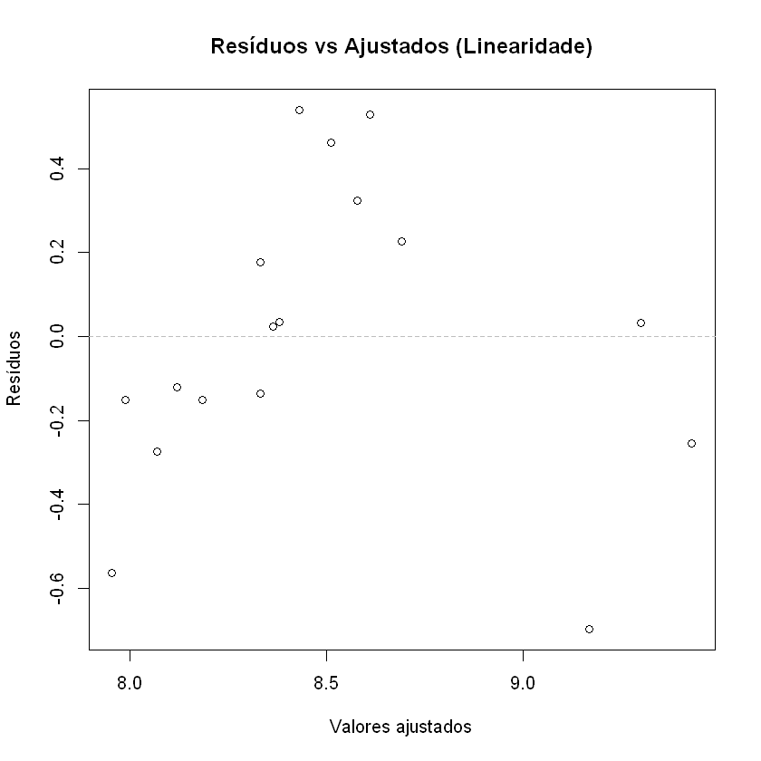

Aparenta ter alguma estrutura de um U invertido, isso pode indicar que um termo quadrático é necessário no modelo (supostamente Experiência^2), mas faço isso se sobrar tempo. Por enquanto vou prosseguir como o mesmo modelo para ver o que acontece.

---


##### 3.2.2 Homocedasticidade

O gráfico seria o mesmo de antes.

Mas formalmente, pode-se fazer um teste de Breusch-Pagan.

```
	studentized Breusch-Pagan test

data:  modelo
BP = 3.9642, df = 2, p-value = 0.1378
```

Valor-p de 0.1378 não é pequeno, a hipótese da homocedasticidade não é violada, podemos prosseguir.

---

##### 3.2.3 Normalidade dos Erros

QQ-Plot e teste de Shapiro-Wilk:

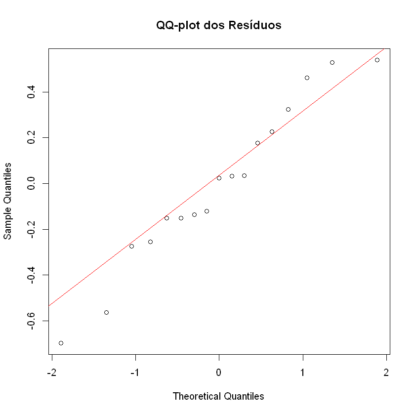

```
	Shapiro-Wilk normality test

data:  residuos
W = 0.96178, p-value = 0.6652
```
* No QQ-plot, a maioria dos pontos estão perto da reta. Pequenos desvios nas caudas são toleráveis com n = 21.

* O teste Shapiro-Wilk: $H_0$ = os dados vêm de uma distribuição normal.

Valor-p = 0.66, não rejeita $H_0$ (que afirma os dados são normalmente distribuídos)

(Claro, mesmo se valor-p fosse razoavelmente pequeno, Note que a regressão linear é robusta a desvios de normalidade especialmente para amostras não muito pequenas.)

---

##### 3.2.4 Independência
Como não temos a ordem de coleta, assumimos que são independentes.

---

#### 3.3 Análise de outliers e pontos influentes

##### 3.3.1 Resíduos studentized e alavancagem (os $H_{ii}$)

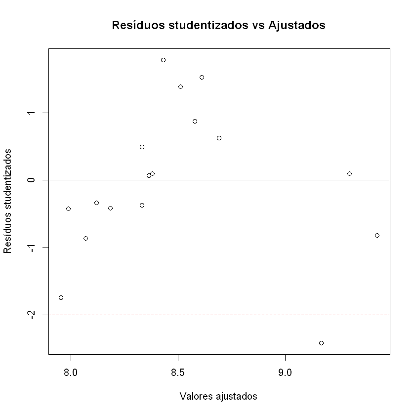


```
Possíveis outliers (resíduo studentizado > |2|):
   Experiencia Escolaridade Setor Idade LogSalario
11          16           16     0    28       8.47

```

Note que a observação 11 foi classificada como outlier pelo resíduo studentizado.

Calculuando os valores de alavancagem ($h_{ii}$):
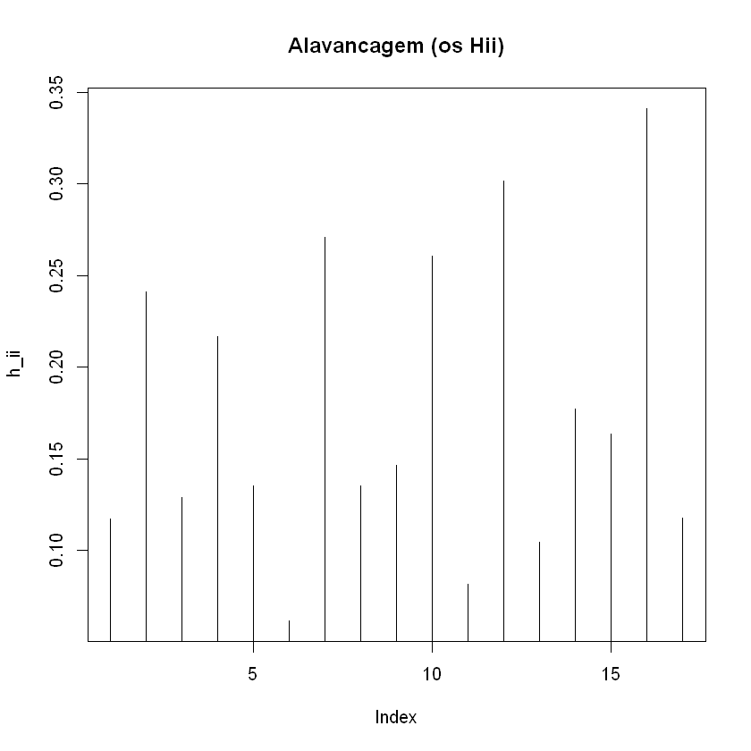

Não tem valores ($h_ii$) maiores que o limiar = 0.35, ou seja ninguém é considerado de alta alavancagem e merece atenção.

---

##### 3.3.2 Distância de Cook
Distância de Cook mede influência global, serve para identificar observações que "puxam" ou desviam a linha de regressão.

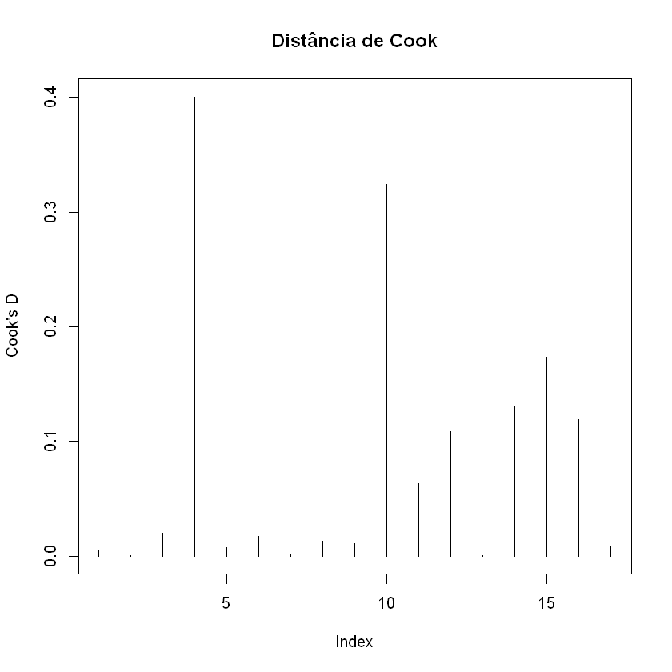

Usando o limiar $F_{n,n-p,0.5}$, nenhuma observação apresentou distância de Cook acima do limite formal,
sugerindo ausência de pontos altamente influentes no ajuste global
da regressão.

---

#### 3.3.3 DFFITS e DFBETAS
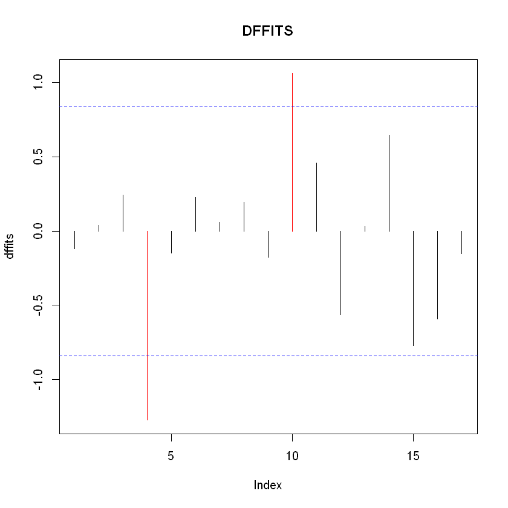

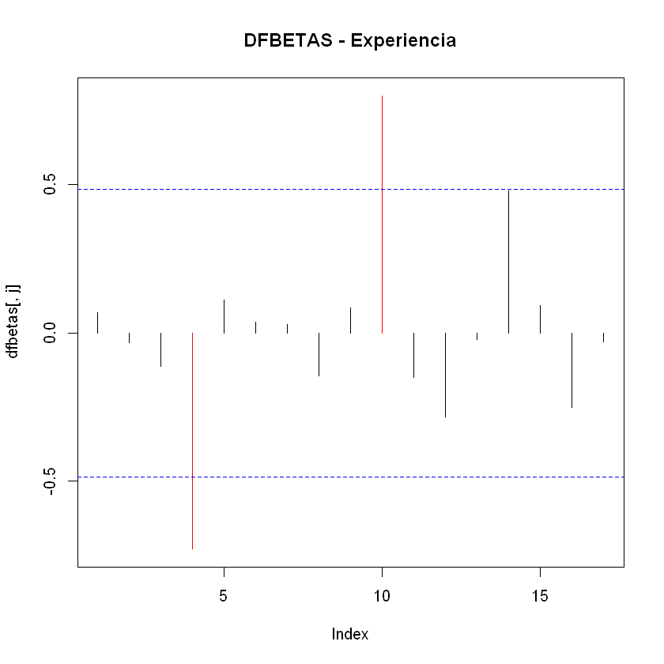

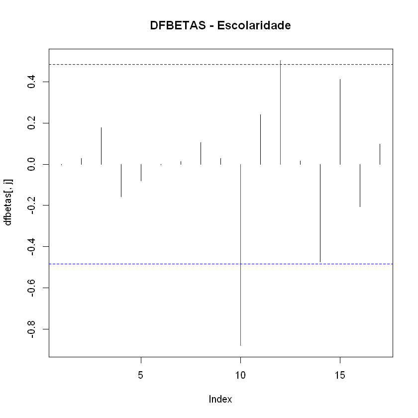

As observações 4 e 10 do treino possuem alta alavancagem, além disso elas se destacam em DFFits e em DFBETAS para Experiencia. Devem ser investigados.

| Estimativa dos $\beta$ | Ambos | Sem4 | Sem10 | Sem ambos |
|-----------|--------|--------|---------|------------|
| (Intercept) | 7.07122157 | 6.9309315 | 6.72441238 | 6.6445531 |
| Experiencia | 0.04919066 | 0.0641627 | 0.03147366 | 0.0476804 |
| Escolaridade | 0.08179765 | 0.0876268 | 0.11694960 | 0.1173557 |

---


#### 3.4 Testes de significância formais

Fazendo um sumário do modelo com comando "summary" do R, tem-se:

```
Call:
lm(formula = LogSalario ~ Experiencia + Escolaridade, data = dados)

Residuals:
     Min       1Q   Median       3Q      Max 
-0.69703 -0.15158  0.02404  0.22629  0.53970 

Coefficients:
             Estimate Std. Error t value Pr(>|t|)    
(Intercept)   7.07122    0.45630  15.497  3.3e-10 ***
Experiencia   0.04919    0.02384   2.063   0.0581 .  
Escolaridade  0.08180    0.04292   1.906   0.0774 .  
---
Signif. codes:  0 '***' 0.001 '**' 0.01 '*' 0.05 '.' 0.1 ' ' 1

Residual standard error: 0.3776 on 14 degrees of freedom
Multiple R-squared:  0.6071,	Adjusted R-squared:  0.551 
F-statistic: 10.82 on 2 and 14 DF,  p-value: 0.001446
```
Note que o $R^2$ ajustado é 0.551

Após confirmar que os pressupostos são aceitáveis, realiza-se os testes:

* Teste F global: já obtido no summary. Conclusão: Rejeita H0: $\beta_1$ = $\beta_2$ = 0， valor-p = 0.0014

* Testes t individuais: obtido no summary. Tanto para $\beta_1$ quanto para $\beta_2$,
todos os valores-p não foram inferiores a 0.05 , não rejeita a hipótese de que são nulas.

Teste F parcial: serve para comparar o modelo reduzido com o modelo completo (incluindo Setor e Idade). Isso avalia se as variáveis excluídas são conjuntamente significativas.

Usando **R** e o type III do teste parcial (comando é Anova(modelo, type = "III")), a saída fica: 

```
A anova: 4 × 4
Sum Sq	Df	F value	Pr(>F)
<dbl>	<dbl>	<dbl>	<dbl>
(Intercept)	34.2369378	1	240.151437	3.304527e-10
Experiencia	0.6069104	1	4.257110	5.814262e-02
Escolaridade	0.5178092	1	3.632119	7.741689e-02
Residuals	1.9958953	14	NA	NA

```
Assim, pode-se dizer que:

* Para Experiência: valor-p = 0.058 não é muito pequeno, isso significa que remover “Experiência” piora (moderadamente) o ajuste do modelo, mesmo mantendo “Escolaridade”.

* Para Escolaridade: valor-p = 0.074 não é muito pequeno, isso significa que remover Escolaridade piora (moderadamente) o ajuste do modelo, mesmo mantendo "Experiência".

Resumindo: tanto experiência quanto escolaridade apresentaram contribuição mais ou menos significativa para explicar a variável resposta LogSalário.

E fazendo anova comparando o modelo reduzido e o modelo full, tem-se um valor-p = 0.30, confirmando que a exclusão de Setor e Idade não compromete o ajuste.

---

#### 3.5 Conclusão da Etapa3 

O diagnóstico de resíduos não revelou violações muito graves dos pressupostos:

* A linearidade não parece fortemente adequada, talvez precise de um termo quadrático

* A hmocedasticidade é garantida (teste de Breusch-Pagan valor-p = 0.13),

* A normalidade dos resíduos é sustentável (Shapiro-Wilk p = 0.66) 

* Não há indícios de dependência. 

A análise de influência detectou pontos com leverage ligeiramente alto (obs. 4 e 10), e D de Cook > limite. 

Os testes de significância indicam que o modelo como um todo não é muito significativo (coeficiente de Determinação ajustado $R^2$ = 0.551) (F-global valor-p = 0.001) e que ambos os preditores (Experiência e Escolaridade) são moderadamente relevantes (os valores-p pequenos). 

O teste F-parcial (type III) retornou valores-p são pequenos, ou seja as covariáveis Experiência e Escolaridade são moderadamente significativos.

E fazendo anova comparando o modelo reduzido e o modelo full, tem-se um valor-p = 0.30, confirmando que a exclusão de Setor e Idade não compromete o ajuste. 

Portanto, o modelo reduzido não parece muito apropriado, mas isso vai ser investigado na etapa 4.

---

## Etapa 4:
**Validação** 

Procurar a resposta da seguinte questão: **O modelo é útil para uma nova Base de dados??**

O que pode ser feito é antes de ajustar o modelo, separar um conjunto pequeno para validar depois.

1. Divisão aleatória antes de ajustar. exemplo: 70% treino e 30% teste.
2. Opções de validar o modelo:
* Reportar medidas preditivas como RMSE
* Validação cruzada (k-fold)

**Note que n = 24 - 7 = 17, a amostra é pequena**

---

#### 4.1 Divisão em treino e teste

O modelo foi ajustado com as 17 observações separadas, pois já no início com o set.seed(20260513) para reprodutividade, o grupo teste é formado por 7 observações (1;5;8;13;14;18;19), e o grupo treino é o que sobrou.

#### 4.2 Predição no conjunto de teste.

|  Indice     | Experiencia | Escolaridade | Setor | Idade | LogSalario | Pred_LogSal |
|---------|--------------|---------------|--------|--------|-------------|--------------|
| |
|1 | 5  | 16 | 1 | 38 | 8.874 | 8.625 |
|5 | 3  | 8  | 1 | 23 | 7.472 | 7.873 |
|8 | 11 | 9  | 0 | 28 | 8.599 | 8.348 |
|13 | 3  | 15 | 0 | 42 | 8.632 | 8.445 |
|14 | 3  | 12  | 0 | 32 | 8.149 | 8.200 |
|18 | 6  | 11 | 0 | 34 | 9.060 | 8.75 |
|19 | 4  | 11   | 1  |  39   |  8.156    | 8.167 |

---

##### 4.3 Métricas de erro de predição

São usadas as seugintes métricas: 

* RMSE (raiz do erro quadrático médio)
* MAE (erro absoluto médio)
* MAPE (erro absoluto percentual médio)
* $R^2$ (Coeficiente de determinação preditivo)

```
RMSE_teste: 0.2434 
 MAE_teste: 0.2075 
 MAPE: 0.0248 
 R² preditivo: 0.9676 

RMSE_treino: 0.3426 
MAE_treino: 0.2763 

```

#### 4.4 O que dizer sobre essas métricas

Para avaliar a capacidade preditiva do modelo, a base (24 obs.) é dividida aleatoriamente em treino (17 obs.) e teste (7 obs.), com semente 20260512. 

É feito um ajuste do modelo no treino e obtivemos no teste um $RMSE_{teste}$ de 0.2434, $MAE_{teste}$ de 0.2075  e R² preditivo de 0.9676, enquanto $RMSE_{treino}$ é 0.3426 e $MAE_{treino}$ é 0.2763. E temos um MAPE de 0.0248 que significa em média o modelo erra em 2.48% do valor real.


Apesar do tamanho diminuto do conjunto de teste, o resultado acima obtido por divisão treino-teste sugere que o modelo é moderadamente útil para novas observações.

---

#### 4.5 Conclusão da Validação Cruzada (5‑fold)

A validação cruzada com 5 partições foi aplicada ao modelo **LogSalario ~ Experiencia + Escolaridade** utilizando **todos os 24 dados brutos** (sem separação prévia treino/teste). Os resultados médios foram:

- **RMSE = 0,3629**  
- **R² = 0,7317**  
- **MAE = 0,2950**

**Comparação com as métricas anteriores (hold‑out):**  

| Métrica | Hold‑out (treino) | Hold‑out (teste) | Validação Cruzada (5‑fold) |
|---------|------------------|------------------|----------------------------|
| RMSE    | 0,3426           | 0,2434           | **0,3629**                 |
| R²      | 0,6071 (ajust=0,551) | 0,9676 (preditivo) | **0,7317**                 |
| MAE     | 0,2763           | 0,2075           | **0,2950**                 |

**Interpretação:**

1. **O RMSE da validação cruzada (0,3629) é ligeiramente superior ao RMSE de treino (0,3426)**, o que era esperado – a CV avalia o erro em dados não vistos durante o treinamento de cada fold.  
   - Porém, o RMSE da CV é **maior do que o RMSE obtido no conjunto de teste hold‑out (0,2434)**. Isso indica que a estimativa pontual baseada em uma única divisão treino‑teste (com apenas 7 observações) foi **otimista** (subestimou o erro real). A CV fornece uma métrica mais estável e confiável para uma amostra pequena (n=24).

2. **O R² médio da CV (0,7317)** é **muito menor do que o R² preditivo do hold‑out (0,9676)**, confirmando que o hold‑out superestimou a capacidade preditiva devido ao tamanho reduzido do conjunto de teste.  
   - O valor 0,7317 está mais próximo do R² ajustado do treino (0,551) e do R² múltiplo (0,6071), sugerindo que o modelo explica cerca de **73% da variabilidade de novos dados**, em média.

3. **O MAE da CV (0,2950)** indica que, em média, a previsão do log‑salário erra por aproximadamente **0,30 unidades**. Na escala original do salário (exponencial), isso representa um erro multiplicativo de cerca de **$exp(0,295) ≈ 1,34$** (34% de erro percentual médio) – um valor moderado, mas que pode ser aprimorado.

**Conclusão final sobre a utilidade do modelo:**

- O modelo com **Experiência e Escolaridade** apresenta **capacidade preditiva razoável**, porém não excelente.  
- A validação cruzada corrige o viés otimista do hold‑out e mostra que o erro esperado em novas observações é **RMSE ≈ 0,36**, ainda assim inferior ao desvio padrão da resposta **(sd(dados_brutos$LogSalario) ≈ 0,54)**, indicando que o modelo agrega valor em relação a uma previsão ingênua (apenas a média).  
- Recomenda‑se, em trabalhos futuros, testar a inclusão de termos quadráticos (especialmente para **Experiencia**) ou investigar a interação entre escolaridade e setor, pois o R² da CV de 0,73 deixa margem para melhoria.

**Portanto, o modelo é útil, mas deve ser usado com cautela – especialmente porque a amostra é pequena (24 observações) e os pontos influentes (obs. 4 e 10) podem distorcer as estimativas em novas bases.**

## Adicional:

# Problema no Teste de linearidade: 
incluir quadrático de Experiencia -----> LogSalario ~ Experiencia + I(Experiencia^2) + Escolaridade

```
RMSE_teste: 0.117 
 MAE_teste: 0.0993 
 MAPE: 0.0118 
 R² preditivo: 0.9586 
RMSE_treino: 0.253 
 MAE_treino: 0.2112 
```