# Atividade 3 -- Análise de Regressão:

Aluno: Marcelo Huang
 
Enunciado: "*O conjunto acima envolve as covariáveis Ano de Experiencia, Ano de Escolaridade,Setor do Trabalho, Idade do Funcionario e a resposta Log(Salário). Ajuste um
modelo de regressão considerando as 4 etapas discutidas em sala.*"

### Contexto

Nesta atividade, será realizada uma análise de um conjunto de dados dito na sala de aula, usando um modelo de regressão linear. A partir desses dados, serão conduzidos: Diagnóstico/Análise de resíduos; Detecção de outliers e pontos influentes; Testes estatísticas; e validação do modelo.

O conjunto de dados é composto por 3 covariáveis e 1 variável resposta:

* $X_1$: Anos de Experiência profissional
* $X_2$: Anos de Escolaridade
* $X_3$: Variável dummy, é 1 ou 0. 1 significa **Privado**, 0 significa **Público**
* $X_4$: Idade da pessoa
* $Y$: log(Salário).

---
*Nessa atividade, as análises serão realizadas no software **R**, utilizando funções da linguagem, nativas e/ou de pacotes externas*

## Etapa 1: 
*Pegar os dados brutos e começa a verificar inconveniências.*

Nesse contexto seria verificar a consistência entre idade, experiência e escolaridade.

* Corrigir
* Transformar 
* Remover

*Todas ações feitas devem ser documentadas e justificadas.*

---
#### 1.1 Carregando os dados (disponibilizado no classroom):
# Dados do Experimento

| Ano_Exper | Ano_Escol | Setor | Idade | Log(Salario) |
|------------|------------|--------|--------|---------------|
| 5  | 16 | 1 | 38 | 8.874 |
| 11 | 10 | 1 | 39 | 8.970 |
| 9  | 13 | 1 | 22 | 8.901 |
| ... | ... | ... | ... | ... |
| 5  | 13 | 1 | 21 | 8.416 |
| 6  | 10 | 1 | 23 | 8.033 |

---

#### 1.2 Verificando inconsistências:

Para um indivíduo, a idade deve ser compatível com anos de experiência e escolaridade. Geralmente a idade de início da vida profissional pode ser aproximada por:

**Início=Idade−(Experiencia + Escolaridade + 6)**

Supondo que a escolaridade ***formal*** comece aos 6 anos. Além disso o início da vida profissional deve ser maior ou igual a 16 anos para ser razoável (podendo ter uma margem de erro).

|Índice da Observação | Idade | Anos de Experiencia | Anos de Escolaridade | Início do trabalho |
|------------|------------|------------|--------|---------------|
|9 | 22  | 17 |  17 | -6 |
|10| 28 | 18 |  18 | -2 |
|11| 28  | 16 |  16 | 2 |
|3| 22  | 9 |  13 | 6 |
| ... | ... | ... | ... | ... |

Tabela acima é ordenada de maneira crescente pelo "Início do trabalho".

Fazendo a conta usando a aproximação dada acima, pode-se perceber que existe algumas observações estranhas, por exemplo: 

* Observação **9**: 

-> Idade=22, Experiencia=17, Escolaridade=17. Início = 22 – 17 – (17 – 6) = 22 – 17 – 11 = –6. 

-> Para ter 17 anos de experiência e 17 de escolaridade, seriam necessários pelo menos 17+11=28 anos de vida. Com 22 anos, é matematicamente impossível, nem trabalho infantil nem estudo concomitante explicam. Remover.

* Observação **10**:

-> Idade=28, Experiencia=18, Escolaridade=18. Início = 28 – 18 – 12 = –2.

-> Mesmo problema: seriam necessários no mínimo 30 anos de vida. Impossível. Remover.


* Observação **11**:

-> Idade=28, Experiencia=16, Escolaridade=16. Início = 28 – 16 – 10 = 2.

-> Aqui a idade de início seria 2 anos, o que ainda é absurdo. O total de anos “ocupados” (experiência + escolaridade pós-6) é 16+10=26, contra 28 de idade, sobrariam apenas 2 anos antes dos 6, ou seja, a pessoa teria começado a trabalhar aos 2 anos. Não provável. Remover.

* Observação **3**: Idade=22, Experiencia=9, Escolaridade=13. Início = 22 – 9 – 7 = 6.

-> Mais ou menos possível (se a pessoa vive na era vitoriana na Inglaterra), mas num contexto profissional contemporâneo, 6 anos soa como erro de registro. A anomalia é menos grave, porém digna de nota. Manter.

#### **Logo as observações 9 e 10 e 11 violam a consistência lógica, vão ser removidas já que não sabemos se foi um erro de registro ou outra coisa**.

Assim a base resultante contém agora 21 observações depois de remover 9 e 10 e 11.

---
#### 1.3 Análise gráfica para linearidade:

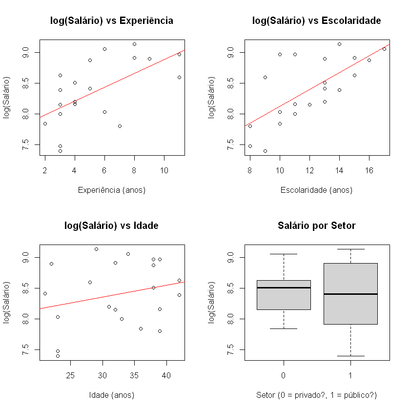

As variáveis Experiência, Escolaridade, e Idade apresentam comportamento linear com a resposta log(Salário). Não tem indícios da necessidade de uma transformação.

---

#### 1.4 Verificando outliers univariados

Outliers na resposta ou nas preditoras podem distorcer a análise. Faça boxplots individuais:

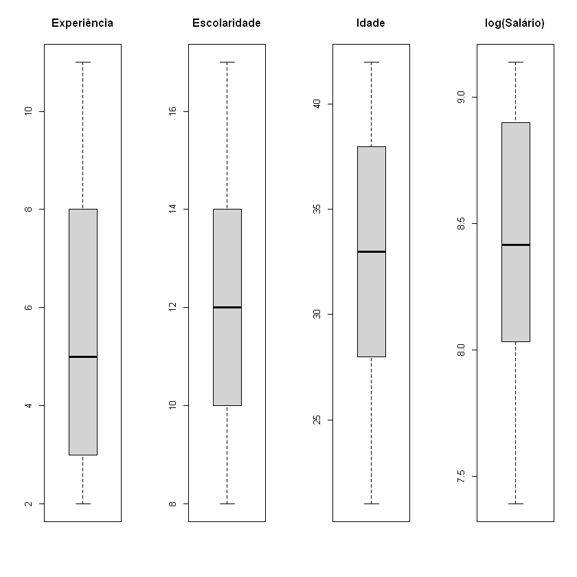

Não parece ter outliers na covariáveis

---
#### 1.5 Concluindo etapa 1

* A base tem 24 observações completas, sem dados ausentes, mas duas observações (**9, 10 e 11**) foram removidas por violar a lógica.

* As variáveis estão nos intervalos esperados, sem erros de digitação óbvios.

* A verificação de idade de início de trabalho mostrou valores entre X e Y, todos plausíveis (ou, se encontrou algo, a ação tomada).

* Os gráficos de dispersão sugerem relação aproximadamente linear entre log-salário e as preditoras, exceto talvez a Idade, que apresentou pouco efeito no log-salário. O boxplot de Setor mostra diferença de medianas, indicando possível efeito.

---
## Etapa 2:

*Para a base da nossa análise, deve se verificar as seguintes coisas:*

* Redução de dimensão das covariáveis (Parcimonia)
* Matriz de correlação
* Matriz de dispersão
* Multicolinearidade, usando critério de VIF (Variance Inflation Factor) como medida
* Seleção de variáveis

*Qual o ponto dessa etapa? Preparar as covariáveis para o ajuste. *

***Covariáveis IMPORTANTES/RELEVANTES***

---

#### 2.1 Matriz de correlação

| | Experiencia | Escolaridade | Idade | LogSalario |
| :--- | :---: | :---: | :---: | :---: |
| **Experiencia** | 1.000 | -0.071 | -0.060 | 0.635 |
| **Escolaridade** | -0.071 | 1.000 | 0.252 | 0.682 |
| **Idade** | -0.060 | 0.252 | 1.000 | 0.255 |
| **LogSalario** | 0.635 | 0.682 | 0.255 | 1.000 |

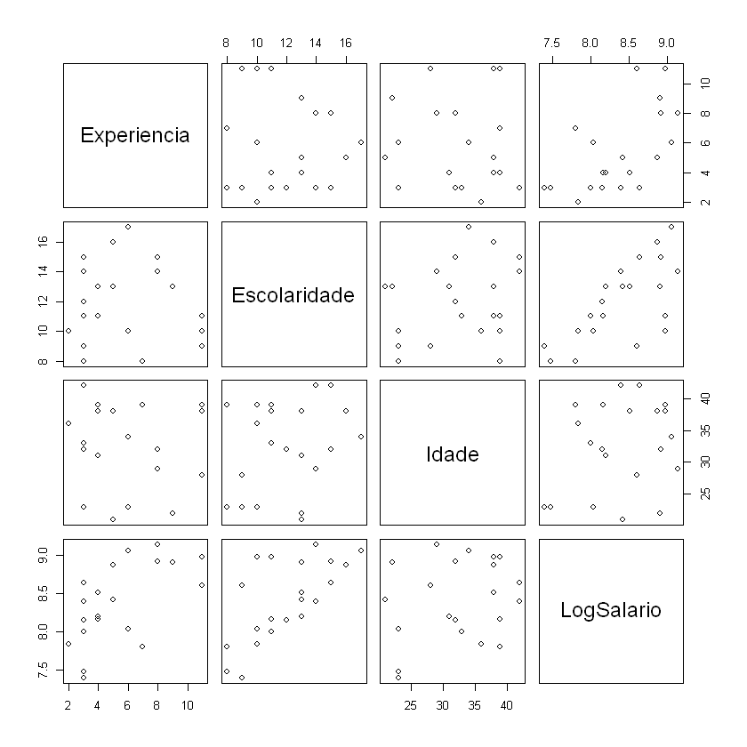
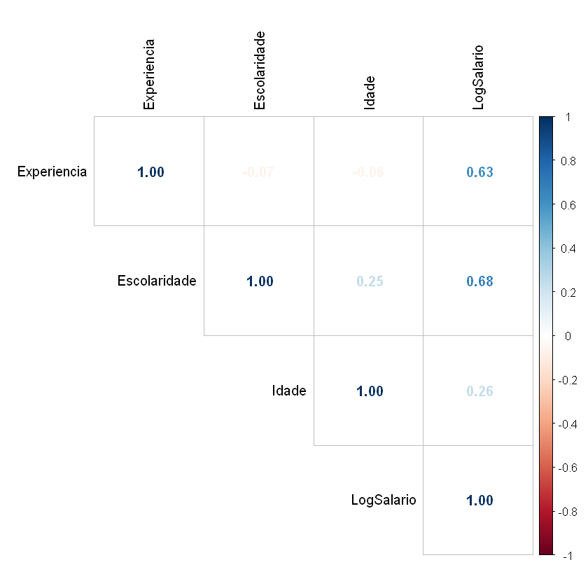

A matriz de correlação não revela correlações elevadas entre as variáveis preditoras (todas as correlações entre pares de preditores são menores que 0,3 em valor absoluto). Isso sugere **ausência de multicolinearidade** problemática, indicando que as covariáveis são aproximadamente linearmente independentes entre si.

---

#### 2.2 Diagnóstico de multicolinearidade usando VIF (Variance Inflation Factor) como medida

| | Experiencia | Escolaridade | Idade | LogSalario |
| :--- | :---: | :---: | :---: | :---: |
| **VIF** | 1.021 | 1.07 | 1.10 | 0.635 |1.14


Os Valores do Fator de Inflação da Variância (VIF) são todos inferiores a 2, próximos de 1. Esse resultado confirma a **ausência de multicolinearidade**; não há evidência de que alguma preditora seja combinação linear das demais.

---

#### 2.3 Seleção de variáveis

* Stepwise: a saída em R fica do jeito abaixo


```text
Call:
lm(formula = LogSalario ~ Escolaridade + Experiencia + Idade, 
    data = dados)

Coefficients:
(Intercept)  Escolaridade   Experiencia         Idade  
   5.714365      0.141135      0.122842      0.009121
```

O método stepwise both com critério AIC partiu do modelo nulo e adicionou/removeu termos até encontrar o modelo com menor AIC. O modelo selecionado contém **Escolaridade, Experiencia e Idade**. A variável Setor foi excluída.

* Cp de Mallows:
```text
         Experiencia Escolaridade Setor1 Idade
1  ( 1 ) " "         "*"          " "    " "  
2  ( 1 ) "*"         "*"          " "    " "  
3  ( 1 ) "*"         "*"          " "    "*"  
4  ( 1 ) "*"         "*"          "*"    "*" 
```
| | 1 variável | 2 variável | 3 variável | 4 variável |
| :--- | :---: | :---: | :---: | :---: |
| **Cp de Mallows** |156.214020  | 6.107709 |  3.706976  | 5.000000 

os Cp de Mallows são:

1 variável: 11.26 (Escolaridade);
***2 variável: 6.1  (Experiencia + Escolaridade);***
**3 variável: 3.7  (Experiencia + Escolaridade + Idade);**
4 variável: 5.00  (Experiencia + Escolaridade + Idade + Setor)

O modelo com menor Cp é o de 3 variáveis (Experiencia + Escolaridade + Idade). Mas o Cp de 2 variaáveis também é pequeno, próximo com o Cp de 3.

* LASSO: 

```text
5 x 1 sparse Matrix of class "dgCMatrix"
               lambda.min
(Intercept)   5.831765894
Experiencia   0.120882575
Escolaridade  0.138458408
Setor1       -0.038042853
Idade         0.007505697
```
O LASSO reteve Experiencia, Escolaridade, e atribui valores baixos de $\lambda$ para Setor e Idade.

---
#### 2.4 Conclusão da Etapa 2

* A Matriz de Correlação não mostrou correlações elevadas entre preditoras, e os VIFs (todos próximos de 1) confirmaram ausência de multicolinearidade. 

* Na seleção de variáveis, o método Stepwise com AIC reteve Experiencia, Escolaridade e Idade, assim como o Cp de Mallows. 

* Entretanto, o Cp de Mallows com duas variáveis (Experiencia e Escolaridade) possui Cp pequeno também, com desempenho similar ao modelo de três variáveis. 

* Além disso, O LASSO excluiu Setor, atribuiu à Idade um coeficiente desprezível (0,003), corroborando a ideia de que nem o setor nem a Idade contribuem de forma expressiva. Adicionalmente, a correlação entre Idade e LogSalario é baixa (0,26).

* Em respeito ao princípio da parcimônia e apoiado pelo Cp e LASSO, selecionamos para a etapa seguinte **o modelo com Experiencia e Escolaridade**.”

---
## Etapa 3:

1. Ajustar o modelo
2. Fazer Diagnóstico/ análise de resíduo para verificar os pressupostos:
* Lineraridade (gráfico de resíduos vs. valores ajustados)
* Homocedasticidade (o mesmo gráfico + teste de Breusch-Pagan ou outros testes)
* Normalidade dos erros (QQ-plot + teste de Shapiro-Wilk ou outros)
* Independência (gráfico de resíduos vs. ordem de coleta, nesse caso não temos a ordem)

3. Se passar pelo crivo da análise de resíduo --> prossiga
4. Inclua a parte de detecção de outliers e pontos influentes. Opções: $H_{ii}$; DF-Betas; DF-Fits; D-Cook
5. Após análise de resíduo faça testes: F-Global; t; F-Parcial
---

#### 3.1 Ajuste do modelo

Pela etapa 2, o modelo é da forma

$ Y = log(salário) = {\beta}_0 + {\beta}_1*Experiencia  + {\beta}_2*Escolaridade + \varepsilon_{ij} $

```
Call:
lm(formula = LogSalario ~ Experiencia + Escolaridade, data = dados)
... ...
Coefficients:
             Estimate Std. Error t value Pr(>|t|)    
(Intercept)   5.94336    0.16459   36.11  < 2e-16 ***
Experiencia   0.12193    0.01071   11.39 1.16e-09 ***
Escolaridade  0.14716    0.01213   12.13 4.25e-10 ***
... ...
```

* Coeficientes estimados: $\hat{\beta_0} = 5.94$, $\hat{\beta_1} = 0.12$, $\hat{\beta_2} = 0.14$

Interpretação: 

Para cada ano adicional de Experiência, o log-Salário aumenta em média 12%, mantendo a Escolaridade fixa; 

Para cada ano adicional de Escolaridade, o log-salário aumenta em média 14%, mantendo a escolaridade fixa”; 

Não tem interpretação para $\beta_0$ pois aparentemente 0 não está no range das covariáveis Experiência e Escolaridade.

#### 3.2 Diagnóstico/ Análise de resíduos
##### 3.2.1 Linearidade

O gráfico de resíduos vs valores ajustados. A hipótese é que a relação é linear se os resíduos se distribuem aleatoriamente em torno de zero, sem curvatura.

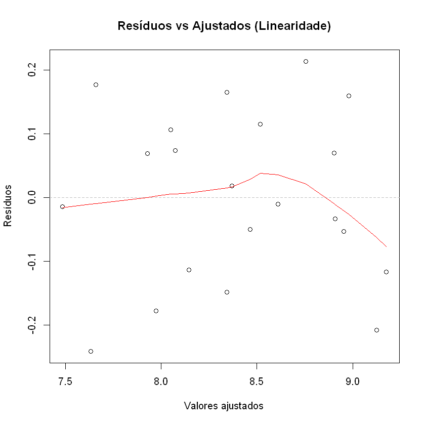

Não parenta ter alguma estrutura, podemos prosseguir.

---

##### 3.2.2 Homocedasticidade

O gráfico seria o mesmo de antes.

Mas formalmente, pode-se fazer um teste de Breusch-Pagan.

```
	studentized Breusch-Pagan test

data:  modelo
BP = 0.66704, df = 2, p-value = 0.7164
```

Valor-p de 0.71 não é pequeno, a hipótese da homocedasticidade não é violada, podemos prosseguir.

---

##### 3.2.3 Normalidade dos Erros

QQ-Plot e teste de Shapiro-Wilk:

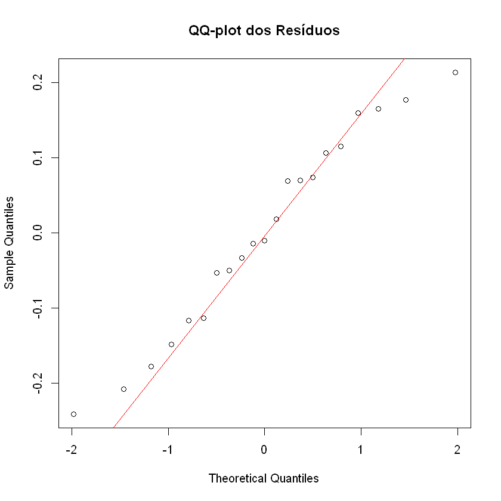

```
	Shapiro-Wilk normality test

data:  residuos
W = 0.96513, p-value = 0.6248
```
* No QQ-plot, a maioria dos pontos estão perto da reta. Pequenos desvios nas caudas são toleráveis com n = 21.

* O teste Shapiro-Wilk: $H_0$ = os dados vêm de uma distribuição normal.

Valor-p = 0.62, não rejeita $H_0$ (que afirma os dados são normalmente distribuídos)

(Claro, mesmo se valor-p fosse razoavelmente pequeno, Note que a regressão linear é robusta a desvios de normalidade especialmente para amostras não muito pequenas.)

---
##### 3.2.4 Independência
Como não temos a ordem de coleta, assumimos que são independentes.

---

#### 3.3 Análise de outliers e pontos influentes

##### 3.3.1 Alavanacagem (leverage)

Calculuando os valores de alavancagem ($h_{ii}$):
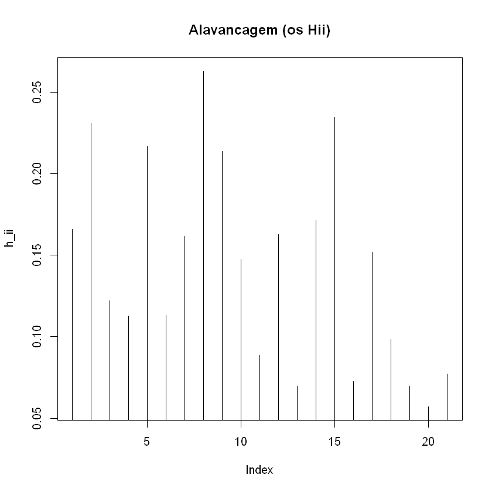

Não tem valores ($h_ii$) maiores que o limiar = 0.28, ou seja ninguém é considerado de alta alavancagem e merece atenção.

##### 3.3.2 Distância de Cook
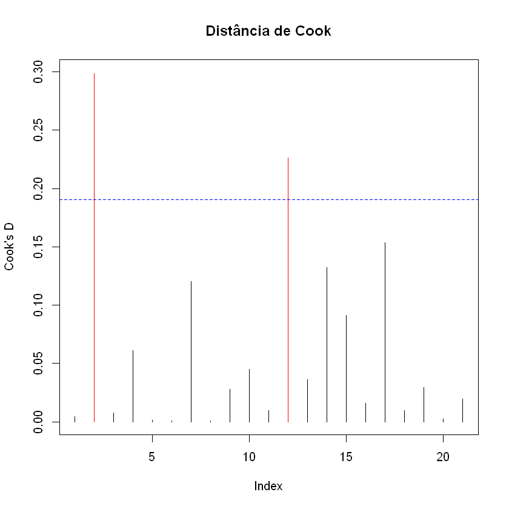

Tem dois valores (observação com índices 2 e 15, pois 9,10 e 11 foram removidos) que são maiores que o limiar (4/21 = 0.19 ) sinalizando que são pontos influentes.

#### 3.3.3 DFFITS e DFBETAS
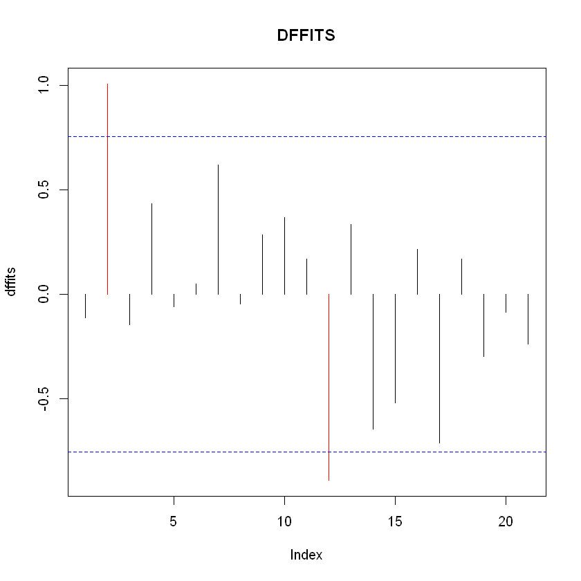

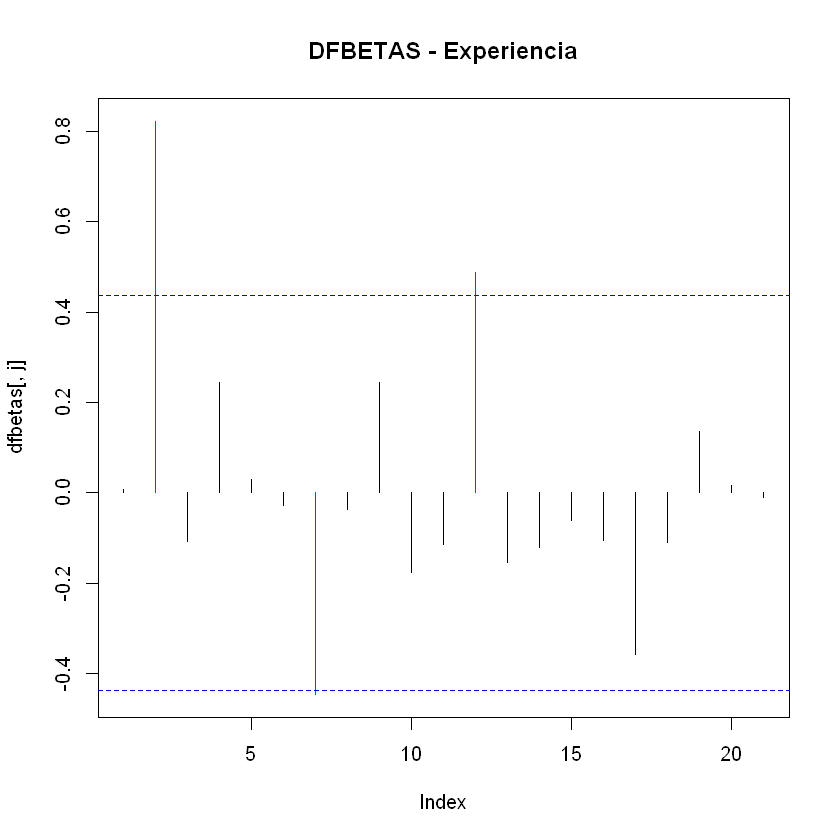

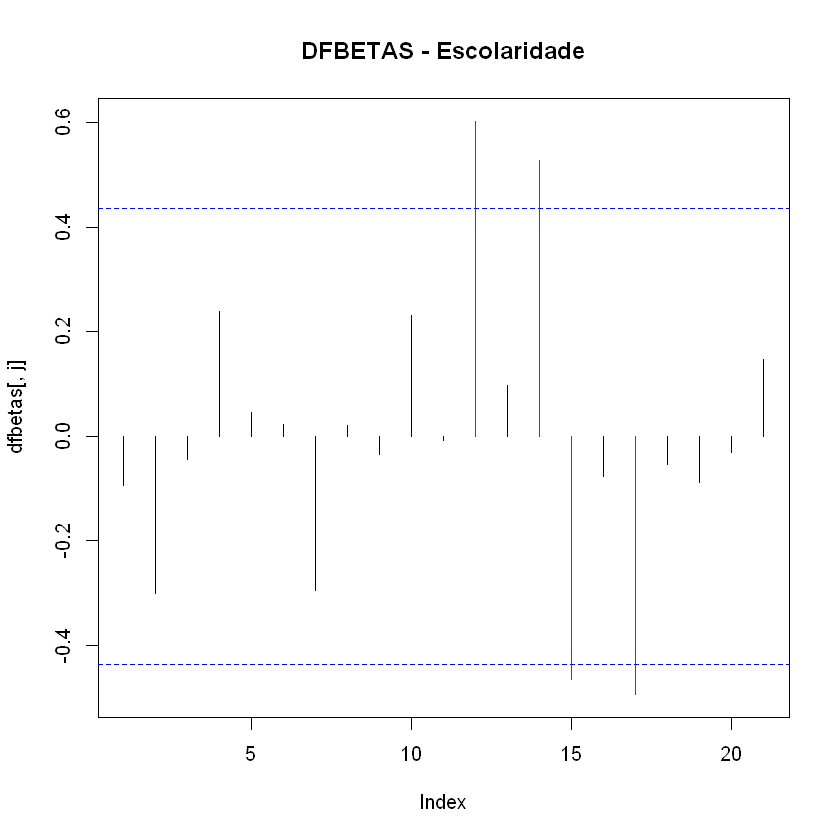

As observações 2 e 15 possuem a distância de Cook que ultrapassa o limiar, além disso elas apresentam alta alavancagem/leverage e destacam-se em DFFits e em DFBETAS para Experiencia. Devem ser investigados.

---

#### 3.4 Testes de significância formais

Fazendo um sumário do modelo com comando "summary" do R, tem-se:

```

Call:
lm(formula = LogSalario ~ Experiencia + Escolaridade, data = dados)

Residuals:
     Min       1Q   Median       3Q      Max 
-0.24164 -0.11360 -0.01011  0.10610  0.21373 

Coefficients:
             Estimate Std. Error t value Pr(>|t|)    
(Intercept)   5.94336    0.16459   36.11  < 2e-16 ***
Experiencia   0.12193    0.01071   11.39 1.16e-09 ***
Escolaridade  0.14716    0.01213   12.13 4.25e-10 ***
---
Signif. codes:  0 '***' 0.001 '**' 0.01 '*' 0.05 '.' 0.1 ' ' 1

Residual standard error: 0.1411 on 18 degrees of freedom
Multiple R-squared:  0.9349,	Adjusted R-squared:  0.9276 
F-statistic: 129.2 on 2 and 18 DF,  p-value: 2.105e-11
```
Note que o $R^2$ ajustado é 0.9276

Após confirmar que os pressupostos são aceitáveis, realiza-se os testes:

* Teste F global: já obtido no summary. Conclusão: Rejeita H0: $\beta_1$ = $\beta_2$ = 0， valor-p = 2.1e-11

* Testes t individuais: já no summary. todos valores-p foram bem pequneas, rejeita a hipótese de que são nulas.

Teste F parcial: serve para comparar o modelo reduzido com o modelo completo (incluindo Setor e Idade). Isso avalia se as variáveis excluídas são conjuntamente significativas.

Usando **R** e o type III do teste parcial (comando é Anova(modelo, type = "III")), a saída fica: 

```
A anova: 4 × 4
Sum |    Sq	|    Df	|   F value	|   Pr(>F)
<dbl>	<dbl>	<dbl>	<dbl>
(Intercept)	25.9742132	1	1304.0053	3.001280e-18
Experiencia	2.5836976	1	129.7115	1.164790e-09
Escolaridade	2.9303732	1	147.1160	4.246866e-10
Residuals	0.3585383	18	NA	NA

```
Assim, pode-se dizer que:

* Para Experiência: valor-p = 1.16e-09 é muito pequeno, isso significa que remover “Experiência” piora fortemente o ajuste do modelo, mesmo mantendo “Escolaridade”.

* Para Escolaridade: valor-p = 4.24e-10 é muito pequeno, isso significa que remover Escolaridade piora fortemente o ajuste do modelo, mesmo mantendo Experiência.

Resumindo: tanto experiência quanto escolaridade apresentaram contribuição significativa para explicar a variável resposta LogSalário, controlando-se mutuamente.

---

#### 3.5 Conclusão da Etapa3 

O diagnóstico de resíduos não revelou violações graves dos pressupostos:

* A linearidade parece adequada (resíduos sem padrão)

* A hmocedasticidade é garantida (teste de Breusch-Pagan valor-p = 0.71),

* A normalidade dos resíduos é sustentável (Shapiro-Wilk p = 0.62) 

* Não há indícios de dependência. 

A análise de influência detectou pontos com leverage ligeiramente alto (obs. 2 e 15), mas D de Cook < limite. 

Os testes de significância indicam que o modelo como um todo é significativo, pois:

1. coeficiente de Determinação ajustado $R^2$ = 0.927 

2. F-global valor-p = 2.1e-11 

3. e que ambos os preditores (Experiência e Escolaridade) são individualmente relevantes (os valores-p pequenos em F-parcial). 

---

## Etapa 4:
**Validação** 

*Procurar a resposta da seguinte questão: **O modelo é útil para uma nova Base de dados??***

O que pode ser feito é antes de ajustar o modelo, separar um conjunto pequeno para validar depois.

1. Divisão aleatória antes de ajustar. exemplo: 70% treino e 30% teste.
2. Opções de validar o modelo:
* Reportar medidas preditivas como RMSE
* Validação cruzada (k-fold) (é uma possibilidade mas não será abordada nessa atividade)

**Note que n=24 - 3 = 21, a amostra é pequena**

---

#### 4.1 Divisão em treino e teste

A amostra tinha 24 observações, removeu-se 3 observações absurdas sobrou 21 observações. Para validar é feita uma divisão de dados: 70% são usados para ajustar o modelo, e 30% são usados para validar.

Usando set.seed(20260512) para reprodutividade, o grupo teste é formado por 6 observações (1,5,8,10,14,18), e o grupo para ajustar é o que sobrou.

#### 4.2 Reajuste do modelo para a base de treino

```
Call:
lm(formula = LogSalario ~ Experiencia + Escolaridade, data = dados_treino)
...
Coefficients:
             Estimate Std. Error t value Pr(>|t|)    
(Intercept)   6.09257    0.24459  24.909 1.06e-11 ***
Experiencia   0.12863    0.01404   9.161 9.16e-07 ***
Escolaridade  0.13220    0.01893   6.982 1.47e-05 ***
```
$Y = log(salário) = {\beta}_0 + {\beta}_1*Experiencia  + {\beta}_2*Escolaridade + \varepsilon_{ij}$

* Coeficientes estimados nesse reajuste: $\hat{\beta_0} = 6.09$, $\hat{\beta_1} = 0.1286$, $\hat{\beta_2} = 0.132$

#### 4.3 Predição no conjunto de teste

| Experiencia | Escolaridade | Setor | Idade | LogSalario | Pred_LogSal |
|--------------|---------------|--------|--------|-------------|--------------|
| 5  | 16 | 1 | 38 | 8.874 | 8.850 |
| 3  | 8  | 1 | 23 | 7.472 | 7.536 |
| 11 | 9  | 0 | 28 | 8.599 | 8.697 |
| 3  | 15 | 0 | 42 | 8.632 | 8.461 |
| 7  | 8  | 1 | 39 | 7.796 | 8.050 |
| 3  | 11 | 0 | 33 | 7.997 | 7.932 |

---

##### 4.4 Métricas de erro de predição

São usadas as seugintes métricas: 

* RMSE (raiz do erro quadrático médio)
* MAE (erro absoluto médio)
* $R^2$ (Coeficiente de determinação preditivo)

```
RMSE: 0.1368 
MAE: 0.1125 
R² preditivo: 0.9329 
```

--- 

##### 4.6 Conclusão da etapa 4

Para avaliar a capacidade preditiva do modelo, a base (21 obs.) é dividida aleatoriamente em treino (15 obs.) e teste (6 obs.), com semente 20260512. 

É feito um ajuste do modelo no treino e obtivemos no teste um RMSE de 0.1368, MAE de 0.1125 e R² preditivo de 0.9329. 

Esses valores indicam que o modelo captura parte substancial da variação do log‑salário. 

Apesar do tamanho diminuto do conjunto de teste, o resultado sugere que o modelo é útil para novas observações.