# Lista 3 - Séries Temporais

Componentes do Grupo:

nome

nome

nome

---

### Enunciado:

*Ajustar um modelo para duas séries.*

*Se quiserem tentem ajustar modelo para alguma série de https://finance.yahoo.com/*

*fiquem à vontade.*

---

# Análise de Séries Temporais em R

Nós apresentamos o **procedimento** para análise de séries temporais, seguindo a metodologia abaixo:

1. Carregamento e visualização dos dados
2. Decomposição da série
3. Teste de estacionariedade
4. Transformações (se necessário)
5. Identificação do modelo (ACF / PACF)
6. Ajuste do modelo ARIMA
7. Diagnóstico dos resíduos
8. Previsão

---


### Série 1

Usaremos a série `unemp` — taxa de desemprego (unemployment rate) dos Estados Unidos de 1890 a 1988.

## 1. Carregamento e visualização inicial

O primeiro passo é **olhar pros dados**. Queremos entender:
- Existe **tendência** (crescimento ou queda ao longo do tempo)?
- Existe **sazonalidade** (padrões que se repetem periodicamente)?
- Tem anormalidade?
- A variância é **constante** ou cresce com o tempo?

```
Início: 1890 1 
Fim: 1988 1 
Frequência: 1 observações/ano
Comprimento: 99 observações

Resumo estatístico:
   Min. 1st Qu.  Median    Mean 3rd Qu.    Max. 
 0.1823  1.3736  1.7047  1.7514  2.0540  3.2149 

```

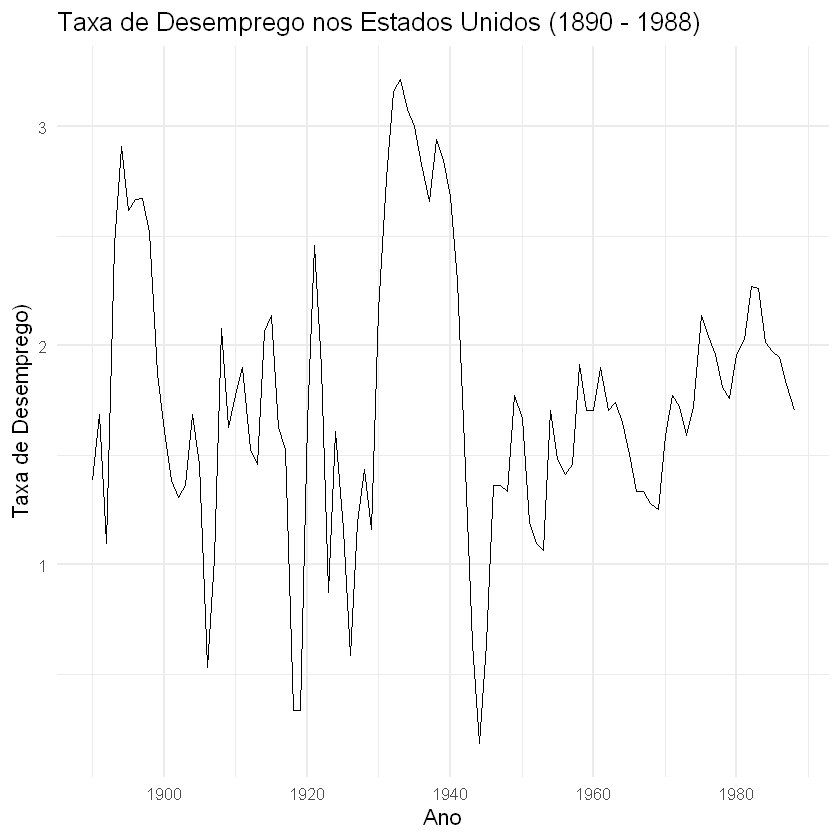
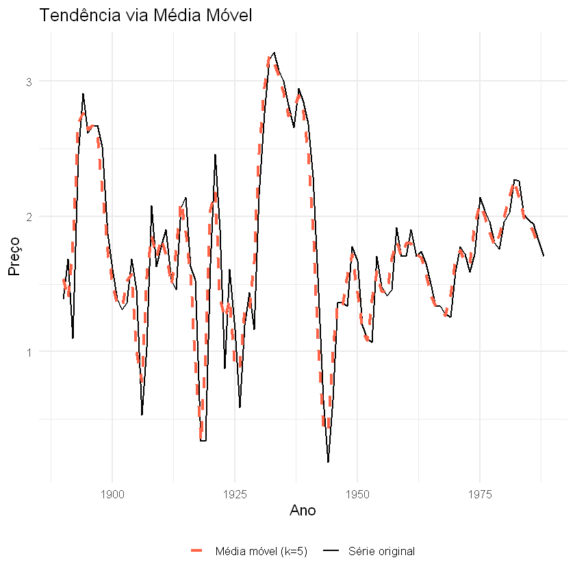

**Observações da visualização:**

- Não há uma tendência decrescente clara ao longo de todo o período. A série oscila bastante e apresenta diferentes fases de crescimento e queda
- Existem períodis de forte variação, uns picos mais acentuados entre 1930 e 1940, e umas quedas(vales) em torno de 1915-1920 e 1940-1945
- A homocedasticidade não é muito evidente já que a amplitude das oscilações parece variar ao longo do tempo, especialmente entre as décadas 1920 e 1940 que aparenta ter uma variação maior.
- A série parace ter um comportamento periódico que pode indicar a presença de sazonalidade, embora não é muito identificável (o que também é esperado para os dados anuais).
- O gráfcico de média móvel mostra as mesmas característica descritas acima.


---
## 2. Decomposição da série

Não vamos decompor a série pois a frequência de dados é 1 (são dados anuais), ou seja não tem sazonalidade.

---
## 3. Teste de Estacionariedade

Queremos ajustar um modelo ARIMA para os dados. (Não é SARIMA pois não tem sazonalidade).

Modelos ARIMA exigem série **estacionária** (média e variância constantes no tempo).

Para confirmar nossa suspeita de tendencia, Vamos realizar os testes de Dickey-Fuller Aumentado que verifica se a série é estacionária.

- **ADF**: $H_0$ = tem raiz unitária (não estacionária). $p < 0{,}05$ → estacionária.

Usando a função "adf.test" do R temos um valor-p de 0.0556. Assim não rejeitamos a hipótese de que a série tem tendência ao nível de 5%.

Saída do código em R:

```
	Augmented Dickey-Fuller Test

data:  ts_data
Dickey-Fuller = -3.4183, Lag order = 4, p-value = 0.0556
alternative hypothesis: stationary
```

---
## 4. Transformações para Estacionarizar

Como a série **pode não ser estacionária**, aplicamos:

- **Diferenciação simples** — para remover tendência.

Usamos `ndiffs()` para determinar automaticamente o número de diferenças necessárias.

Porém R nos retornou que o número de diferenças necessárias é 0, isso pode indicar que nos outros testes (aém do ADF) de Tendência vs Estaionariedade a nossa série é considerada como estacionária. Com o valor-p de 0.0556 do teste de ADF, pelo princípio da parcimonia, nós iremos mudar de ideia e considerar que é plasível determinar que a série ja é estacionária ao nível de 10%.

---
## 5. Identificação do Modelo — ACF e PACF

Com a série estacionária, para identificar as ordens $p$ e $q$ podemos usar ACF e PACF como referência:

| Padrão observado | Interpretação |
|-----------------|---------------|
| ACF corta no lag $q$, PACF decai | Processo **MA(q)** |
| PACF corta no lag $p$, ACF decai | Processo **AR(p)** |
| Ambos decaem gradualmente | Processo **ARMA(p,q)** |

Com o gráfico de ACF e PACF abaixo, podemos ver que em 

- ACF:
 Lag 1 bem alto, lag 2 e lag 3 ainda significativo, e a partir do lag 4 entra no intervalo

- PACF:
 Lag 1 alto, lag 2 é negativo e significativo e depois fica dentro do intervalo.

Isso pode indicar que talvez o modelo seja um ARIMA(2,0,0)

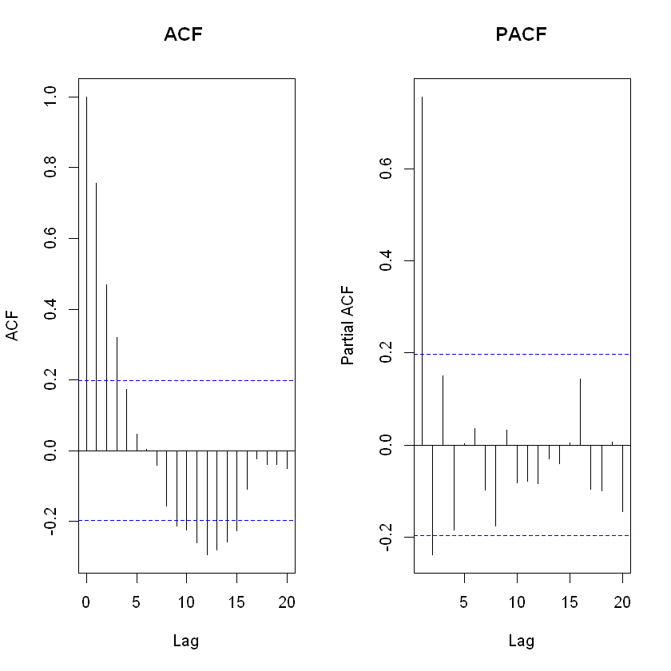

Mas no próximo passo iremos escolher com a função auto.arima do R para ver o que as ferramentas sugerem.


---
## 6. Ajuste do Modelo ARIMA

Podemos tanto **especificar manualmente** quanto usar o `auto.arima()` que testa automaticamente as combinações via critério de informação (AIC/BIC).

Com a saída do código abaixo, e pelo menor AIC, iremos ficar com o modelo ARIMA(1,0,1) que é um modelo ARMA(1,1)

```
Series: ts_data 
ARIMA(1,0,1) with non-zero mean 

Coefficients:
         ar1     ma1    mean
      0.5269  0.5546  1.7374
s.e.  0.1098  0.1311  0.1274

sigma^2 = 0.158:  log likelihood = -48.22
AIC=104.43   AICc=104.86   BIC=114.81

Training set error measures:
                      ME      RMSE       MAE       MPE     MAPE      MASE
Training set 0.004466967 0.3914123 0.2898267 -10.81206 25.33637 0.9151758
                    ACF1
Training set -0.04648874

```

---
## 7. Diagnóstico dos Resíduos

Tendo um modelo ajustado (ARIMA(1,0,1)) agora, podemos ver os resíduos.

Um bom modelo deve ter resíduos que se comportem como **ruído branco**:

- Média ≈ 0
- Variância constante (homocedasticidade)
- Sem autocorrelação significativa
- Distribuição aproximadamente normal

Um teste adequado nesse caso é o **Teste de Ljung-Box**: $H_0$ = não há autocorrelação nos resíduos.

Abaixo está um conjunto de gráfico feito com a função sarima do pacote astsa. E dá para ver que os resíduo comportam do jeito esperado:


- A média dos resíduos está em torno de zero

- Parecem homocedásticos e normais

- e o teste de Ljung-Box é feito para vário lags no último gráfico, isso nos diz que a hipótese de que os resíduos aleatórios e independentes não é rejeitada.


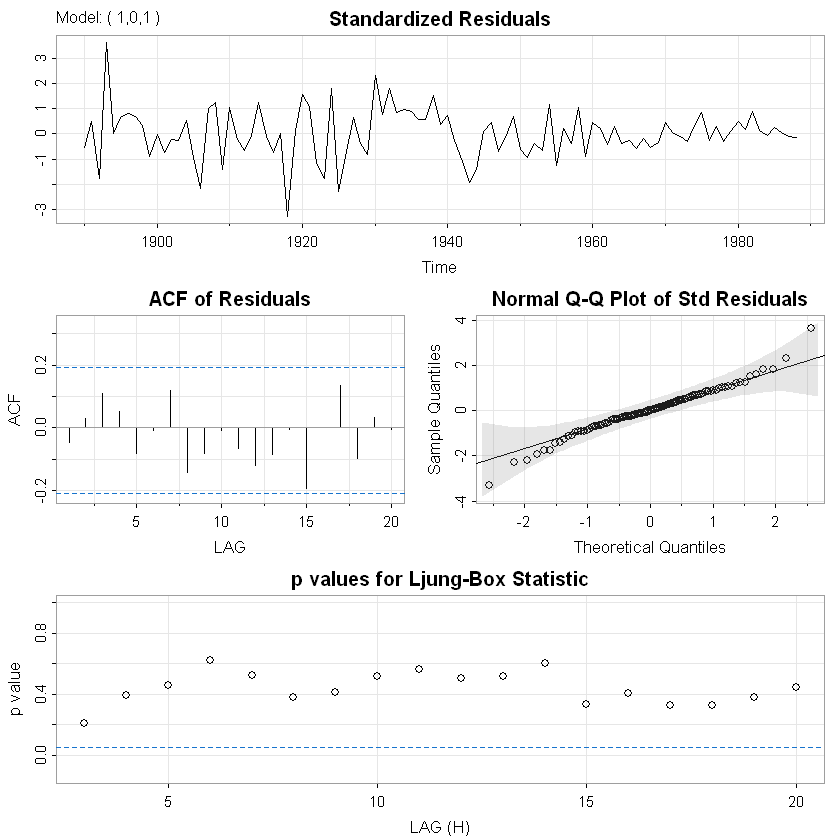

---
## 8. Previsão (*Forecast*)

O nosso modelo é validado, iremos gerar previsões (foco de horizonte = h = 5).

```

Point Forecast     Lo 80    Hi 80     Lo 95    Hi 95
1989       1.687894 1.1785011 2.197286 0.9088450 2.466942
1990       1.711332 0.9610145 2.461650 0.5638202 2.858845
1991       1.723682 0.9191736 2.528191 0.4932923 2.954072
1992       1.730190 0.9112718 2.549107 0.4777630 2.982616
1993       1.733618 0.9107450 2.556491 0.4751422 2.992094

```

O gráfico abaixo mostra uma visualização melhor das previsões (dentro do intervalo azul).

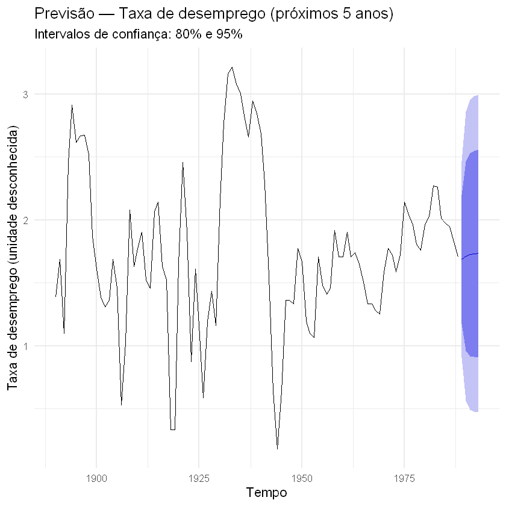

---

### Série 2

Usaremos a série `MSFT` — preço das ações da empresa Microsoft de 2020 a 2026.

---
## 1. Carregamento e visualização inicial

Os dados são obtidos diretamente do Yahoo Finance via pacote `quantmod`. A coluna `MSFT.Adjusted` contém o **preço ajustado de fechamento**, que desconta dividendos e splits — é a mais adequada para análise de série temporal.

### Sobre a frequência

Dados de ações são **diários** (e não tem dados nos fins de semana: sábado e domingo), com aproximadamente 252 pregões por ano. A escolha de `frequency` afeta apenas a decomposição e a detecção de sazonalidade:

Usaremos **`frequency = 252`** para permitir a decomposição com perspectiva anual. Para a modelagem ARIMA, o valor de `frequency` não influencia o resultado — o que importa é a estrutura de dependência temporal.

**Olhar pros dados**.

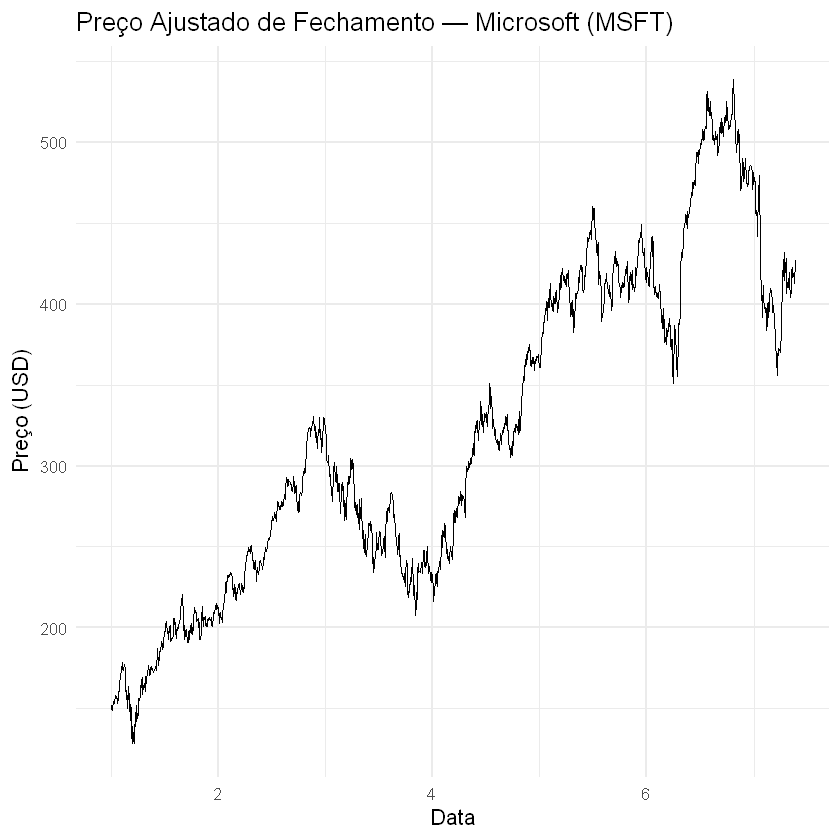
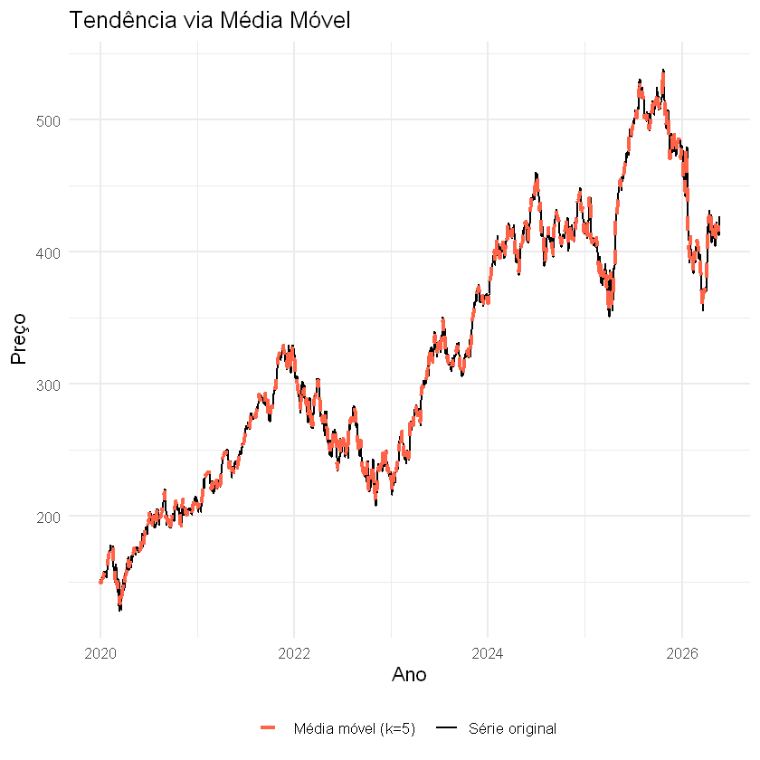

**Observações da visualização:**

- Há uma **tendência crescente** ao longo do período, com forte aceleração entre 2020 e 2021, e novamente a partir de 2023.
- A **variância não é constante**: a amplitude das oscilações cresce junto com o nível da série — comportamento típico de série **heterocedástica**, sugerindo que uma **transformação logarítmica** pode ser útil.
- Não há evidências visuais claras de **sazonalidade**, pois não se observa um padrão regular e repetitivo de ciclos ao longo do período.
- Observa-se uma queda acentuada em 2022, possivelmente relacionada ao ciclo de alta de juros nos EUA.
- Visualmente, a série **não é estacionária** — tendência clara e variância crescente.
- O gráfico de média móvel tende a suavizar as oscilações de curto prazo e reforça a percepção da tendência crescente observada na série original.

---
## 2. Decomposição da série

Com `frequency = 252`, vamos usar a decomposição STL (que usa modelo de regressão LOESS para decompor) para tentar isolar um padrão sazonal anual.

Para séries de preços de ações, esse componente sazonal tende a ser **fraco** — o que reforça que o grosso da variação está na tendência e no resíduo.

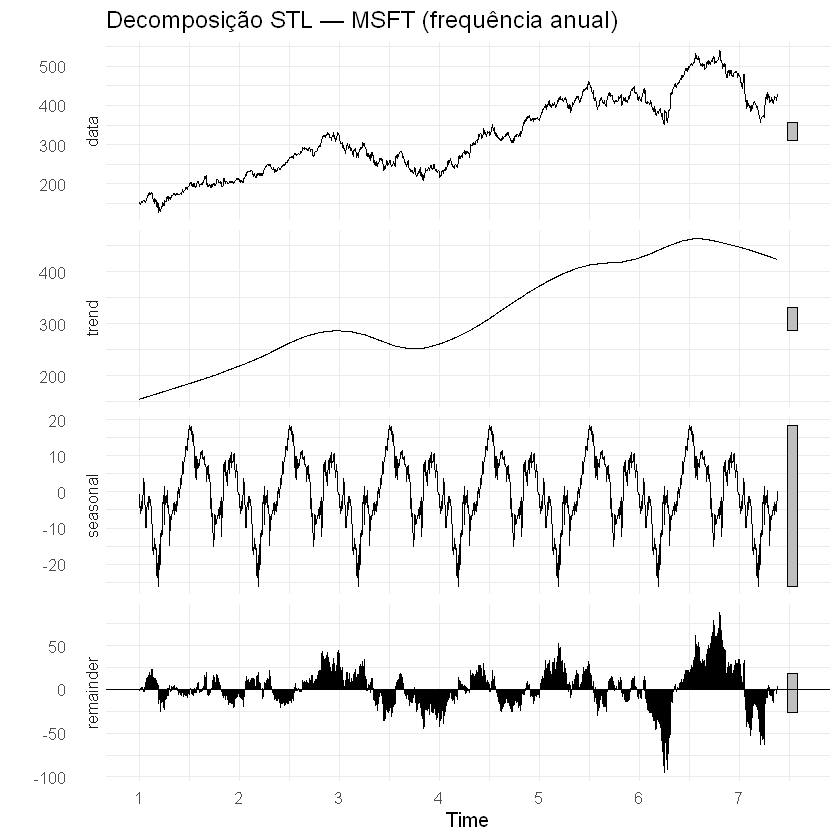

---
## 3. Teste de Estacionariedade

- **ADF**: $H_0$ = tem raiz unitária (não estacionária). $p < 0{,}05$ → estacionária.

Usando a função "adf.test" do R temos um valor-p de 0.4198. Assim não rejeitamos a hipótese de que a série tem tendência ao nível de 5%.

```
	Augmented Dickey-Fuller Test

data:  ts_msft
Dickey-Fuller = -2.3745, Lag order = 11, p-value = 0.4198
alternative hypothesis: stationary

```

---
## 4. Transformações para Estacionarizar

Para séries financeiras com variância crescente, podemos fazer o seguinte:

1. **Transformação log** — estabiliza a variância (converte a série em *log-preços*)
2. **Diferenciação simples** — remove a tendência, convertendo log-preços em **log-retornos**

O log-retorno $r_t = \log(P_t) - \log(P_{t-1})$ é a métrica padrão em finanças para analisar variações percentuais de preço.

```
Diferenças simples sugeridas (ndiffs)  : 1 
Diferenças sazonais sugeridas (nsdiffs): 0 
```

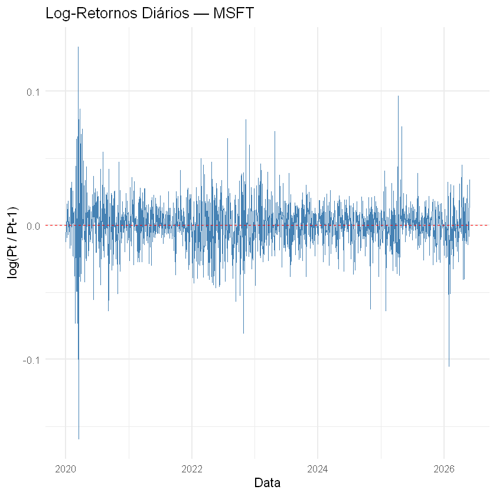

ADF na série transformada: 

```
Warning message in adf.test(ts_logret):
"p-value smaller than printed p-value"

	Augmented Dickey-Fuller Test

data:  ts_logret
Dickey-Fuller = -11.655, Lag order = 11, p-value = 0.01
alternative hypothesis: stationary
```

Feito uma transformação de log-retorno, o teste aplicado na série transformada deu um valor-p menor que 0.01, que evidencia que a série está estabilizada.

---
## 5. Identificação do Modelo — ACF e PACF

Analisamos os gráficos de ACF e PACF dos **log-retornos** (série estacionária) para identificar as ordens $p$ e $q$.

Para séries financeiras, é muito comum que os log-retornos se comportem como **ruído branco** — sem autocorrelação linear significativa. Isso levaria a um ARIMA(0,1,0) nos log-preços (equivalente a um *random walk*), que é o modelo de precificação eficiente de mercado de acordo com informações da internet.


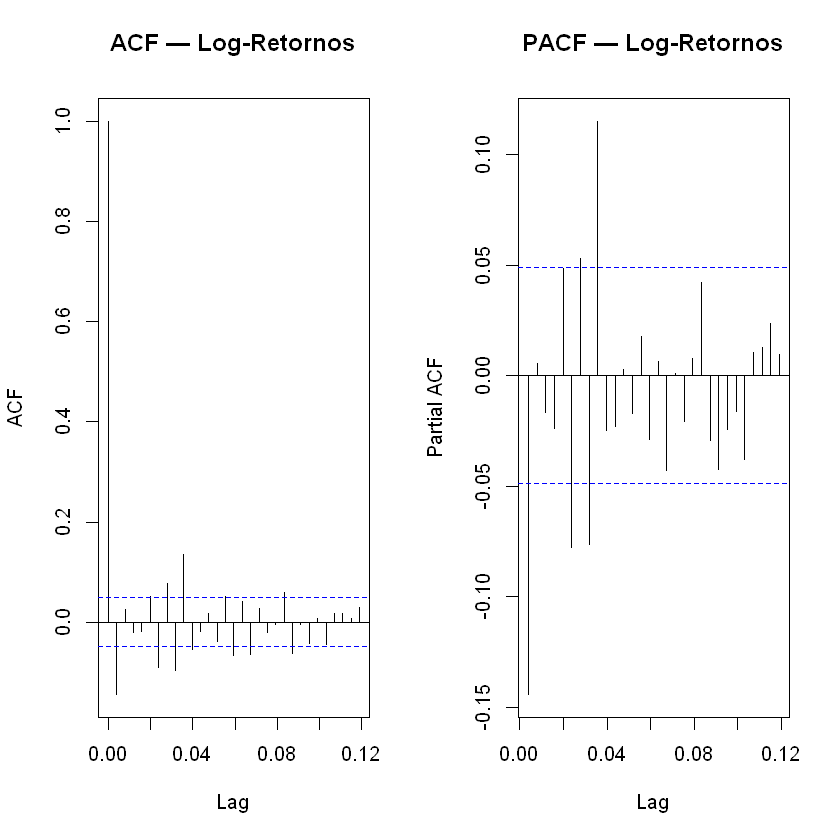

**Observações da visualização:**

- A ACF dos log-retornos apresenta autocorrelações muito próximas de zero (nenhuma passou de 0.2, embora tenha algumas passou da linha azul tracejada que R calculou) na maior parte das defasagens, indicando baixa dependência linear entre observações consecutivas.

- Apenas alguns lags isolados ultrapassam os limites de significância, mas não formam um padrão persistente de autocorrelação.

- A PACF também mostra poucos coeficientes significativos, sem um comportamento de corte claro que sugira um modelo AR(p) específico.

- A ausência de um padrão sistemático na ACF e na PACF sugere que os log-retornos podem ser aproximados por um processo de ruído branco em termos da média.

- Não há evidências visuais fortes que justifiquem a inclusão de componentes autorregressivos ou de médias móveis de ordem elevada.

- Tudo isso pode indicar que modelo talvez seja um ARIMA(0,1,0), ou seja um ruído branco. Entretanto isso parece ser comum nas séries financeiras já que o log-retorno se comporta assim e tem casos onde pessoas usam passeio aleatório para modelar.

Enfim o próximo passo iremos ver se a função auto.arima do R nos diz outra coisa.

---
## 6. Ajuste do Modelo ARIMA

Rodamos o `auto.arima()` na série de **log-preços** (não nos log-retornos). Isso porque o `auto.arima()` determina internamente o $d$, e queremos que o modelo final seja expresso como ARIMA $(p, d, q)$ na escala dos log-preços para facilitar a previsão.

A função auto.arima diz que o modelo selecionado é ARIMA(1,1,0) with drift.

O resumo do modelo está abaixo:

```

Series: ts_log 
ARIMA(1,1,0) with drift 

Coefficients:
          ar1  drift
      -0.1445  6e-04
s.e.   0.0247  4e-04

sigma^2 = 0.0003431:  log likelihood = 4133.36
AIC=-8260.71   AICc=-8260.7   BIC=-8244.56

Training set error measures:
                        ME       RMSE        MAE          MPE      MAPE
Training set -5.465093e-07 0.01850475 0.01300781 -0.000224974 0.2315613
                   MASE         ACF1
Training set 0.05616329 0.0006359506

```

---
## 7. Diagnóstico dos Resíduos

Tendo um modelo ajustado ARIMA(1,1,0).
Verificamos se os resíduos do modelo se comportam como **ruído branco**:


Abaixo está um conjunto de gráfico feito com a função sarima do pacote astsa. E dá para ver que os resíduo comportam assim:

- A média dos resíduos está em torno de zero

- A normalidade não é muito bem atendida pelo QQ-plo, tem pontos que desviaram da reta. Poderia fazer um teste de normalidade (exemplo: Shapiro-Wilk), mas sabemos que o modelo é robusto a desvio da normalidade. 

- O gráfico de resíduos apresenta uma estrutura diferente no final, pode ser que isso indique que a homocedasticidade é levemente violada.

- e o teste de Ljung-Box é feito para vário lags no último gráfico, isso nos diz que a hipótese de que os resíduos aleatórios e independentes não é rejeitada.

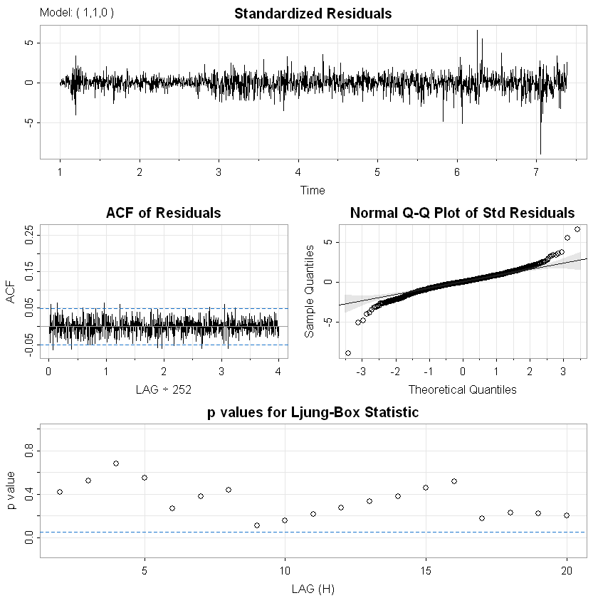


---
## 8. Previsão

Geramos previsões para os próximos **30 pregões** (~6 semanas) na escala de log-preços e revertemos com `exp()` para a escala original de preço em USD.

```
pred_log       Forecast    Lo 80    Hi 80    Lo 95    Hi 95
7.384921       427.3352 417.2081 437.7082 411.9446 443.3008
7.388889       427.5890 413.3293 442.3408 405.9741 450.3548
7.392857       427.8360 410.4274 445.9830 401.5004 455.8990
7.396825       428.0846 408.0352 449.1191 397.8047 460.6694
7.400794       428.3454 405.9787 451.9443 394.6152 464.9587
......

```
O gráfico abaixo mostra uma visualização melhor das previsões (dentro do intervalo azul).

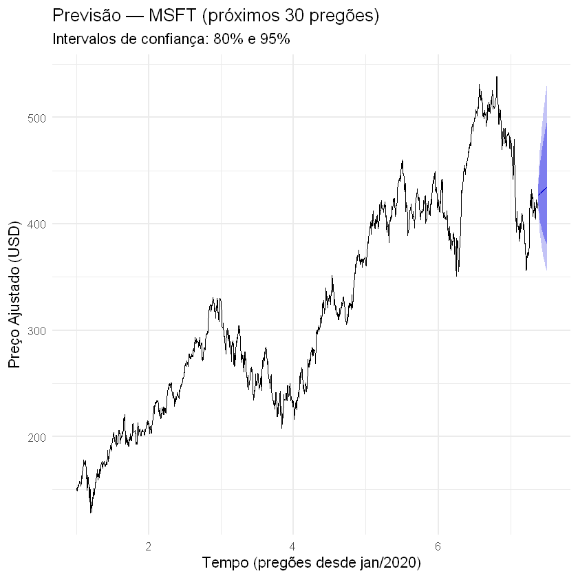