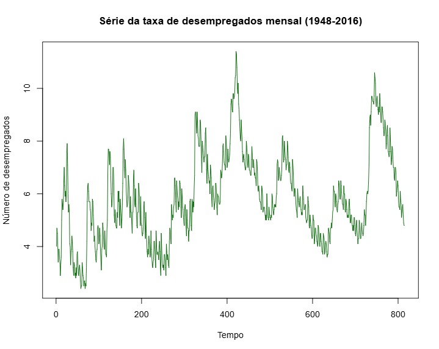
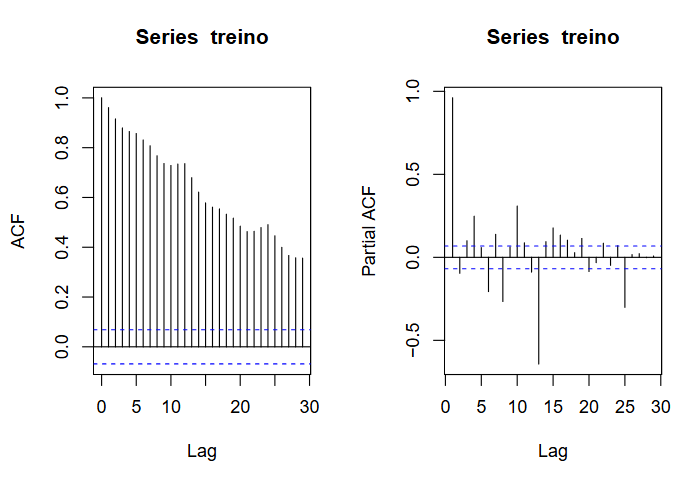
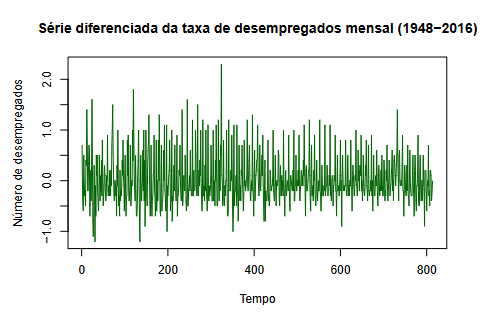
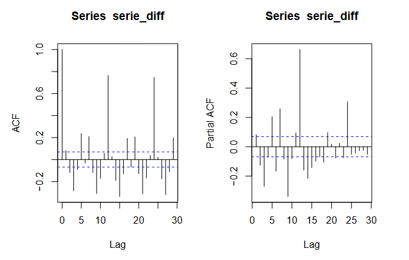
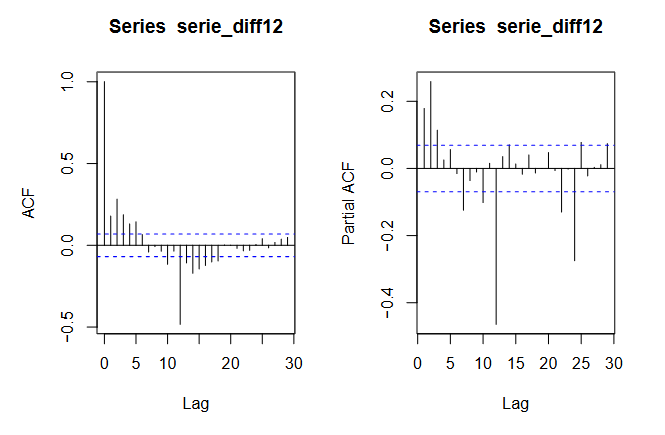
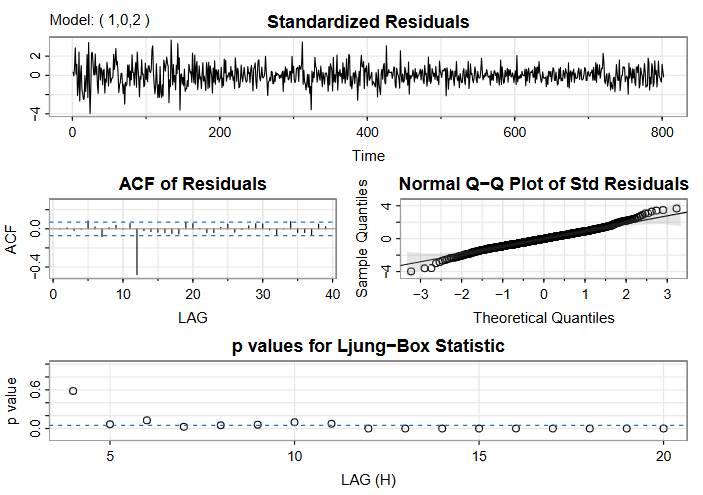
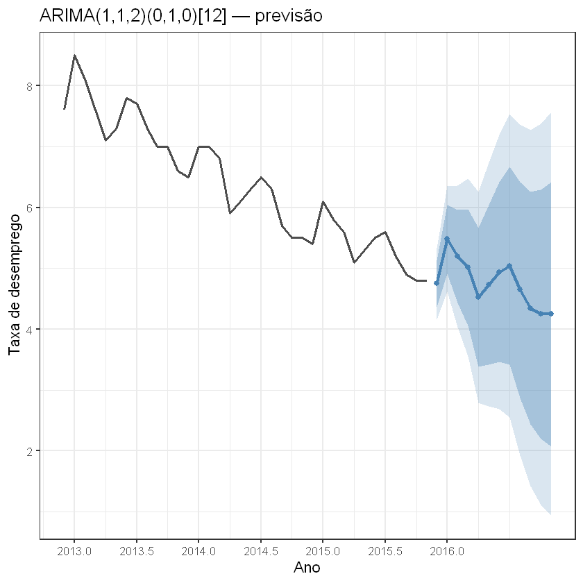
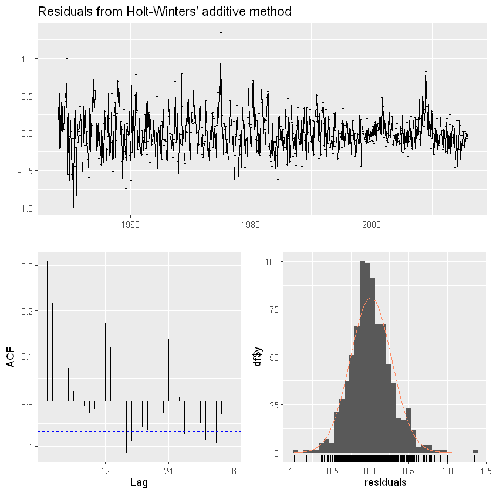
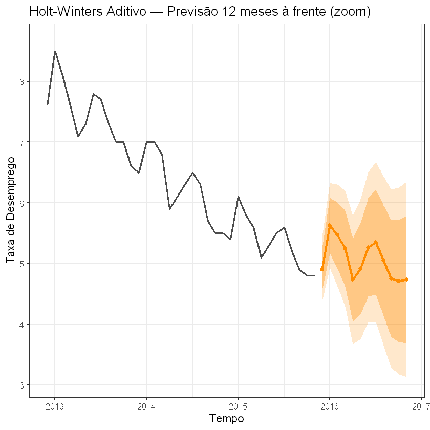
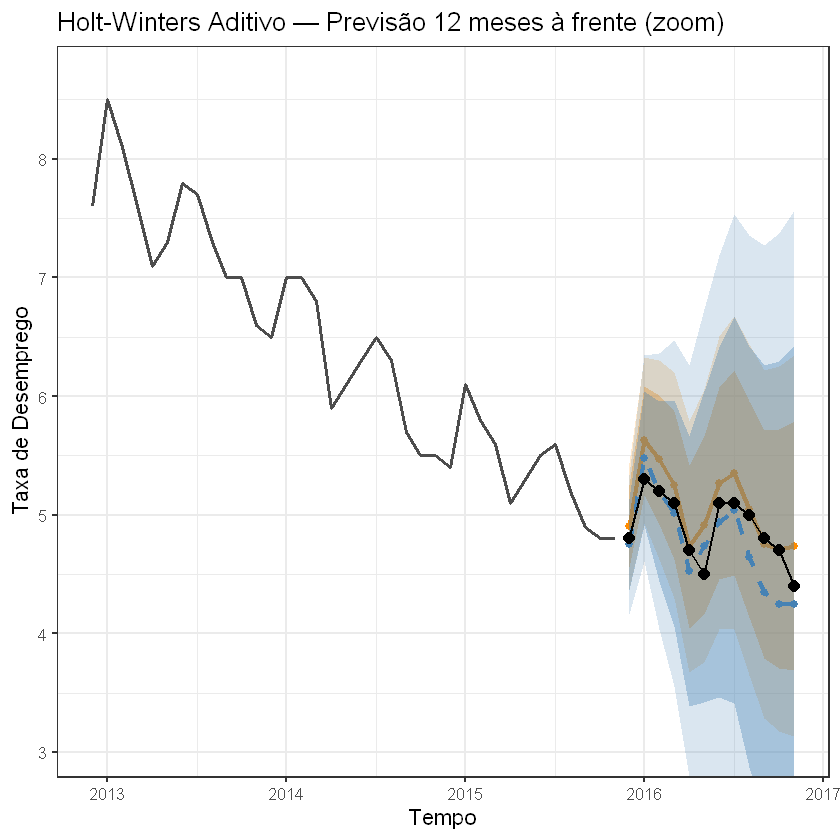

# Lista 4 - Séries Temporais

Componentes do Grupo:

Letícia Yumi Ichibara - 834396

Marcelo Xinhong Huang - 832111

Pedro Henrique de Araújo - 831235

---


## Exercício 2

### Teste da raiz unitária

A série que iremos ajustar é a série *UnempRate*, presente no pacote *astsa* do R. Essa série representa o número de desempregados nos EUA, por mês, dos anos de 1948 até 2016.

Em primeiro lugar, iremos realizar uma breve análise da série. Para realizar futuras validações do modelo, dividirimos a base em treino-tese, sendo a base de teste os últimos 12 meses de observações.




```
   Min. 1st Qu.  Median    Mean 3rd Qu.    Max. 
  2.400   4.700   5.600   5.826   6.900  11.400 
```

Agora, vamos aplicar o teste da raiz unitária para analisar a estacionariedade da série. Para isso, vamos usar o teste ADF, que analisa as hipóteses

$$
\begin{cases} H_0: \text{a série possui raiz unitária (série não-estacionária)} \\ H_1: \text{a série não possui raiz unitária (série estacionária)} \end{cases}
$$


```
=== Teste ADF ===

	Augmented Dickey-Fuller Test

data:  serie
Dickey-Fuller = -2.5923, Lag order = 9, p-value = 0.3276
alternative hypothesis: stationary
```



Como p-valor = 0,29 \> 0,05, a um nível de significância de 5%, não rejeitamos $H_0$ e temos evidências de que a série não é estacionária. Além disso, os gráficos de autocorrelação indicam que os valores demoram muito a decair, indicativo claro de tendência.

Para resolver o problema, iremos realizar uma diferenciação de ordem 1 para retirar a tendência.







Feita a diferenciação, o teste ADF nos dá um p-valor = 0,01 \< 0,05, rejeitamos $H_0$ e temos evidências de que a série se tornou estacionária.

Porém, analisando o gráfico de autocorrelação, se percebe um padrão sazonal nos valores a cada lag de 10-12 meses.

Desse modo, iremos realizar uma diferenciação sazonal de ordem 12 para retirar a sazonalidade da série já diferenciada.




Realizada a diferenciação sazonal, temos que o padrão temporal na autocorrelação não se torna mais tão evidente.

#### Verificação de outliers

Nessa etapa, verificaremos se há existência de outliers na série que possam afetar o desempenho do modelo.

Usaremos a função $\texttt{tsoutliers}$ presente no pacote $\texttt{forecast}$.

Verificando outliers na série, vemos pela função $\texttt{tsoutliers}$ que não há outliers.

#### Ajuste do modelo

Feita a detecção de outliers, ajustaremos o modelo. Como já fizemos as diferenciações, o parâmetro $d$ será 0. Usando a função $\texttt{auto.arima}$ para encontrar o melhor modelo, encontramos que o melhor modelo para a série diferenciada será o $ARIMA(1,0,2)$.

Desse modo, a série ajustada é

$$
\Delta^{12}X_t = \phi_1X_{t-1}+\epsilon_t+\theta_1\epsilon_{t-1}+\theta_2\epsilon_{t-2},
$$

substituindo com os coeficientes encontrados pela função:

$$
\Delta^{12}X_t = 0,7226X_{t-1}+\epsilon_t-0,6257\epsilon_{t-1}+0,1621\epsilon_{t-2}
$$

#### Análise de resíduos

Agora, iremos realizar o diagnóstico dos resíduos para verificar se atendem aos pressupostos desejados, que são:

-   Resíduos com média próximas de zero;

-   Independentes, ou seja, sem autocorrelação;

-   Teste de Ljung-Box não-significativo, isto é, não-rejeição da hipótese nula $H_0: \rho_1 = \rho_2 = \dots = 0$.



Na saída da função $\texttt{sarima}$, vemos que:

-   Os coeficientes $\phi_1, \theta_1$ e $\theta_2$ são estatisticamente significativo, pois seus p-valores são menores do que 0,05;

-   A média dos resíduos padronizados é próxima de zero;

-   A autocorrelação de quase todos os lags se mantém dentro dos intervalos de confiança no gráfico ACF, indicando independência dos resíduos;

-   Os p-valores do teste Ljung-Box se mantém maiores do que o nível de significância de 0,05 nos primeiros lags

Portanto, todos os pressupostos do modelo de séries temporais foram validados.

#### Previsões

Ajustado o nosso modelo, o passo final é fazer previsões para o nosso modelo.


Usando a função $\texttt{forecast}$, iremos prever os próximos 12 meses da nossa série (modelo treinado usando a série inteira menos os últimos 12 meses). Observando apenas as últimas 36 observações + 12 previsões para uma melhor visualização, temos que a previsão do próximo ano será:

```
         Point Forecast    Lo 80    Hi 80     Lo 95    Hi 95
Dec 2015       4.750050 4.367766 5.132335 4.1653967 5.334704
Jan 2016       5.478658 4.911219 6.046097 4.6108353 6.346481
Feb 2016       5.199331 4.437657 5.961005 4.0344509 6.364211
Mar 2016       5.014270 4.061590 5.966949 3.5572726 6.471267
Apr 2016       4.525065 3.389178 5.660952 2.7878756 6.262254
May 2016       4.732866 3.423119 6.042613 2.7297803 6.735951
Jun 2016       4.938503 3.464466 6.412540 2.6841577 7.192848
Jul 2016       5.042577 3.413437 6.671716 2.5510233 7.534130
Aug 2016       4.645520 2.869823 6.421217 1.9298264 7.361214
Sep 2016       4.347647 2.433205 6.262090 1.4197604 7.275534
Oct 2016       4.249185 2.203074 6.295295 1.1199284 7.378441
Nov 2016       4.250295 2.078900 6.421691 0.9294326 7.571158

```
(o modelo para a diferença sazonal resulta em ARIMA(1,0,2), isso é equivalente usar um modelo ARIMA(1,1,2)(0,1,0)[12] na nossa série original)



## Questão 3 — Holt-Winters

Uma das opções é O método de **Holt-Winters**:


Há duas variantes:

| Variante | Quando usar | Equação sazonal |
|----------|-------------|----------------|
| **Aditivo** | Amplitude sazonal constante | $\hat{y} = (\ell + bh) + s$ |
| **Multiplicativo** | Amplitude cresce com o nível | $\hat{y} = (\ell + bh) \times s$ |

Vamos ajustar **ambos** e comparar pelo AIC.

**Usando R**:

```
=== Holt-Winters Aditivo ===
Holt-Winters' additive method 

Call:
hw(y = treino, h = h_prev, seasonal = "additive", level = c(80, 
    95))

  Smoothing parameters:
    alpha = 0.862 
    beta  = 1e-04 
    gamma = 0.1379 

  Initial states:
    l = 2.9312 
    b = -0.0057 
    s = -0.3279 -0.6 -0.8446 -0.6393 -0.0452 -0.1438
           0.2465 -0.108 -0.013 0.4742 1.1187 0.8822

  sigma:  0.2702

     AIC     AICc      BIC 
3347.764 3348.532 3427.718 

Training set error measures:
                      ME      RMSE       MAE       MPE    MAPE      MASE
...
AIC Aditivo       : 3347.76 
AIC Multiplicativo : 3660.21 

→ Modelo selecionado: Holt-Winters Aditivo 
```

Pelo AIC vamos escolhero HoltWinters **Aditivo**.

```
Parâmetros Holt-Winters Aditivo :
  alpha (nível)     = 0.862 
  beta  (tendência) = 1e-04 
  gamma (sazonal)   = 0.1379
```


Os resíduos parecem estacionários e centrados em zero. Embora existam algumas autocorrelações pontuais, não há um padrão forte remanescente, indicando um ajuste possivelmente satisfatório do modelo.

### Previsões feitas com o modelo:

```
=== Previsões Holt-Winters Aditivo ===
         Point Forecast    Lo 80    Hi 80    Lo 95    Hi 95
Dec 2015       4.903212 4.556972 5.249451 4.373684 5.432739
Jan 2016       5.626526 5.169383 6.083669 4.927387 6.325666
Feb 2016       5.465461 4.919478 6.011445 4.630451 6.300471
Mar 2016       5.250692 4.628408 5.872976 4.298991 6.202393
Apr 2016       4.731893 4.041677 5.422108 3.676300 5.787486
May 2016       4.911937 4.159888 5.663986 3.761777 6.062097
Jun 2016       5.270970 4.461786 6.080154 4.033430 6.508511
Jul 2016       5.353423 4.490868 6.215978 4.034259 6.672587
Aug 2016       5.046274 4.133452 5.959096 3.650233 6.442314
Sep 2016       4.751975 3.791503 5.712448 3.283059 6.220891
Oct 2016       4.712618 3.706740 5.718497 3.174260 6.250977
Nov 2016       4.739819 3.690488 5.789151 3.135005 6.344633

```




---

## Questão 4 — Comparação: ARIMA vs Holt-Winters

Usamos **hold-out simples**: reservamos os últimos 12 meses como teste, ajustamos ambos os modelos no restante (treino) e comparamos o erro nas observações retidas.  

**Usando R temos as seguintes métricas:**

```
Observações no treino: 815 
Observações no teste : 12 

=== Hold-out: erros no treino (últimos 12 meses) ===
                   Modelo   RMSE    MAE    MAPE     ME
1 ARIMA(1,1,2)(0,1,0)[12] 0.2953	0.2240	4.1377  -0.0010
2            Holt-Winters 0.2675	0.2030	3.7581  0.0089

=== Hold-out: erros no teste (últimos 12 meses) ===
                   Modelo   RMSE    MAE    MAPE
1 ARIMA(1,1,2)(0,1,0)[12] 0.1958	0.2436	4.0669
2            Holt-Winters 0.1801	0.2226	3.7036

→ Menor RMSE no teste: Holt-Winters

```



Dá pra perceber que o método de HoltWinters possui uma precisão ligeiramente melhor na previsão das observações.

## Apêndice (códigos usados):

```
library(astsa)
data(UnempRate)

library(forecast)
library(ggplot2)

n <- length(UnempRate)
h <- 12

treino <- head(UnempRate, n-h)
teste  <- tail(UnempRate, h)

# conferir
frequency(treino)
start(treino)
end(treino)
library(tseries)
serie_diff <- diff(treino)
serie_diff12 <- diff(serie_diff, 12)

library(forecast)
tsoutliers(treino)

#ajuste <- auto.arima(serie_diff12)
ajuste <- Arima(
  serie_diff12,
  order = c(1,0,2)
)

prev <- forecast(ajuste, h = 12)
plot(prev)
modelo_arima <- Arima(
  treino,
  order = c(1,1,2),
  seasonal = list(
    order = c(0,1,0),
    period = 12
  )
)
prev_arima <- forecast(
  modelo_arima,
  h = h,
  level = c(80,95)
)

#print(prev_arima)
n_hist_graf <- 36

serie_zoom <- tail(treino, n_hist_graf)


df_hist_z <- data.frame(
  t = time(serie_zoom),
  y = as.numeric(serie_zoom)
)


df_prev_a <- data.frame(
  t = time(prev_arima$mean),
  mean = as.numeric(prev_arima$mean),
  lo80 = as.numeric(prev_arima$lower[, "80%"]),
  hi80 = as.numeric(prev_arima$upper[, "80%"]),
  lo95 = as.numeric(prev_arima$lower[, "95%"]),
  hi95 = as.numeric(prev_arima$upper[, "95%"])
)


ggplot() +
  geom_line(
    data=df_hist_z,
    aes(t,y),
    colour="gray30",
    size=0.9
  ) +
  geom_ribbon(
    data=df_prev_a,
    aes(t,ymin=lo95,ymax=hi95),
    fill = "steelblue",
    alpha=0.20
  ) +
  geom_ribbon(
    data=df_prev_a,
    aes(t,ymin=lo80,ymax=hi80),
    fill = "steelblue",
    alpha=0.35
  ) +
  geom_line(
    data=df_prev_a,
    aes(t,mean),
    colour = "steelblue",
    size=1.2
  ) +
  geom_point(
    data=df_prev_a,
    aes(t,mean),
    colour = "steelblue",
    size=2
  ) +
  scale_x_continuous(
    breaks = pretty(df_hist_z$t, n=6)
  ) +
  ggtitle("ARIMA(1,1,2)(0,1,0)[12] — previsão") +
  xlab("Ano") +
  ylab("Taxa de desemprego") +
  theme_bw(base_size=13)
erro <- as.numeric(teste) - as.numeric(prev_arima$mean)


MAE <- mean(abs(erro))

RMSE <- sqrt(mean(erro^2))

MAPE <- mean(abs(erro / as.numeric(teste))) * 100


metricas <- data.frame(
  MAE = MAE,
  RMSE = RMSE,
  MAPE = MAPE
)

round(metricas,4)
# Holt-Winters aditivo
h_prev <- 12  # horizonte: 12 meses à frente
hw_add  <- hw(treino, seasonal = "additive",       h = h_prev, level = c(80, 95))
# Holt-Winters multiplicativo
hw_mult <- hw(treino, seasonal = "multiplicative", h = h_prev, level = c(80, 95))

cat("=== Holt-Winters Aditivo ===\n")
print(summary(hw_add$model))

cat("\n=== Holt-Winters Multiplicativo ===\n")
print(summary(hw_mult$model))

cat("\nAIC Aditivo       :", round(hw_add$model$aic,  2), "\n")
cat("AIC Multiplicativo :", round(hw_mult$model$aic, 2), "\n")

# Seleciona o melhor
if (hw_add$model$aic <= hw_mult$model$aic) {
  modelo_hw <- hw_add
  tipo_hw   <- "Aditivo"
} else {
  modelo_hw <- hw_mult
  tipo_hw   <- "Multiplicativo"
}
cat("\n→ Modelo selecionado: Holt-Winters", tipo_hw, "\n")
# Parâmetros estimados do modelo selecionado
par_hw <- modelo_hw$model$par
cat("Parâmetros Holt-Winters", tipo_hw, ":\n")
cat("  alpha (nível)     =", round(par_hw["alpha"], 4), "\n")
cat("  beta  (tendência) =", round(par_hw["beta"],  4), "\n")
cat("  gamma (sazonal)   =", round(par_hw["gamma"], 4), "\n")
checkresiduals(modelo_hw)
cat("=== Previsões Holt-Winters", tipo_hw, "===\n")
print(modelo_hw)

# ── Gráfico focado na previsão ──────────────────────────────────────────────
df_prev_hw <- data.frame(
  t    = as.numeric(time(modelo_hw$mean)),
  mean = as.numeric(modelo_hw$mean),
  lo80 = as.numeric(modelo_hw$lower[, "80%"]),
  hi80 = as.numeric(modelo_hw$upper[, "80%"]),
  lo95 = as.numeric(modelo_hw$lower[, "95%"]),
  hi95 = as.numeric(modelo_hw$upper[, "95%"])
)

y_min_hw <- min(df_hist_z$y, df_prev_hw$lo95) * 0.98
y_max_hw <- max(df_hist_z$y, df_prev_hw$hi95) * 1.02

ggplot() +
  geom_line(data = df_hist_z, aes(x = t, y = y),
            colour = "gray30", size = 0.9) +
  geom_ribbon(data = df_prev_hw,
              aes(x = t, ymin = lo95, ymax = hi95),
              fill = "darkorange", alpha = 0.20) +
  geom_ribbon(data = df_prev_hw,
              aes(x = t, ymin = lo80, ymax = hi80),
              fill = "darkorange", alpha = 0.35) +
  geom_line(data = df_prev_hw, aes(x = t, y = mean),
            colour = "darkorange", size = 1.2) +
  geom_point(data = df_prev_hw, aes(x = t, y = mean),
             colour = "darkorange", size = 2) +
  coord_cartesian(ylim = c(y_min_hw, y_max_hw)) +
  ggtitle(paste0("Holt-Winters ", tipo_hw, " — Previsão 12 meses à frente (zoom)")) +
  xlab("Tempo") + ylab("Taxa de Desemprego") +
  theme_bw(base_size = 13)
print(modelo_hw$mean)
accuracy(prev_arima)
accuracy(modelo_hw)
erro <- as.numeric(teste) - as.numeric(prev_arima$mean)


MAE <- mean(abs(erro))

RMSE <- sqrt(mean(erro^2))

MAPE <- mean(abs(erro / as.numeric(teste))) * 100


metricas <- data.frame(
  MAE = MAE,
  RMSE = RMSE,
  MAPE = MAPE
)

round(metricas,4)
erro <- as.numeric(teste) - as.numeric(modelo_hw$mean)


MAE <- mean(abs(erro))

RMSE <- sqrt(mean(erro^2))

MAPE <- mean(abs(erro / as.numeric(teste))) * 100


metricas <- data.frame(
  MAE = MAE,
  RMSE = RMSE,
  MAPE = MAPE
)

round(metricas,4)
df_real <- data.frame(
  t = as.numeric(time(teste)),
  y = as.numeric(teste)
)
ggplot() +
  geom_line(data = df_hist_z, aes(x = t, y = y),
            colour = "gray30", size = 0.9) +
  geom_ribbon(data = df_prev_hw,
              aes(x = t, ymin = lo95, ymax = hi95),
              fill = "darkorange", alpha = 0.20) +
  geom_ribbon(data = df_prev_hw,
              aes(x = t, ymin = lo80, ymax = hi80),
              fill = "darkorange", alpha = 0.35) +
  geom_line(data = df_prev_hw, aes(x = t, y = mean),
            colour = "darkorange", size = 1.2) +
  geom_point(data = df_prev_hw, aes(x = t, y = mean),
             colour = "darkorange", size = 2) +
  geom_line(
      data=df_hist_z,
      aes(t,y),
      colour="gray30",
      size=0.9
    ) +
    geom_ribbon(
      data=df_prev_a,
      aes(t,ymin=lo95,ymax=hi95),
      fill = "steelblue",
      alpha=0.20
    ) +
    geom_ribbon(
      data=df_prev_a,
      aes(t,ymin=lo80,ymax=hi80),
      fill = "steelblue",
      alpha=0.35
    ) +
    geom_line(
      data=df_prev_a,
      aes(t,mean),
      colour = "steelblue",
      size=1.2,
      linetype = "dashed"
    ) +
    geom_point(
      data=df_prev_a,
      aes(t,mean),
      colour = "steelblue",
      size=2
    ) +
    geom_point(data = df_real, aes(x = t, y = y),
            colour = "black", size = 3, shape = 16) +
    geom_line(data  = df_real, aes(x = t, y = y),
    colour = "black", size = 0.8) +             
  coord_cartesian(ylim = c(y_min_hw, y_max_hw)) +
  ggtitle(paste0("Holt-Winters ", tipo_hw, " — Previsão 12 meses à frente (zoom)")) +
  xlab("Tempo") + ylab("Taxa de Desemprego") +
  theme_bw(base_size = 13)

```