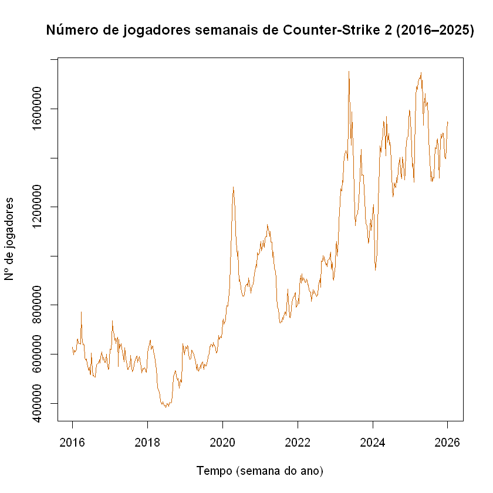
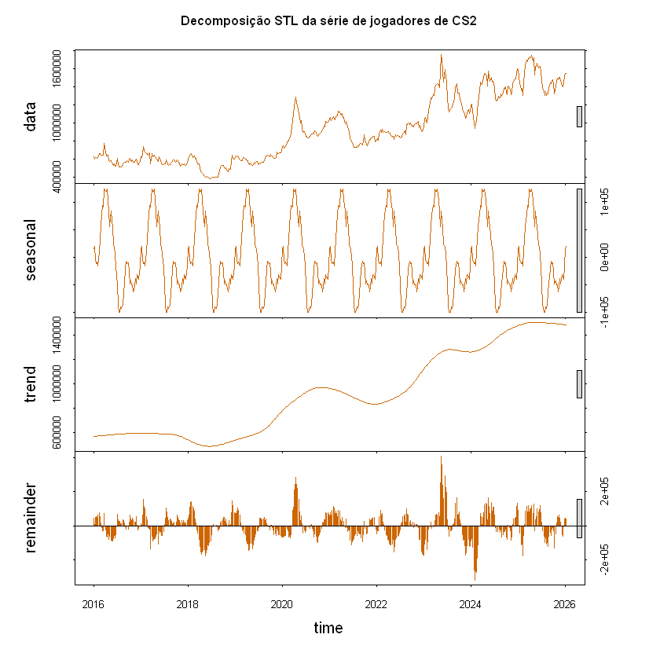
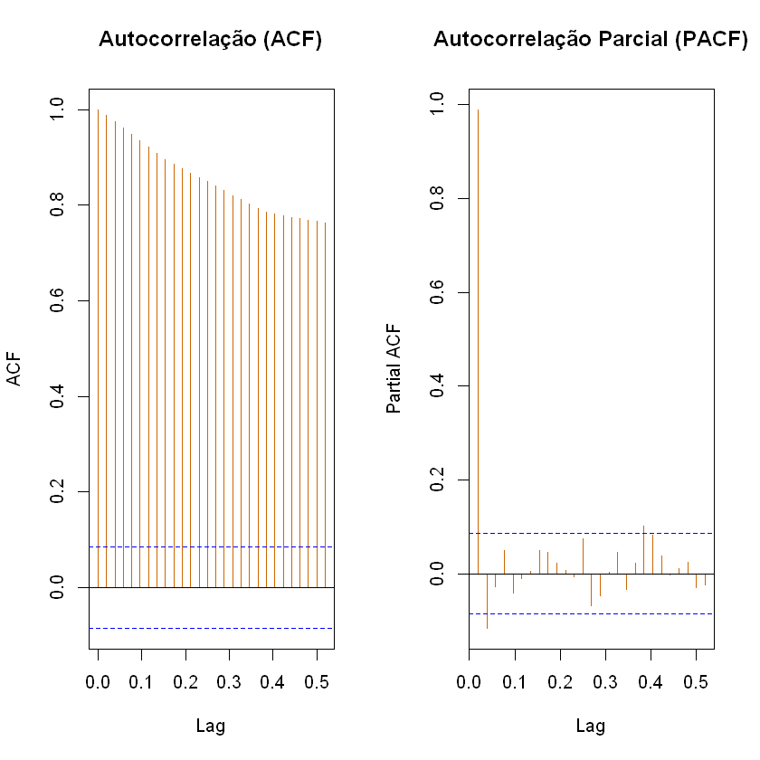
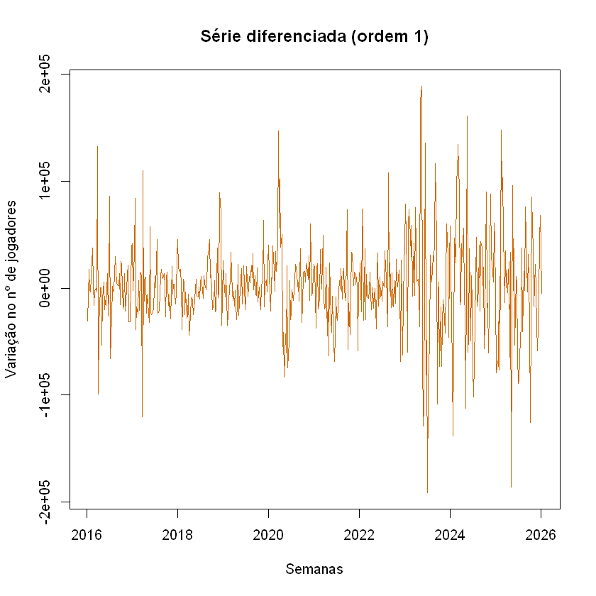
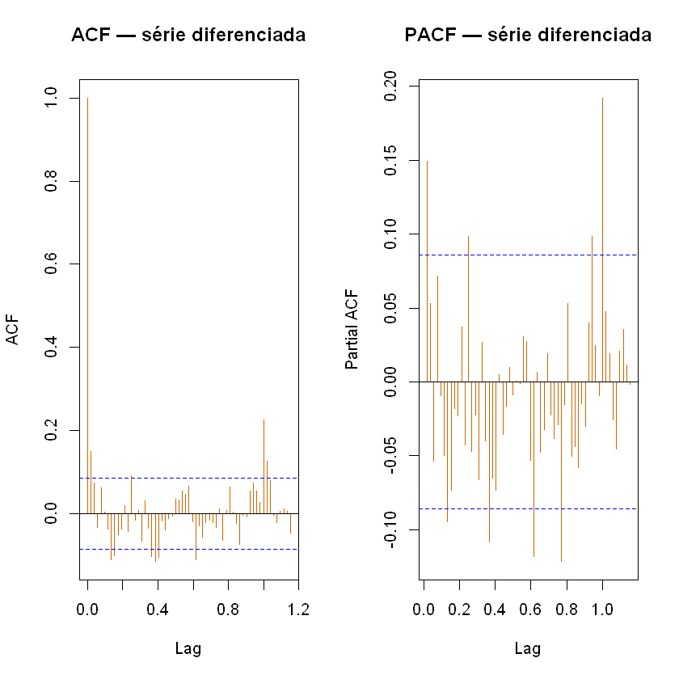
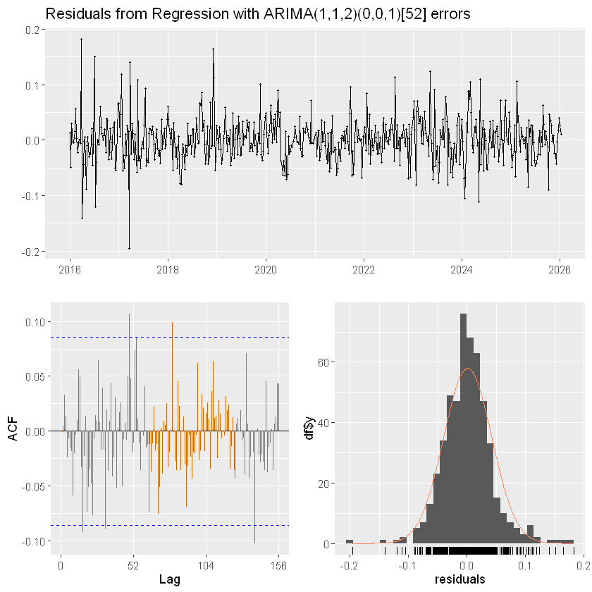
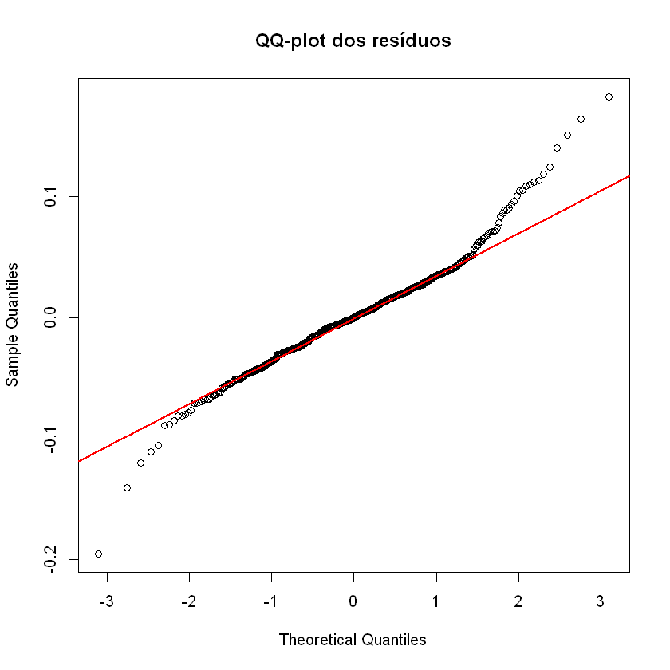
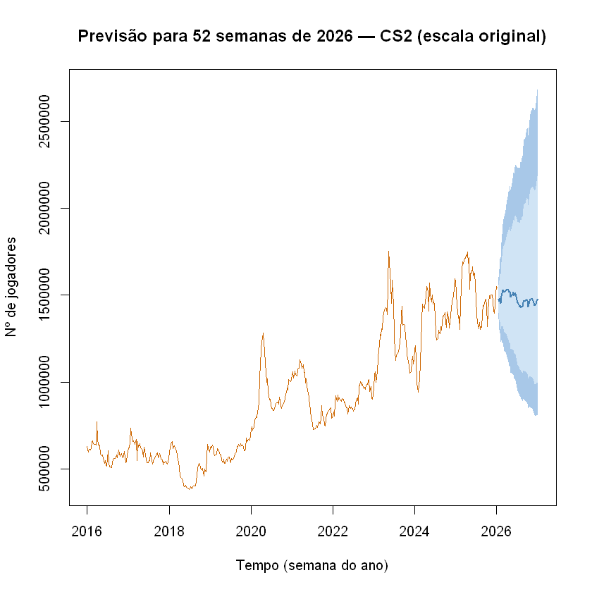
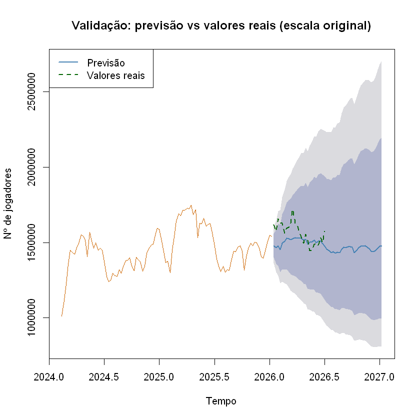

# Análise de Séries Temporais — Jogadores Semanais de Counter-Strike 2

**Enunciado:** *"Apresentar uma análise de dados real"*

---

## Sumário

1. **Introdução** — descrição da base, importação e filtro 2016–2025
2. **Análise exploratória** — gráfico da série, descritivas, ACF/PACF, decomposição STL
3. **Estacionariedade** — testes ADF & KPSS, diferenciação
4. **Detecção de outliers** — `tsoutliers`
5. **Modelagem** — leitura dos gráficos ACF/PACF e `auto.arima`
6. **Diagnóstico dos resíduos** — ACF, Ljung-Box, normalidade, homocedasticidade
7. **Previsão** — h passos à frente com intervalos de confiança
8. **Validação** — janela treino/teste e métricas de erro


---

## 1: Introdução

A análise de séries temporais é um método estatístico bem eficiente para dados levantados ao longo de um determinado período de tempo, permitindo identificar padrões, tendências e sazonalidades.

Por isso, para esse trabalho, iremos realizar uma análise completa de uma série temporal, desde as medidas descritivas, decomposição STL, identificação de outliers até ajuste de modelos ARIMA e previsões.

A série escolhida para esta análise é o **número semanal de jogadores de Counter-Strike 2** (antes da transição para CS2 em 2023, era conhecido como CS:GO — *Counter-Strike: Global Offensive*), um jogo de tiro multiplayer da plataforma Steam, na qual Counter Strike 2 se encontra disponível para download. Os dados foram extraídos da plataforma de terceiros "SteamDB", que registra o número de jogadores ativos por dia.

Para uma análise mais focada e precisa, a série foi reduzida/filtrada entre **1 de janeiro de 2016** e **31 de dezembro de 2025**, e os registros diários foram agregados em médias **semanais** (semanas iniciando às segundas-feiras).

---

## 2: Análise exploratória

Antes de qualquer modelagem, com a série apresentada, começaremos, agora, uma breve análise descritiva da série a fim de entender o comportamento visual da série de jogadores de Counter Strike 2 e caracterizar sua estrutura.

Para isso, iremos primeiramente visualizar a série, no período delimitado anterior.

### 2.1 Gráfico da série



### 2.2 Estatísticas descritivas

```
   Min. 1st Qu.  Median    Mean 3rd Qu.    Max. 
 382055  599685  849719  916332 1207915 1753420 
 
```

Analisando visualmente a série, percebemos que ela possui uma tendência crescente bem evidente, com poucos picos decrescentes que mudem o crescimento da série. Esse comportamento se dá devido ao jogo ser multijogador, ou seja, não possui fases e mantém as pessoas jogando por mais tempo.

Além disso, há vários picos evidentes ao longo do tempo, provavelmente indicativos de eventos ou atualizações no jogo para aumentar o número de jogadores.

### 2.3 Decomposição STL

Para verificar melhor a tendência, tanto quanto outros componentes da série, iremos decompô-lá por meio da função $\texttt{stl}$, a qual decompõe a série em:

$$
X_t = T_t + S_t + R_t, 
$$

em que $T_t$ é o componente de tendência, $S_t$ é o componente sazonal e $R_t$ é o componente residual.



Com a série decomposta, podemos analisar seus componentes mais detalhadamente.

A **tendência** já age conforme o esperado, com um claro padrão crescente por todo o tempo analisado. Já a **sazonalidade** também é bem evidente, apresentando pico de jogadores em todo começo de ano, período de férias ou recesso, o que aumenta o número de jogadores.

Por fim, temos os **resíduos**, o restante da série após retirarmos a tendência e a sazonalidade. Exceto por picos em 2020 (pandemia) e 2023-2024 (lançamento do CS2), os resíduos não apresentam padrão evidente, oscilando em torno de série com o passar do tempo.


### 2.4 Gráficos ACF e PACF

A última análise a ser feita nessa etapa será avaliar a presença de autocorrelação e autocorrelação parcial, ferramentas para identificar a dependência temporal da série.



Analisando a autocorrelação, há um indicativo forte de tendência, uma vez que os lags decaem de forma lenta, demorando a entrar no intervalo de confiança. Isso é uma evidência para diferenciarmos a série, passo que será feito na próxima etapa.

Já a autocorrelação parcial mostra um pico do lag 1 muito próximo de 1 decaindo rapidamente para dentro do intervalo de confiança logo no próximo lag, evidenciando que a série possa ser modelado futuramente como um modelo autoregressivo de ordem 1.

---

## 3: Estacionariedade

Como analisado na última etapa, é claro que a série utilizada não é estacionária, ou seja, sua média não se mantém constante ao longo do tempo.

Além da decomposição e gráfico ACF, uma maneira mais precisa de verificar estacionariedade é por meio de dois testes estatísticos. O teste Dickey-Fuller Aumentado (ADF) e o teste KPSS.

Os teste ADF e KPSS têm como hipóteses:

| Teste | $H_0$ | $H_1$ |
|---|---|---|
| **ADF** (*Augmented Dickey-Fuller*) | Há raiz unitária (não-estacionária) | Não há raiz unitária (estacionária) |
| **KPSS** | Série estacionária | Série não-estacionária |

### 3.1 Testes na série original

Realizando os testes:

```
	Augmented Dickey-Fuller Test

data:  serie
Dickey-Fuller = -3.5364, Lag order = 8, p-value = 0.03881
alternative hypothesis: stationary
```

```
	KPSS Test for Level Stationarity

data:  serie
KPSS Level = 6.286, Truncation lag parameter = 6, p-value = 0.01
```

O p-valor do teste ADF resultou em aproximadamente 0,038, ou seja, rejeitamos $H_0$ e temos evidências que a série é estacionária.

Entretanto, o teste KPSS resultou em um p-valor menor que 0,01, ou seja, esse teste já indica que a série não é estacionária.

Dado a divergência dos testes e o fato dos gráficos anteriores indicarem com clareza a tendência crescente da série, o caminho é diferenciar a série e refazer os testes.

Iremos fazer, então, uma **diferenciação** de ordem 1 na série, isto é,

$$
X_t = X_t - X_{t-1}
$$

### 3.2 Diferenciação de ordem 1

A diferenciação de ordem 1 remove a tendência linear ao calcular:


 
Percebemos, analisando o gráfico da série diferenciada, que após uma diferenciação a série se tornou bem mais estacionária do que a anterior, com indícios de que a média se tornou constante.

Para confirmar a suspeita de estacionariedade, realizaremos os teste ADF e KPSS novamente, juntamente com os gráficos de ACF e PACF.

```
	Augmented Dickey-Fuller Test

data:  serie_diff
Dickey-Fuller = -8.6564, Lag order = 8, p-value = 0.01
alternative hypothesis: stationary
```

```
	KPSS Test for Level Stationarity

data:  serie_diff
KPSS Level = 0.043643, Truncation lag parameter = 6, p-value = 0.1
```


Uma vez que ambos os testes indicam que a série se tornou estacionária e o gráfico ACF mostra uma queda brusca do lag 0 ao lag 1, comportamento esperado em tendência constante, temos evidências suficientes para concluir que a série dos jogadores semanais de CS2 se torna estacionária após uma diferenciação.

---

## 4. Detecção de outliers

Antes de ajustar o modelo, identificamos possíveis outliers com a função `tso` do pacote `forecast`. Ela detecta automaticamente observações atípicas — como *Additive Outliers* (AO), *Level Shifts* (LS) e *Transient Changes* (TC), além de dizer qual é o impacto do outlier na série

```
Outliers:
  tipo 	posicao  	tempo 	 impacto  	t estat
1   LS 	220 		2020:12  376735 	13.995
2   TC 	384 		2023:20  248359  	5.153
3   LS 	391 		2023:27  272742  	8.353
```

**Interpretação dos outliers:** 

**Primeiro LS (posição 220 – Março/2020)**: A mudança permanente no nível da série coincide com o início das medidas de lockdown global decorrentes da pandemia de COVID-19. A classificação como Level Shift (e não como AO) é tecnicamente acertada, pois o isolamento social não gerou um pico passageiro, mas sim uma mudança estrutural no comportamento do consumidor, elevando de forma duradoura a base de espectadores e jogadores ativos devido à adoção massiva do entretenimento digital. A função `tso` nos diz que um impacto +376.735 jogadores, isso significa que a pandemia elevou o patamar de jogadores de forma permanente.

**TC (Índice 384 – Maio/2023)**: Este ponto coincide com as finais do *BLAST.tv Paris Major 2023*, (*Major* é o maior campeonato oficial do jogo) o último Major da história do CS:GO antes da transição para o CS2. A classificação como Temporary Change é coerente com a natureza de um evento pontual de grande apelo midiático: observamos um pico expressivo de engajamento naquela semana específica, cujo efeito, embora intenso, dissipou-se gradualmente nas semanas seguintes, retornando à trajetória de equilíbrio anterior (ou à nova trajetória, como veremos a seguir). O impacto foi de +248.359 jogadores temporariamente.

**Segundo LS (Índice 391 – Julho/2023)**: Este é o ponto mais interessante da análise. Aproximadamente dois meses após o Major, detectamos outro Level Shift positivo e permanente. Esse fenômeno pode ser interpretado como o "efeito legado" do campeonato. É plausível que o lançamento do CS2 (anunciado para o setembro de 2023) e o enorme sucesso do Major tenham atraído uma leva definitiva de novos jogadores e espectadores que, diferentemente do pico agudo de maio, se consolidaram na comunidade, elevando o patamar mínimo de atividade da série de forma estrutural. O impacto é +272.742 jogadores de forma permanente.

As estatísticas t associadas a cada outlier (variando de 5,15 a 13,99) superam amplamente o valor crítico usual (|t| > 2), confirmando a relevância desses choques para a dinâmica da série. Incluir esses efeitos apenas como "pontos a serem monitorados" (como sugerido na análise preliminar) pode não ser suficiente. Posteriormente, na etapa de modelagem, uma opção é utilizaremos os parâmetros gerados pelo tso para construir variáveis de intervenção (dummies permanentes para os LS e com decaimento para o TC) que serão inseridas como regressoras externas (via argumento xreg da auto.arima). Isso poderia evitar que os outliers distorçam a estimativas dos parâmetros do modelo. (**Entretanto**, nós verificamos que o modelo que autorima retornou considerando os outliers possue um desempenho inferior ao modelo retornado sem considerar outliers. Assim, iremos usar auto.arima **sem** argumento xreg).

## 5. Modelagem

Após analisar os componentes da série e detectar os outliers, podemos, enfim, ajustar um modelo apropriado para a nossa série temporal.

Podemos encontrar o modelo de duas maneiras diferentes: manualmente, analisando os gráficos ACF e PACF, ou pela função $\texttt{auto.arima}$, que ajusta o melhor modelo ARIMA encontrando aquele com o menor BIC, critério muito usado em seleção de modelos.


Em primeiro lugar, vale lembrar que esses gráficos ACF e PACF são optidos após a diferenciação de ordem 1 da série. Logo, teremos $d=1$ como parâmetro do modelo ARIMA.

Analisando o gráfico PACF, percebe-se que, após o lag 1, o próximo lag decai rapidamente para o intervalo de confiança. Com isso, um valor possível para o parâmetro autoregressivo seria $p =1$.

Agora, pelo gráfico ACF, percebe-se que o lag 1 apresenta-se para fora do intervalo de confiança e o lag 2 está em cima do tracejado, ou seja, no limiar do IC. Assim, um valor para o parâmetro de médias móveis seria $q=1$ ou $q=2$.

Porém, é válido perceber que ambos os gráficos apresentam um comportamente sazonal a cada um ano, de acordo com a escala transformada dos gráficos. Desse modo, uma diferença sazonal de 52 semanas, isto é, um ano, seria ideal para remover a sazonalidade.

### 5.1 Seleção automática com `auto.arima`

Encontrando o melhor modelo ARIMA pelo função $\texttt{auto.arima}$, percebemos que aquele com menor BIC indica que

$$
X_t \sim ARIMA(1,1,2)(0,0,1)[52]
$$ é o melhor modelo, confirmando o ajuste manual pelos gráficos.

---

## 6: Diagnóstico dos resíduos

Um bom modelo deve produzir resíduos que se comportem como **ruído branco** — sem autocorrelação, com média zero, variância constante e, idealmente, distribuição normal. Para ver isso abaixo está uma figura de diagnóstico de resíduos.

### 6.1 Gráficos de diagnóstico usando a função "checkresiduals"



Essa figura apresenta os principais diagnósticos dos resíduos do modelo ARIMA ajustado. O painel superior mostra a evolução temporal dos resíduos, permitindo verificar se permanecem distribuídos aleatoriamente em torno de zero. Observa-se que não há tendência ou sazonalidade remanescente, indicando que o modelo conseguiu capturar a maior parte da estrutura sistemática da série. Entretanto, nota-se um aumento na dispersão dos resíduos em alguns períodos, principalmente entre 2023 e 2025, sugerindo a ocorrência de maior volatilidade nesse intervalo.

O gráfico da Função de Autocorrelação (ACF), localizado no canto inferior esquerdo, mostra que a maior parte das autocorrelações encontra-se dentro das bandas de confiança de 95%. Embora existam alguns lags isolados que ultrapassem ligeiramente esses limites, não se observa um padrão persistente de autocorrelação, indicando que os resíduos apresentam comportamento próximo ao de ruído branco.

Por fim, o histograma dos resíduos, acompanhado da curva normal ajustada, evidencia que a distribuição é aproximadamente simétrica e centrada em torno de zero. Ainda assim, percebe-se uma concentração de observações na região central e algumas observações extremas nas caudas, indicando pequenos desvios em relação à distribuição Normal, o que é relativamente comum em séries temporais reais.

De maneira geral, a análise gráfica sugere que o modelo apresenta um ajuste satisfatório, produzindo resíduos aproximadamente aleatórios e sem estrutura temporal evidente. A confirmação dessa conclusão é realizada por meio do teste de Ljung-Box, apresentado na seção seguinte.

### 6.2 Teste de Ljung-Box

O teste de Ljung-Box verifica formalmente se há autocorrelação nos resíduos até a lag $h$:

$$\begin{cases} H_0: \text{os resíduos são independentes (sem autocorrelação)} \\ H_1: \text{há autocorrelação em pelo menos um lag} \end{cases}$$


```
	Box-Ljung test

data:  residuals(modelo)
X-squared = 26.043, df = 16, p-value = 0.05343

```

**Interpretação:** o $p\text{-valor} > 0{,}05$, não rejeitamos $H_0$ — os resíduos são independentes, indicando que o modelo capturou adequadamente a estrutura de dependência.

### 6.3 Normalidade dos resíduos


```
	Shapiro-Wilk normality test

data:  res
W = 0.94387, p-value = 3.744e-13
```


Os pontos do QQ-plot não se alinham próximos à reta de referência e o $p\text{-valor}$ do teste de Shapiro-Wilk é $< 0{,}05$, não há evidências de normalidade dos resíduos.

Embora o teste de normalidade tenha rejeitado a hipótese de normalidade dos resíduos, esse pressuposto não é essencial para a previsão ARIMA. O diagnóstico foi concentrado na ausência de autocorrelação residual, avaliada pelo teste de Ljung-Box.

### 6.4 Homocedasticidade

Agora vamos se a variância dos resíduos é constante ao longo do tempo com o teste de Breusch-Pagan:

$$\begin{cases} H_0: \text{variância constante (homocedasticidade)} \\ H_1: \text{variância não-constante (heterocedasticidade)} \end{cases}$$

```
	studentized Breusch-Pagan test

data:  res ~ t_index
BP = 26.431, df = 1, p-value = 2.731e-07
```

**Resumo do diagnóstico:**

| Verificação | Ferramenta | Resultado |
|---|---|---|
| Independência | Ljung-Box | $p > 0{,}05$ — resíduos sem autocorrelação |
| Normalidade | Shapiro-Wilk + QQ-plot | $p <> 0{,}05$ — distribuição não é aproximadamente normal |
| Homocedasticidade | Breusch-Pagan | $p > 0{,}05$ — variância não constante |

Os resíduos não apresentaram comportamento de ruído branco perfeito quanto à distribuição (normalidade e homocedasticidade violadas), porém o teste de Ljung-Box não indicou autocorrelação significativa. Assim, o modelo foi considerado adequado para **fins de previsão**.

---

## 7: Previsão

Com o modelo ajustado e os pressupostos verificados, fazemos previsões para as próximas **52 semanas** (um ano à frente), acompanhadas dos intervalos de confiança de 80% e 95%.



A previsão pontual (linha azul) segue a tendência observada, mantendo o padrão sazonal identificado. Os intervalos de confiança se alargam progressivamente com o horizonte de previsão, refletindo a incerteza crescente. Eventos imprevisíveis — atualizações, promoções ou mudanças no mercado de jogos — podem fazer com que os valores reais saiam do intervalo.

---

## 8: Validação (treino/teste)

Para avaliar a capacidade preditiva do modelo de forma mais rigorosa, separamos a série em:

* **Treino:** todas as semanas até o final de 2024;
* **Teste:** as 52 semanas de 2025 (um ano completo).

Ajustamos o modelo apenas nos dados de treino e comparamos as previsões com os valores reais de 2025.

Usando auto.arima nos temos os seguintes parâmetros:

```
Modelo ajustado no treino:
Series: serie_treino 
ARIMA(0,1,1)(0,0,1)[52] 

Coefficients:
         ma1    sma1
      0.1509  0.1725
s.e.  0.0444  0.0501

sigma^2 = 1.637e+09:  log likelihood = -5640.53
AIC=11287.06   AICc=11287.11   BIC=11299.51

```


### 8.1 Métricas de erro

Para quantificar o desempenho preditivo, calculamos as principais métricas:

| Métrica | Fórmula | Interpretação |
|---|---|---|
| **MAE** | $\frac{1}{h}\sum_{t=1}^{h}\vert e_t \vert$ | Erro médio absoluto (mesma unidade da série) |
| **RMSE** | $\sqrt{\frac{1}{h}\sum_{t=1}^{h}e_t^2}$ | Penaliza mais os grandes erros |
| **MAPE** | $\frac{100}{h}\sum_{t=1}^{h}\left\vert\frac{e_t}{y_t}\right\vert$ | Erro percentual médio |

Resultado: 

```
MAE  =     106571 jogadores
RMSE =     123321 jogadores
MAPE =       7.12 %
```

O MAPE de 7.12 % indica, em média, as previsões erram 7.12 % em relação aos valores reais. Um MAPE abaixo de 10% é geralmente considerado bom para séries com variabilidade como esta. Tanto RMSE quanto MAE indicam o número em média que as previões erram em relação aos valores reais. O RMSE maior que o MAE indica a presença de alguns erros pontuais maiores, compatível com os picos atípicos identificados como outliers.

---

## Conclusão

Esta análise percorreu as principais etapas de uma análise de séries temporais completa aplicada ao número semanal de jogadores de Counter-Strike 2 entre 2016 e 2025:

1. **Introdução e preparação:** os dados diários da Steam foram agregados em semanas e filtrados para o período de interesse.
2. **Análise exploratória:** identificamos visualmente tendência crescente e sazonalidade anual, confirmadas pela decomposição STL e pelos gráficos ACF/PACF.
3. **Estacionariedade:** os testes ADF e KPSS, combinados com a análise visual, indicaram a necessidade de **uma diferenciação regular** ($d = 1$) para tornar a série estacionária.
4. **Outliers:** `tsoutliers` detectou semanas com comportamento atípico, associadas a eventos relevantes do jogo.
5. **Modelagem:** o modelo $\text{SARIMA}(1,1,2)(0,0,1)_{52}$ foi selecionado tanto pela leitura manual dos gráficos quanto pela função `auto.arima`.
6. **Diagnóstico:** os resíduos do modelo não apresentaram autocorrelação, mas não são aproximadamente normais e com variância  não constante.

7. **Previsão:** o modelo produziu previsões para 52 semanas à frente com intervalos de confiança adequados.

8. **Validação:** a comparação entre previsões e valores reais de 2025 confirmou a qualidade preditiva do modelo, com métricas de erro satisfatórias.

### Considerações:

Como o diagnóstico do modelo não foi perfeito, assim sugere-se um trabalho futuro que encontre uma transformação adequada para satisfazer a normalidade e a homocedasticidade.

## Referências

- STEAMDB. *Counter-Strike 2 – Charts*. Disponível em: <https://steamdb.info/app/730/charts/>. Acesso em: 13 jul. 2025.

- WIKIPEDIA. *Counter-Strike 2*. Disponível em: <https://en.wikipedia.org/wiki/Counter-Strike_2>. Acesso em: 13 jul. 2025.

- WIKIPEDIA. *BLAST.tv Paris Major 2023*. Disponível em: <https://en.wikipedia.org/wiki/BLAST.tv_Paris_Major_2023>. Acesso em: 13 jul. 2025.

- DE ASSIS-MOURA, MARIA SILVIA. *Material da disciplina de Séries Temporais*. Notas de aula e materiais disponibilizados no Google Classroom da disciplina, Universidade Federal de São Carlos, 2026.

- STEAM. *Counter-Strike 2*. Disponível em: <https://store.steampowered.com/app/730/CounterStrike_2/>. Acesso em: 13 jul. 2025.